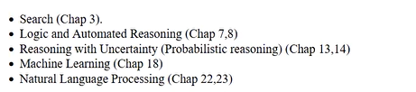

# Artificial Intelligence: Lecture 1 (2023/01/23)

## Syllabus

### Course Info

* Professor: Ernest Davis
* Phone: 2129983123
* Office: 329 Warren Weaver Hall
* Office Hours: Tu 10-12, Th 2-3

Textbook: *Artificial Intelligence: A Modern Approach*

### Grading

* Problem Sets and Programming Assignments (40%)
* Midterm (25%)
* Final Exam (35%)

### Topics

* Search (Chap 3)
* Logic and Automated

### Schedule

| Date       | Topic                                                        | Required Reading                          | Assignment |
| ---------- | ------------------------------------------------------------ | ----------------------------------------- | ---------- |
| M 1/23     | Welcome & Overview                                           | R&N chaps 1, 2                            |            |
| W 1/25     | State space search                                           | R&N 3.1-3.4                               |            |
| M 1/30     | Hill climbing Gradient descent                               | R&N 4.1, 4.2                              |            |
| W 2/1      | Propositional logic                                          | R&N 7.1-7.4 Online notes                  | Hwk1 due   |
| M 2/6      | Davis-Putnam algorithm                                       | R&N 7.6 Online notes                      |            |
| W 2/8      | SAT Compilation                                              | Online notes                              | Hwk2 due   |
| M 2/13     | First-order logic                                            | R&N 8.1-8.2 Online notes                  | Prog1 due  |
| W 2/15     | First-order logic cntd.                                      | R&N 8.3, 8.4                              |            |
| M 2/20     | Presidents' Day                                              |                                           |            |
| W 2/22     | Probability                                                  | R&N 13.1, 13.2 Notes on NYU Classes       | Hwk3 due   |
| M 2/27     | Probability cntd.                                            | R&N 13.3, 13.4, 13.5 Notes on NYU Classes |            |
| W 3/1      | Decision theory                                              | R&N 16.1 Notes on NYU Classes             |            |
| M 3/6      | Review for midterm                                           |                                           |            |
| W 3/8      | Midterm                                                      |                                           |            |
| 3/13- 3/17 | Spring break                                                 |                                           |            |
| M 3/20     | Machine learning Supervised learning Classification Naïve Bayes | R&N 18.1, 18.2                            | Prog2 due  |
| W 3/22     | Reinforcement learning Discuss Prog3                         | Class notes                               | Hwk4 due   |
| M 3/27     | Exemplar-based k nearest neighbors Linear separators         | R&N 18.7                                  |            |
| W 3/29     | Stochastic generative models                                 | Online notes                              |            |
| M 4/3      | Gaussian distribution                                        | Online notes                              |            |
| W 4/5      | Evaluation                                                   | Online notes                              | Hwk5 due   |
| M 4/10     | Gradient-based methods                                       | Online notes                              | Prog3 due  |
| W 4/12     | Deep learning                                                | Online notes                              |            |
| M 4/17     | Unsupervised learning Clustering                             | Online notes                              | Hwk6 due   |
| W 4/19     | Natural Language                                             | R&N 23.1                                  |            |
| M 4/24     | Syntax Chart parser                                          | R&N 23.2 Online notes                     | Hwk7 due   |
| W 4/26     | Semantics Text interpretation Ambiguity                      | R&N 23.3.4 Online notes                   |            |
| M 5/1      | Naïve Bayes for text K-gram models                           | R&N 23.3.5 Online notes.                  | Hwk8 due   |
| W 5/3      | Vector models                                                | Online notes                              | Prog4 due  |
| M 5/8      | Review for final exam                                        |                                           | Hwk9 due   |
| TBA        | Final exam                                                   |                                           |            |