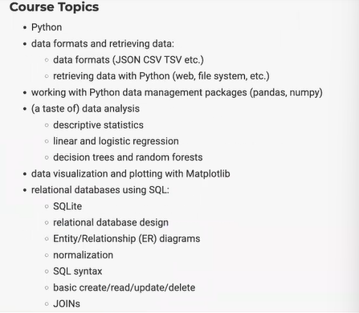
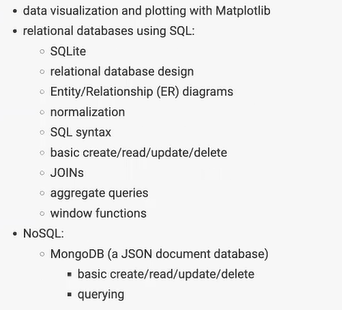

# DMA: Lecture 1 - 2023/01/24

[TOC]

## Syllabus

### Course and Instructor Info

* Data Management and Analysis

    * Prof: Matt Zeidenberg

    * TuTh 3:30-4:45 PM

    * Silver 520

* Office Hour:

    * 2-3 PM every weekday except Friday 
    * 419 Warren Weaver Hall
    *  https://nyu.zoom.us/j/96750082623

### What we learn

* Python
    * basics
    * NumPy
    * Pandas
    * Linear Regression
    * Random Forests
* Relational Databases
* SQL





### Software

* Recommend: Anaconda
* We'll mainly use Google Collab

## Languages for Data Management, Data Analysis, and Data Science

https://colab.research.google.com/drive/1P48h1PqcssBn-jesuOmNSTKpg-ETBQyh?usp=sharing


Proprietary Options for Data Analysis
* SAS 
* SPSS
* Stata
* Matlab
* many others ...

The first three are "old-school" statistics packages but still widely-used. Matlab is used by engineers and scientists for numerical computing, including matrix calculations.

Open Source Options
* Python
* R
* [Julia](https://juliadatascience.io/)

Julia is very fast and is good for computationally-intensive applications. However, we won't cover it in this course.

Dashboarding Options ("Business Intelligence")
* [Tableau](https://www.tableau.com/)
* Microsoft Power BI
* Many others

Dashboarding usually doesn't require much programming. Dashboarding applications (the best known of which is Tableau) are like the Excel of data science and allow end users who are not programmers to analyze data and make interactive graphs. We also won't be covering it in this class. There are NYU SPS [classes](https://www.sps.nyu.edu/professional-pathways/courses/DATA1-CE9000-visual-analytics-with-tableau.html) on data analytics that focus mainly on Tableau.


- Why Python?

- Python has gained much of R's functionality
- Anaconda and Google Colab
- Environments
- Conda and Pip

## Python Fundamentals

* Example: A quicksort program

    ```python
    def quicksort(arr):
        if len(arr) <= 1: 
            return arr
        pivot = arr[len(arr) // 2] 
        left = [x for x in arr if x < pivot] 
        middle = [x for x in arr if x == pivot] 
        right = [x for x in arr if x > pivot] 
        return quicksort(left) + middle + quicksort(right)
    
    print(quicksort([3,6,8,10,1,2,1]))
    # [1, 1, 2, 3, 6, 8, 10]
    ```

* The part `[x for x in arr if x < pivot]` is called a [list comprehension](https://www.w3schools.com/python/python_lists_comprehension.asp)

* Assignment and Operators

    ```python
    x,y = 20, 9
    print (x+y) #29
    print (x-y) #11
    x**2 #400
    x/y #2.222223 普通除法
    x//y #2 整除
    x%y #2 取模
    # convert to strings and concatenate
    str(x)+str(y) #'209'
    x+=6 #26
    ```

* Python uses indentation to create code blocks.

    ```python
    def isPrime(x): # indent 0
        for i in range(2,int(x**0.5)+1): # indent 1
            if x%i==0: # indent 2
                return False # indent 3
        return True # indent 1  
    ```

* Example: Find primes less than 30

    ```python
    primeList=[]
    for i in range(2,31):
        if isPrime(i): primeList.append(i) 
    print(primeList)
    
    # Or using list comprehension
    list = [i for i in range(2,31) if isPrime(1)]
    ```

* 

### Strongly and dynamically typed

* 

### Loops

## File I/O

 
