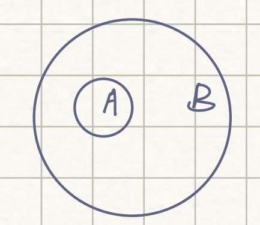
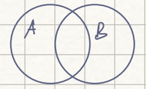

# Statistics: Lecture 1 - 2023/01/23

[TOC]

## Probability Spaces

### Main Ingredients:

* **Sample Space** ($\Omega$): the set of all outcomes of some s=experiment

* **Event**: Any subset of $\Omega$

* **Probability Measure**: A mapping from $p(\Omega)\rightarrow [0,1]$ with 

    * ==a)==  $p[\Omega] = 1$

    * ==b)== if $A_1, A_2, ...$ is a disjoint sequence of events then
        $$
        P\Big(\bigcup^\infty_{i=1}A_i\Big) = \sum^\infty_{i=1}P(A_i)
        $$

    * <u>==(a)== and ==(b)== imply, for example:</u>

        * Since $\Omega = A\cup A^c$,

            ​          $1 = P(\Omega) = P(A)+P(A^c)$

            In particular, $P(\{\}) = 0$

        * If $A\sub B$ then $B = A\cup (B\cap A^c)$

            

            So $P(B) = P(A)+P(B\cap A^c)$

            So $P(B)\ge P(A)$

        * For any events $A$ and $B$, 

            

            $A \cup B = (A\cap B^c) \cup(B\cup A^c) \cup (A\cap B)$

            $P(A\cup B) = P(A\cap B^c)+P(B\cup A^c)+P(A\cap B)$

            > Since $(A\cup B^c) \cup (A\cap B) = A$
            >
            > we have $P(A\cap B^c) = P(A)-P(A\cap B)$

            Thus, 
            $$
            \begin{align*}
            P(A\cup B) &= P(A\cap B^c)+P(B\cup A^c)+P(A\cap B)\\
            &= P(A)-P(A\cap B)+P(B)-P(A\cap B)+P(A\cap B)\\
            &= P(A)+P(B)-P(A\cap B)
            \end{align*}
            $$
            In particular, $P(A\cup B)\le P(A)+P(B)$

### Examples

1. Flip a fair coin 100 times. $\Omega$ is the set of all possible length $100$ sequences of heads and tails

    For any $\omega\in \Omega$, $\displaystyle P(\{\omega\}) = \frac 1{2^{100}}$

    If $A\sub \Omega$,  then 
    $$
    P(A) = \sum_{\omega\in A}\frac 1{2^{100}} = \frac {|A|}{2^{100}}
    $$
    If $A = \{\text{\# heads <100}\}$, 
    $$
    P(A) = 1-P(A^c) = 1-P(\text{100 heads}) = 1-\frac 1{2^{100}}
    $$

    > Notice that the number of outcome $(2^{100})$ is the $100$-fold product of the number of outcome in a single coin flip experiment. 

    * In Sampling <u>with</u> Replacement, you repeat an experiment several times and the result of any experiment has no effect on the others.

    * In Sampling <u>without</u> Replacement, we start with objects of equal probability, but each time an object is sampled, it cannot be drawn in subsequent experiments. 

    If there are $n$ objects initially and you draw $m$ times without replacement, how many outcomes are there? 
    $$
    n\cdot {(n-1)}\cdot (n-2)\cdots (n-m+1) = \frac{n!}{(n-m)!}
    $$
    How many sets of objects can you draw?

    For any sets of $m$ objects, there are $m!$ orderings. So there are $\displaystyle \binom nm = \frac{n!}{(n-m)!m!}$

    > (Confused)
    > $$
    > n\cdot {(n-1)}\cdot (n-2)\cdots (n-m+1) = \frac{n!}{(n-m)!}
    > $$
    > Should be:
    > $$
    > n(n-1)(n-2)....(n-m+1) = \frac{n!}{m!}
    > $$
    > There are $(n-m)$ objects in total, so there are $\displaystyle \binom nm = \frac{n!}{m!(n-m)!}$

2. What's the probability that to draw exactly $k$ heads in $100$ coin flips?

    Think of choosing the slots in which to place the "heads" without replacement

    There are $\displaystyle \binom {100}k$ ways to choose the set of $k$ slots

    So $\displaystyle P(\text{\# heads}=k) = \binom{100} k\frac 1{2^{100}}$

    for a coin with $P(head) = p$,
    $$
    P(\text{\# heads =k in 100 flips}) = \binom{100}k p^k (1-p)^{100-k}
    $$

## Independence

* A sequence of event $A_1, A_2, A_3, ...$ is <u>independent</u> if 
    $$
    P\Big(\bigcap^k_{i=1}A_i\Big) = P(A_1)P(A_2)...P(A_k)\qquad \forall k
    $$

* A sequence is pairwise independent if
    $$
    P(A_i\cap A_j) = P(A_i)P(A_j) \qquad\quad \forall i\ne j
    $$
    

Can you come up with $A_1, A_2, A_3$ that are pairwise independent but not independent?

### Example

* 100 coin flips
* $A_j = \{\text{j-th flip is head}\}$
* $\displaystyle P\Big(\bigcap A_j\Big) = P(\{\text{heads, heads, ... heads}\}) = \frac 1 {2^{100}}$
* $\displaystyle \prod^{100}_{j=1}P(A_j) = \frac 1{2^{100}}$
* Check independence

## Conditional Probability

If $P(B)>0,$ then $\displaystyle P(A|B) = \frac {P(A\cap B)}{P(B)}$

If we fix $B$ then $P(\cdot|B)$ maps $P(\Omega)$ to $[0,1]$ and is a probability measure

If $A$ and $B$ are independent, $P(A|B) = P(A)$.

Suppose      $\displaystyle \bigcup^\infty_{i=1}A_i = \Omega$      and      $A_i\cap A_j = \{\} \text{ for }i\ne j$

Then $\displaystyle P(A_i|B) = \frac{P(A_i\cap B)}{P(B)} = \frac{P(A_i\cap B)}{\sum_iP(A_i\cap B)} = \frac{P(B|A_i)P(A_i)}{\sum_jP(B|A_j)P(A_j)}$

