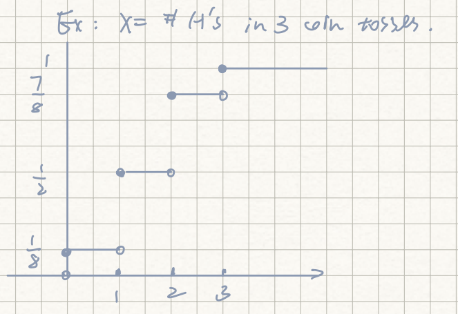
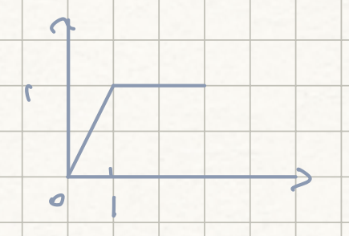
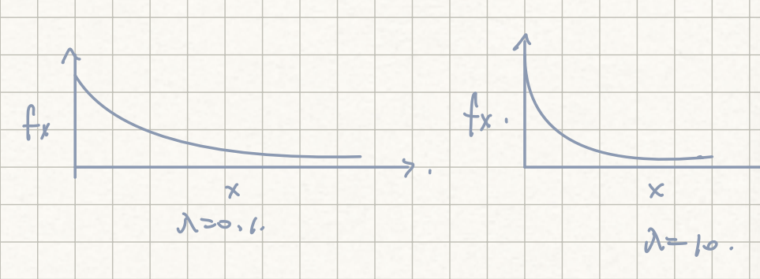
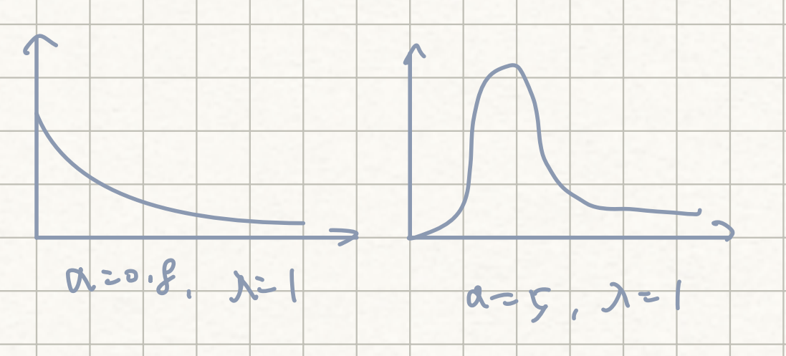
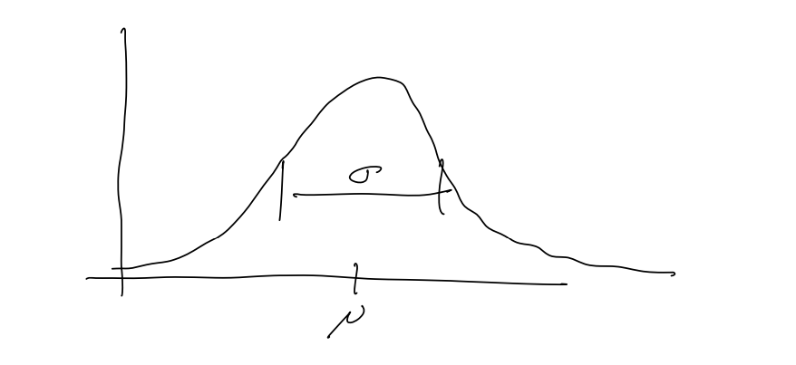

# Statistics: Lecture 2 - 2023/01/25

[TOC]

## Random variable

* A R.V. is a function $X:\Omega\rightarrow \R$.

    * Ex. $X = \{\text{\# H's in 100 coin tosses}\}$

* We often want to know the distribution of a R.V. $X$

    * i.e. for any $B\sub \R$, we want to know:
        $$
        P(X\in B) = P(\{w\in \Omega:X(w)\in B	\})
        $$

### CDF

* The cumulation distribution function (**cdf**) for $X$ is 
    $$
    F_X(x) = P(X\le x)\quad \quad \text{for any }x\in \R
    $$

* $F_X$ uniquely specifies the distribution of $X$.

* Example:

    

    

### Basic Properties of a *c.d.f.*

1. $F_X$ is non-decreasing
2. $\displaystyle \lim_{x\rightarrow -\infty} F_X(x) = 0$     and    $\displaystyle \lim _{x\rightarrow \infty}F_X(x)=1$
3. $\displaystyle \lim_{y\rightarrow x,\  y>x}F_X(y) = F_X(x)$

### Discrete R.V.

$X$ is a **discrete** $R.V$  (i.e. $X$ can take values only in countable subset of $\R$) with possible values $x_1, x_2, ...,$ then, 
$$
F_X(x) = \sum_{x_j\le x}P(X=x_j) = \sum_{x_j\le x}P(x_j) \quad (\leftarrow \text{prob mass function})
$$

#### Example:  Bernoulli

* $Bernoulli(p)$

* $P(1) = p, P(0) = 1-p$

* $$
    F_X(x) = \begin{cases}
    0, \quad\qquad x<0\\
    1-p, \ \quad 0\le x<1\\
    1, \quad\qquad 1\le x
    \end{cases}
    $$

### Independence

A sequence of R.V.s $X_1, X_2, ...$ is independent if for any sequence of subsets $B_1, B_2, ...$ of $\R$, the events $A_j = \{X_j\in B_j\}$ are independent

For discrete R.V.s independent is equivalent to 
$$
p(x_1, x_2, .. x_k) = P(X_1=x_1, X_2=x_2, ..., X_k = x_k)= \prod^k_{j=1}P_{X_j}(x_j)
$$

#### Example

1. 100 biased coin flip with $P(head) = p$

    Let $A_j = \{\text{jth flip is heads}\}$

    Let $X_j$ be the indicator of the event $A_j$

    ​          So $X_j(w) = I_{A_J(w)} = \begin{cases}1 \qquad \text{if }\  w\in A_j\\0\qquad \text{otherwise}\end{cases}$

    $X_j\sim Bernoulli(p)$, 

    ​           check the independence of $A_j$ $\Rightarrow$ independence of $X_j$

    

2. $X = \{\text{\# heads in 100 biased coin flips}\}$.  $(P(heads) = p)$

    $$
\displaystyle p(k) = P(X=k) = \binom {100}kp^k(1-p)^{100-k} = Binomial(100,p)
    $$
In general, if $X_j$ are independent $Bernoulli(p)$, then $\displaystyle X = \sum^n_{j=1}X_j$ is $Binomial(n,p)$

### Continuous R.V.

For a **continuous** R.V. $X$, 
$$
\begin{align*}
F_X(x) = &\int^x_{-\infty}f_X(y)\ dy\\
&\big(\text{where }f_X\ge 0 \text{ and } \int^\infty_{-\infty}f_X(y)\ dy = 1\big)
\end{align*}
$$
 $f_X$ is called the <u>density</u> (or **pdf**) of $X$

Note that if $F_X$ is differentiable at $x$, then $F_X'(x) = f_X(x)$
$$
\begin{align*}
P(X=x)&\le P(X\in (x-\delta,x])  \qquad\text{ for any }    \delta>0\\
&= F_X(x)-F_X(x-\delta) \quad \rightarrow 0 \quad \text{ as }\delta \rightarrow 0
\\&\qquad\qquad\qquad\qquad\text{(because } F_X \text{ is coutinuous)}
\end{align*}
$$
So $P(X=x) = 0$

#### Example

1. $X\sim Uniform(0,1)$

    * $\displaystyle f_X(x) = \begin{cases}1, \quad \text{ if } x\in (0,1)\\0, \quad \text{ otheriwse}\end{cases}$

    * $\displaystyle F_X(x) = \begin{cases}x, \quad \text{ if } x<0\\x, \quad \text{ if } 0\le x<1\\1, \quad \text{ if }1\le x\end{cases}$

        

2. $X\sim Exponential(\lambda)$

    * $\displaystyle f_X(x) = \displaystyle  \begin{cases}\lambda e^{-\lambda x}, \quad  x> 0\\0, \quad \text{ otheriwse}\end{cases}$

    * $\displaystyle F_X(x) = \displaystyle  \begin{cases}1-e^{-\lambda x}, \quad  x> 0\\0, \quad\quad\qquad x\le 0\end{cases}$

        

    * $Exp(1)$ is a special case of $Gamma(\alpha, 1)$
        $$
        f_X(t) = \begin{cases}
        \frac{\displaystyle \lambda^\alpha t^{\alpha-1} e^{-\lambda t}}{\displaystyle\Gamma(\alpha) }\quad\quad t\ge 0\\
        \\\quad\  0\quad\ \qquad\quad\ \quad  t<0
        \end{cases}
        $$
        

        * $\alpha$ is the "<u>shape</u>" parameter
        * $\lambda$ is the <u>scale</u> parameter

        

3. $X\sim Normal (\mu, \sigma^2)$
    $$
    f_X(x) = \frac{1}{\displaystyle \sqrt{2\pi\sigma^2}}e^{\displaystyle - \frac{(x-\mu)^2}{2\sigma^2}}
    $$
    

    * $\mu$ is the <u>mean</u>
    * $\sigma^2$ is the <u>variance</u>

    We will define these terms later

    

## Transformation of RVs

For any distribution (cont. or discrete) with cdf $F_X$,  

if $U\sim Uniform(0,1)$ and $F_X^+(u) = \inf \{x:F_X(x)\ge u\}$ $\forall u \in (0,1)$, 

then $X = F_X^+(U)$ has c.d.f. $F_X$.

> $F_X^+(u)$ is the inverse function(?)

### Proof:

* We will assume that $F_X$ is invertible

* You can try to prove the general case on your own.

* If $F_X$ is invertible then $F^+(u) = F^{-1}(u)$

* def $X=F_X^{-1}(U)$

* Then 
    $$
    \begin{align*}
    P(X\le x)&= P(F_X^{-1}(U)\le x)\\
    &=P(U\le F_X(x))\\
    &= F_X(x)
    \end{align*}
    $$

### Example

* Suppose $F_X(x) = 1-e^{-\lambda x}$

    * i.e. $X\sim Exp(\lambda)$ 

* then $\displaystyle F_X^{-1}(u) = -\frac 1\lambda log(1-u)$  

* So if $U\sim uniform(0,1)$, 

    then $\displaystyle -\frac 1\lambda \log{(1-U)}\sim Exp(\lambda)$

    

For continuous R.V., we can specify exactly how the density of $X$ changes under a transformation $g$.

Suppose $g$ is smooth and invertible, $X\sim f_X$ and $Y = g(X)$ that is density of $Y$, we may as well assume that $g$ is increasing

Then 
$$
\begin{align*}
P(Y\le y) &= P(g(X)\le y)\\
&= P(X\le g^{-1}(y))\\
&= \int ^{g^{-1}(y)}_{-\infty} f_X(z) \ dz\\
\\\text{now let }w=g(z),& \\
 dw = g'(z)&\ dz = g'(g^{-1}(z))\ dz\\
\\&= \int^y_{-\infty} \frac{f_X(g^{-1}(w))}{g'(g^{-1}(w))}\ dw
\end{align*}
$$
Therefore, 
$$
f_Y(w)= \frac{f_X(g^{-1}(w))}{g'(g^{-1}(w))}
$$

### Example

You can check if $U\sim uniform (0,1)$ and  $\displaystyle g(u) = -\frac{1}{\lambda}\log(1-u)$

Then the density of $g(u)$ is $Exp(1)$

* $U\sim uniform(0,1)$,
* $\displaystyle g(u) = -\frac{1}{\lambda}\log(1-u)$

We know: 

* $X=g(U)$ should be $Exp(1)$

Then 

* $g^{-1}(x) = 1-e^{-\lambda x}$
* $\displaystyle g'(u) = \frac 1{\lambda(1-u)} $
* $\displaystyle g'(g^{-1}(x)) = \frac 1{\lambda e^{-\lambda x}}$

So 
$$
f_X(x) = 
\begin{cases}
\frac{1}{g'(g^{-1}(x))} =  \lambda e^{-\lambda x}\quad \quad x>0
\end{cases}
$$
