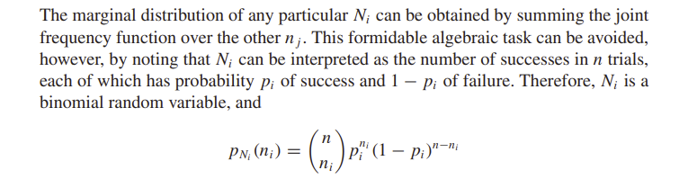
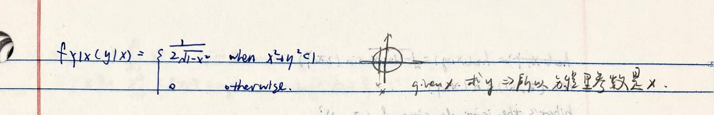

# Math Stats: lecture 3 - 01/30/2023

[TOC]

Last time: Random Variable

This time: Joint Distributions (Chapter 3)

## Joint Distributions (Chapter 3)

>  We've talked about independent R.V.s
>
> Much of statistics is about understanding relationships between variables that are not independent

If $X$ and $Y$ are two R.V.s that on the same probability space then their joint cdf is 
$$
F(x,y)=P(X\le x, Y\le y)
$$
which contains all information about the relationship between $X$ and $Y$

* Notice that 

$$
F_X(x) = \lim_{y\rightarrow\infty}F(x,y)
$$

* In this case $F_X$ is the <u>marginal c.d.f.</u> of $X$

## Discrete Joint RV

If $X$ and $Y$ are **discrete** $R.V.$s, then 
$$
\begin{align*}
F(x,y) &= \sum_{x_i\le x}\sum_{y_j\le y}\  P(X=x_i, Y=y_j)\\
&= \sum\sum\ P(x_i, y_j) 
\end{align*}
$$

* Then $P(x_i, y_j)$ is the <u>joint pmf</u>.

$$
\begin{align*}
\sum_{y_j}\ P(x, y_j) &= \sum _{y_j}\ P(X=x, Y=y_j)\\
&= P(X=x)\\
&= P_X(x)
\end{align*}
$$

* Then $P_X(x)$ is the <u>marginal p.m.f</u> of $X$

* If $X$ and $Y$ are <u>independent</u>, then 

$$
P(x,y) = P_X(x)P_Y(y)
$$

### Example

Let 

* $X = \{\text{\# heads in 2 coins flips }\}$

* $Y = \{\text{\# tails in 1st flip}\}$

    | Y \ X | 0        | 1        | 2        | $P_Y$ |          |
    | ----- | -------- | -------- | -------- | ----- | -------- |
    | 0     | 0        | 1/4      | 1/4      | 1/2   | $P_Y(0)$ |
    | 1     | 1/4      | 1/4      | 0        | 1/2   | $P_Y(1)$ |
    | $P_X$ | 1/4      | 1/2      | 1/4      | 1     |          |
    |       | $P_X(0)$ | $P_X(1)$ | $P_X(2)$ |       |          |

    * Not independent

        

* If $X$ and $Y$ are discrete, then the <u>conditional p.m.f</u> of $X$ given $Y$ is 
    $$
    \begin{align*}
    P_{X|Y}(x|y) &= P(X=x|Y=y)\\
    \\\text{By Bayes,}
    \\&= \frac{P(X=x, Y=y)}{P(Y=y)}\\
    &= \frac{P(x,y)}{P_Y(y)}
    \end{align*}
    $$

* Then this is the table for $P_{X|Y}$

    | $Y$\ $P_{X|Y}$ \ $X$ | 0    | 1    | 2    |
    | -------------------- | ---- | ---- | ---- |
    | 0                    | 0    | 1/2  | 1/2  |
    | 1                    | 1/2  | 1/2  | 0    |

    

* We can also compute the <u>marginal</u> $P_X(x)$ by
    $$
    \begin{align*}
    P_X(x) &= \sum_{y_i} \ P(x, y_i) \\
    &= \sum_{y_i}\ P_{X|Y}(x|y_i)\ P_Y(y_i)
    \end{align*}
    $$
    

### Multinomial

Recall:

that $Binomial (n,p)$ in the distribution of the $\#$ of selection of one type from among objects of two types, in the $n$ total selection with replacement and with the probability of selecting the type equals to $p$

Then 

* $Multinomial(n,(p_1, p_2, ... p_r))$ when $\sum_{i=1}^r p_i = 1$, and $p_i\ge 0$

is the number of selections $N_1, ..., N_r$ of each of $r$ types when drawing with replacement $n$ times and the probability of drawing type $i$ is $p_i$

Then, the p.m.f is
$$
p(n_1, n_2, ..., n_r)=\frac{n!}{n_1!...n_r!}p_1^{n_1}...p_r^{n_r}
$$

> $$
> \frac{n!}{n_1!...n_r!} = \binom{n}{n_1,..., n_r}
> $$

* What is the marginal of $N_1$?

    

* What is the conditional of $N_2, N_3,... , N_r$ given $N_1 = n$? 

    

## Continuous Joint RV

$X$ and $Y$ are joint continuous $R.V.$s 

* If 
    $$
    F(x,y) = \int^X_{-\infty}\int^Y_{-\infty} f(z,w)\ dzdw
    $$
    for some function $f\ge 0$ with $\displaystyle \int\int f(z,w)\ dzdw = 1$

* Note that,  when it exists, 
    $$
    f(x,y) = \frac{\part^2 }{\part x \part y} F(x,y)
    $$
    ($f(x,y)$ is the joint density / p.d.f.)

* $$
    \lim_{y\rightarrow \infty} F(x,y) = \int^x_{-\infty}(\int^\infty_{-\infty}f(z,w)\ dw)dz
    $$

    

* $X$ and $Y$ are independent iff $f(x,y) = f_X(x)f_Y(y)$

### Example

1. $f(x,y) = \begin{cases}\displaystyle \frac 1\pi \quad\quad\text{if } x^2+y^2<1\\ \\0\quad\quad\quad \text{otherwise}\end{cases}$

    * A circle

    * Are $X,Y$ independent?

    * $$
        \begin{align*}
        f_X(x) &= \int^\infty_{-\infty}f(x,y)dy \\
        &= \frac 1 \pi \int^{\sqrt{1-x^2}}_{-\sqrt{1-x^2}}dy \\
        &= \frac{2\sqrt{1-x^2}}{\pi} \quad(|x|<1)
        \end{align*}
        $$

    * Not independent!

2. $X = \cos{\Theta}$,     $Y = \sin \Theta$,    $\Theta \sim Uniform(0, \displaystyle \frac\pi2)$

    * $$
        f_\Theta(\theta) = \frac 2\pi
        $$

    * 

    

    

    

## Transformations of more than one continuous RVs

$X_1, ..., X_n$ are jointly continuous and $h:\R^n\rightarrow\R^n$ is a diffeomorphism

Set $(Y_1, Y_2, ..., Y_n) = h(X_1, X_2, ... X_n)$

then
$$
F(y_1,...,y_n) = \int^\infty_{-\infty}...\int^\infty_{-\infty}
$$

