# Math Stats 2/1/2023

[TOC]

## Expectations

* For a discrete RV, $X$
    $$
    E[X] = \sum_{x_i} x_i\cdot p(x_i)
    $$
    

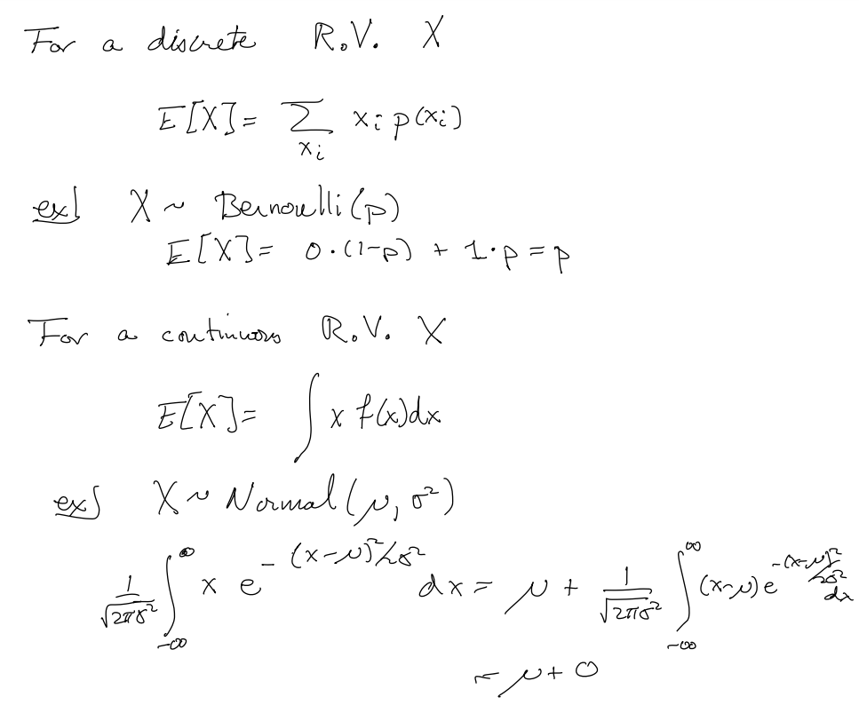

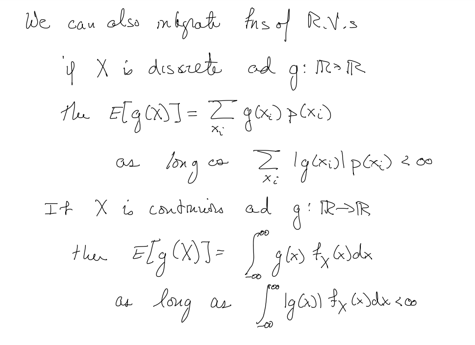

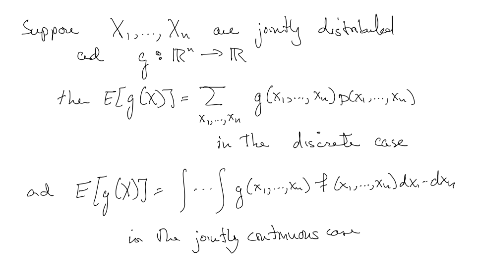

### Independence

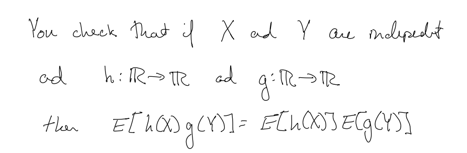

### Linearty

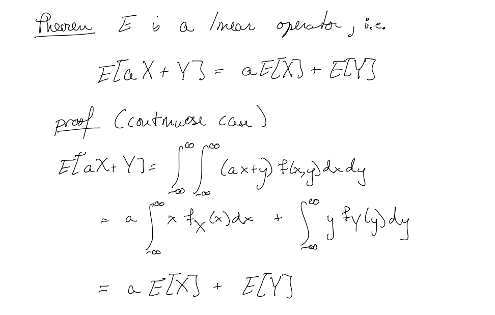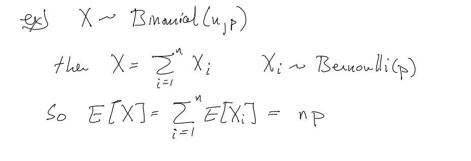

## Variance

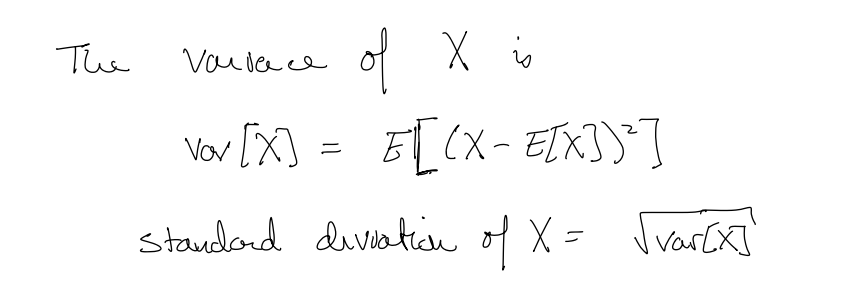

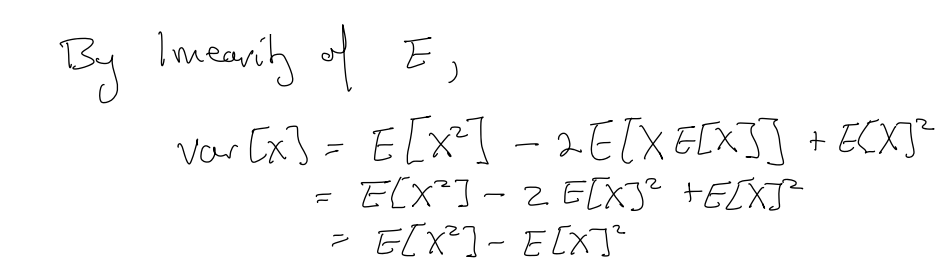

### Not Linear

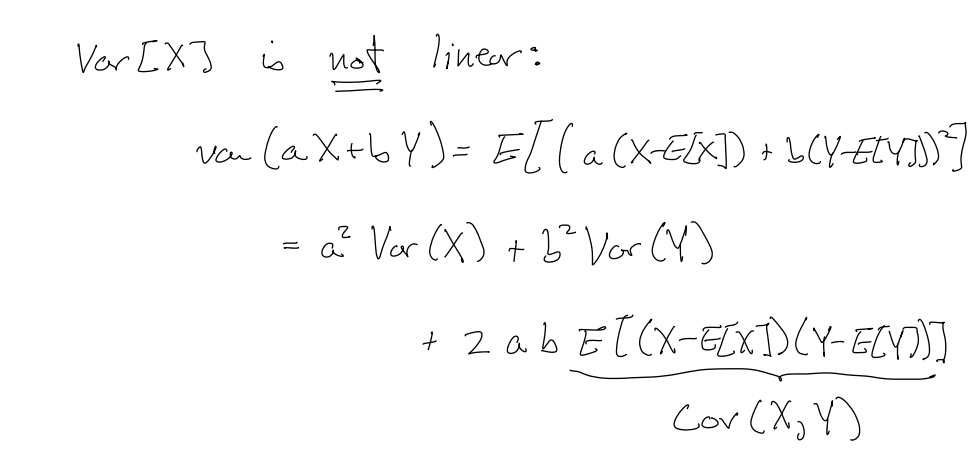

> ### Covariance $Cov(X,Y)$
>
> 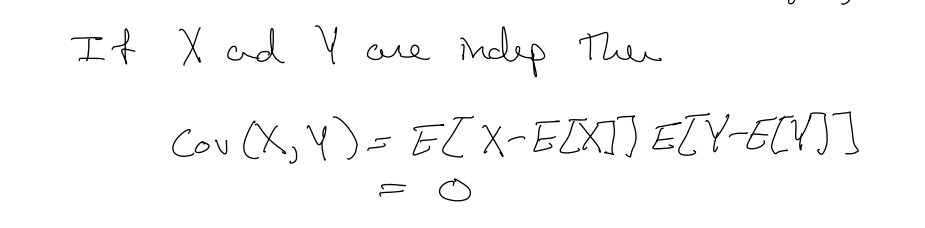

### Examples

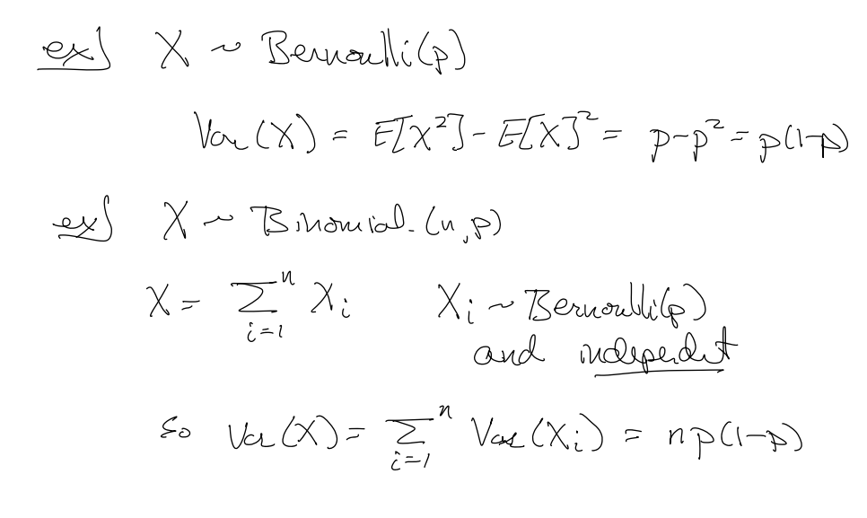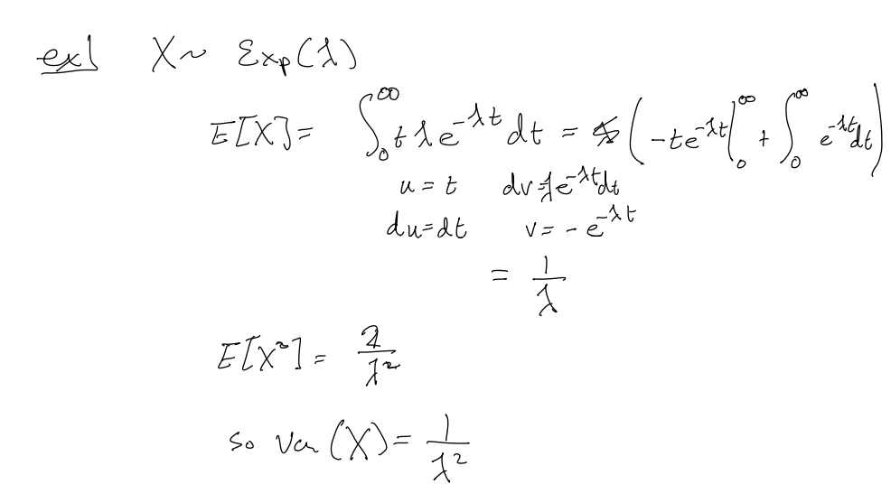

## Some Bounds

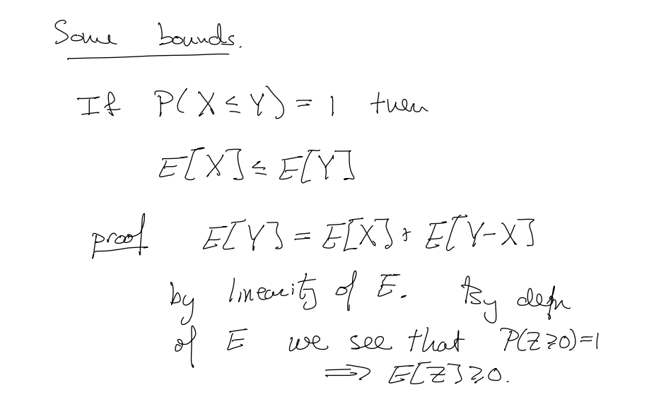

### Markov Inequality

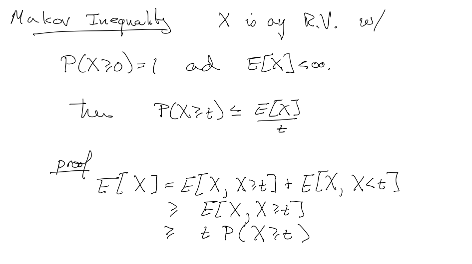

### CHebyshev Inequality

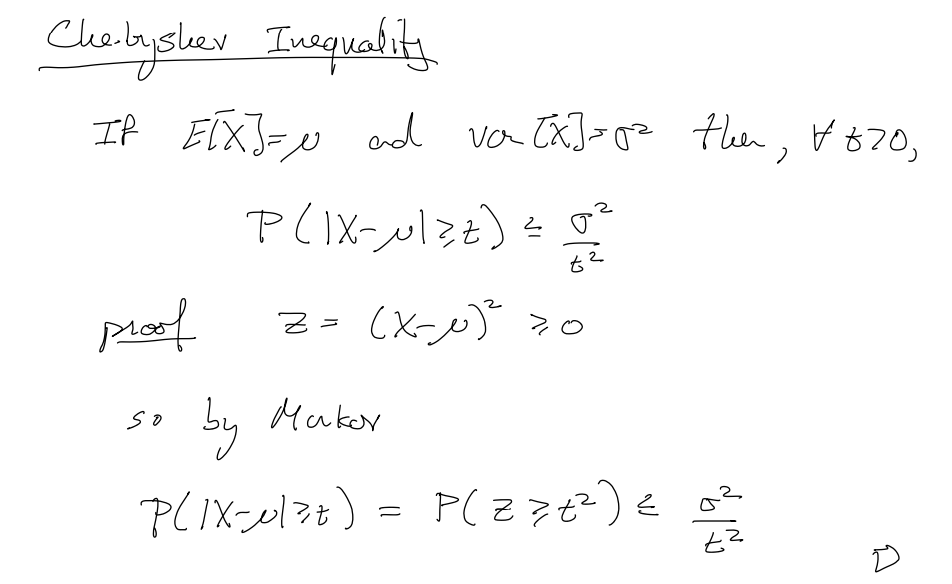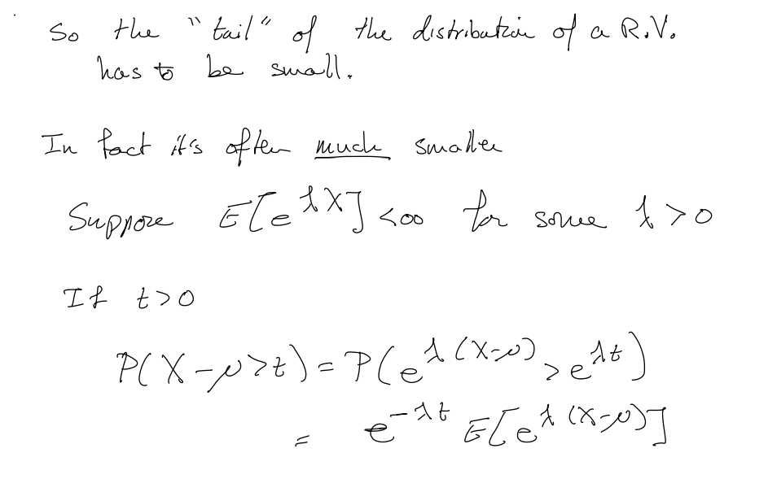