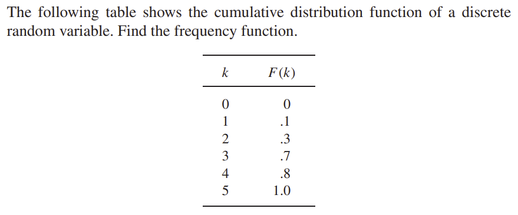
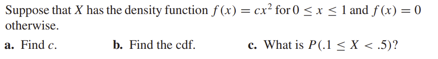
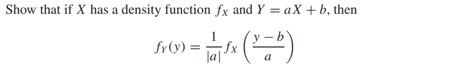

# Mathematical Statistics: HW 1

Due Feb 2, 2023

1. Chapter 1, Exercise 5

    Let $A$ and $B$ be arbitrary events. Let $C$ be the event that either $A$ occurs or $B$ occurs, but not both. Express $C$ in terms of $A$ and $B$ using any of the basic operations of union, intersection, and complement.

    <u>**Answer:**</u>

    Since $C$ means $A$ or $B$ occurs, but not both, we have 
    $$
    C= A\cup B-A\cap B = (A\cap B^c)\cup (B\cap A^c)
    $$

    

    

2. Chapter 1, Exercise 11

    The first three digits of a university telephone exchange are $452$. If all the sequences of the remaining four digits are equally likely, what is the probability that a randomly selected university phone number contains seven distinct digits?

    <u>**Answer:**</u>

    Since there are 3 digits already used, for the forth digit, we have $7$ different choice, and $6$ choice for the next one, and so on. Also, if we don't consider the repetition, we have $10$ cases for each digit. Therefore, the result is:
    $$
    \frac{7*6*5*4}{10^4} = 0.084
    $$
    

    

    

3. Chapter 1, Exercise 46

    Urn A has three red balls and two white balls, and urn B has two red balls and five white balls. A fair coin is tossed. If it lands heads up, a ball is drawn from urn A; otherwise, a ball is drawn from urn B. 

    a. What is the probability that a red ball is drawn?

    b. If a red ball is drawn, what is the probability that the coin landed heads up?

    <u>**Answer:**</u>

    Let $A$ be the event that the coin lands heads up, $B$ be the event that the coin land tails up. $R$ be the event that the red ball is drawn, $W$ be the event that the white ball is drawn. 

    

    a. $P(A) = P(B) = 0.5$

    $P(R) = P(R|A)P(A)+P(R|B)P(B) = \frac{3/5+2/7}{2} \approx 0.443$

    

    b. $\displaystyle P(A|R) = \frac{P(AR)}{P(R)} = \frac{P(R|A)P(A)}{P(R|A)P(A)+P(R|B)P(B)}= \frac{3/5}{3/5+2/7} \approx 0.677$

    

    

    

4. Chapter 1, Exercise 54

    This problem introduces a simple meteorological model, more complicated versions of which have been proposed in the meteorological literature. Consider a sequence of days and let $R_i$ denote the event that it rains on day $i$. Suppose that $P(R_i| R_{i−1}) = \alpha$ and $P(R^c_i|R^c_{i−1}) = \beta$. Suppose further that only today’s weather is relevant to predicting tomorrow’s; that is, $P(R_i | R_{i−1} \cap R_{i−2} ∩···∩ R_0) = P(R_i | R_i−1)$. 

    a. If the probability of rain today is $p$, what is the probability of rain tomorrow? 

    b. What is the probability of rain the day after tomorrow? 

    c. What is the probability of rain $n$ days from now? What happens as $n$ approaches infinity?

    <u>**Answer:**</u>

    a.  
    $$
    \begin{align*}
    P(R_{i+1}) &= P(R_{i+1}|R_i)P(R_i)+P(R_{i+1}|R^c_i)P(R^c_i) \\
    &= \alpha p +(1-\beta)(1-p) \\
    &= \alpha p + 1-\beta -p+\beta p \\
    &= 1-\beta +\alpha p  -p+\beta p \\
    &= 1-\beta + p(\alpha+\beta-1)\\
    &= 1-\beta + P(R_i)(\alpha+\beta-1)
    \end{align*}
    $$
    b. 
    $$
    \begin{align*}
    P(R_{i+2}) &= 1-\beta + P(R_{i+1})(\alpha+\beta-1)\\
    &= 1-\beta + (1-\beta + p(\alpha+\beta-1))(\alpha+\beta-1)\\
    &= 1-\beta + (1-\beta +\alpha p  -p+\beta p)(\alpha+\beta-1)\\
    &= (\alpha+\beta-1)^2 p +(1-\beta)(\alpha+1)-(1-\beta)^2
    \end{align*}
    $$
    c.
    $$
    \begin{align*}
    P(R_{i+n}) &= P(R_{i+n}|R_{i+n-1})\cdot P(R_{i+n-1})+P(R_{i+n}|R^c_{i+n-1})P(R^c_{i+n-1})\\
    &= (\alpha+\beta-1)\cdot P(R_{i+n-1})+1-\beta\\
    &= (\alpha + \beta - 1)^2\cdot P(R_{i+n2})+(1-\beta)(\alpha+\beta-1+1)\\
    &= (\alpha + \beta - 1)^n\cdot p+(1-\beta)\sum^{n-1}_{k=0}(\alpha+\beta-1)^k\\
    &= (\alpha+\beta-1)^n\cdot p+(1-\beta)\cdot \frac {(\alpha+\beta-1)^n-1}{\alpha+\beta-2}
    \end{align*}
    $$
    Since $0<\alpha<1$, $0<\beta<1$. So $|\alpha+\beta-1|<1$, so $\lim_{n\rightarrow\infty}(\alpha+\beta-1)^n = 0$

    So $\displaystyle \lim_{n\rightarrow\infty}P(R_{i+n})= \lim_{n\rightarrow\infty}(\beta-1)\cdot \frac{1}{\alpha+\beta-2} = \frac{\beta-1}{\alpha+\beta-2}$

    

    

    

5. Chapter 1, Exercise 71

    Show that if $A$, $B$, and $C$ are mutually independent, then $A\cap B$ and $C$ are independent and $A\cup B$ and $C$ are independent.

    <u>**Answer:**</u>

    If $A,B,C$ mutually independent, we have:

    $P(A\cap B\cap C) = P(A)P(B)P(C)$

    $P(A\cap B) = P(A)P(B)$

    $P(C\cap B) = P(C)P(B)$

    $P(A\cap C) = P(A)P(C)$

    Therefore, $P((A\cap B)\cap C) = P(A\cap B\cap C) = P(A)P(B)\cdot P(C) = P(A\cap B)P(C) $

    Thus $A\cap B$ and $C$ are independent

    Also, 
    $$
    \begin{align*}
    P((A \cup B) ∩ C) &= P((A∩C) \cup (B∩C)) \\
    &= P(A∩C)+P(B∩C)-P(A∩B∩C) \\
    &= P(A)P(C)+P(B)P(C)-P(A)P(B)P(C) \\
    &= \big(P(A)+P(B)-P(A∩B)\big){P(C)}\\
    &= P(A\cup B)P(C)
    \end{align*}
    $$
    Thus $A\cup B$ and $C$ are independent

    

    

    

    

6. Chapter 2, Exercise 3

    

    <u>**Answer:**</u>
    $$
    p(1) = 0.1-0 = 0.1\\
    P(2) = 0.3-0.1 = 0.2\\
    p(3) = 0.7-0.3 = 0.4\\
    p(4) = 0.8-0.7 = 0.1\\
    p(5) = 1.0-0.8 = 0.2
    $$

    | $k$  | $f(k)$ |
    | ---- | ------ |
    | 1    | 0.1    |
    | 2    | 0.2    |
    | 3    | 0.4    |
    | 4    | 0.1    |
    | 5    | 0.2    |

    

    

    

    

7. Chapter 2, Exercise 40

    

    <u>**Answer:**</u>

    a.
    $$
    \int^1_0 cx^2 = 1 = \frac{cx^3}{3}\Bigg|^1_0 = \frac c3\\
    $$
    ​        Therefore $c = 3$

    b. 
    $$
    F_X(x) = \int^x_0 3x^2 = x^3 \Bigg|^x_0 = x^3\\
    F_X(x) = 
    \begin{cases}
    0, \qquad x<0\\
    x^3, \quad   0\le x<1\\
    1, \qquad x\ge 1
    \end{cases}
    $$
    c.
    $$
    P(0.1\le X<0.5) = F_X(0.5)-F_X(0.1) = 0.5^3-0.1^3 = 0.124
    $$
    

    

    

    

8. Chapter 2, Exercise 46

    $T$ is an exponential random variable, and $P(T < 1) = .05$. What is $\lambda$?

    <u>**Answer:**</u>

    Let $T$ be an exponential random variable. Therefore, $T\sim Exp(\lambda$. 

    Thus we have $F_T(t) = 1-e^{-\lambda t}$

    $P(T<1) = F_T(1) = 1-e^{-\lambda} = 0.05$

    Thus $e^{-\lambda} = 0.95$

    $\lambda = -\ln{0.95}\approx 0.051$

    

    

9. Chapter 2, Exercise 62

    

    <u>**Answer:**</u>
    $$
    Y = aX+b
    $$

    1. if $a< 0$
        $$
        F_Y(y) = P(Y\le y) = P(aX+b\le y) = P(X\ge \frac{y-b}{a}) = 1-F_X(\frac{y-b}{a})
        $$
        Take derivative of both sides: 
        $$
        f_Y(y) = -\frac{1}{a}f_X(\frac{y-b}{a})
        $$
        

    2. if $a> 0$
        $$
        F_Y(y) = P(Y\le y) = P(aX+b\le y) = P(X\le \frac{y-b}{a}) = F_X(\frac{y-b}{a})
        $$
        Take derivative of both sides: 
        $$
        f_Y(y) = \frac{1}{a}f_X(\frac{y-b}{a})
        $$

    

    Therefore, we have
    $$
    f_Y(y) = \frac{1}{|a|}f_X(\frac{y-b}{a})
    $$
    

