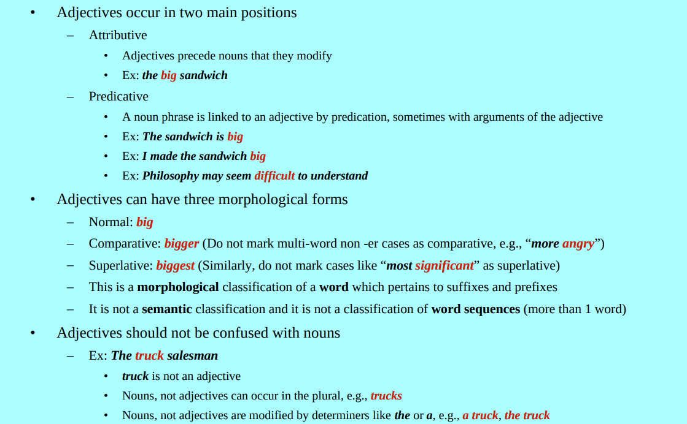
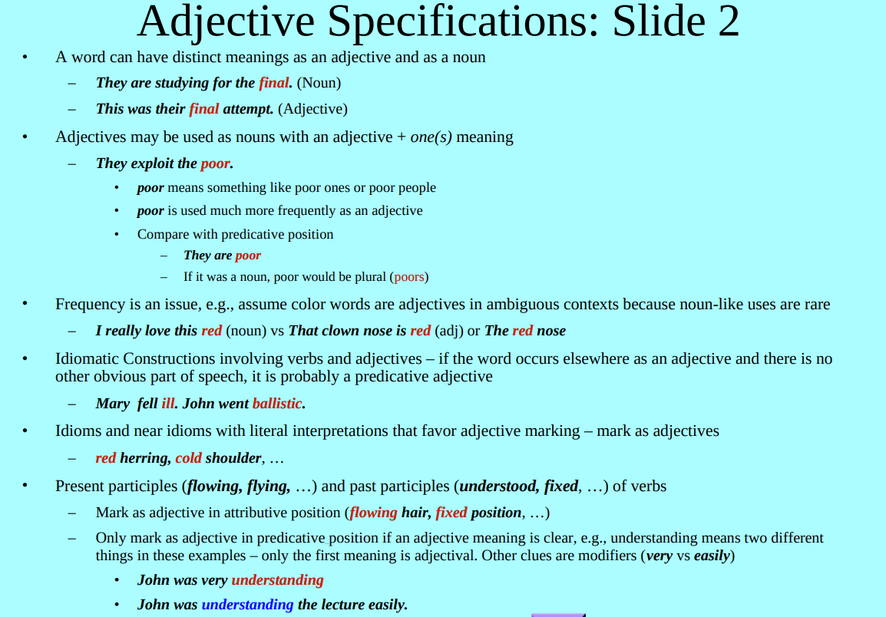
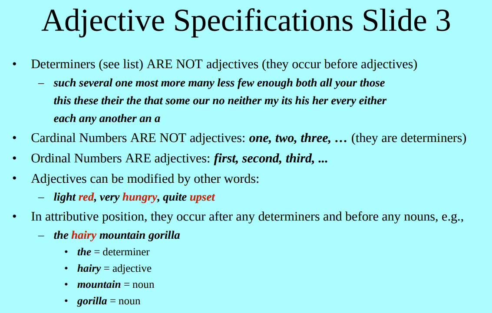
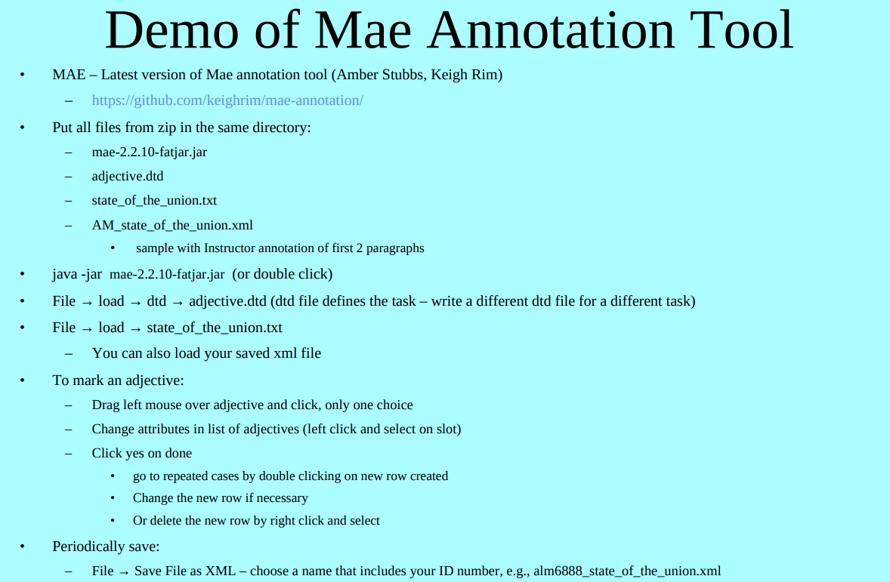
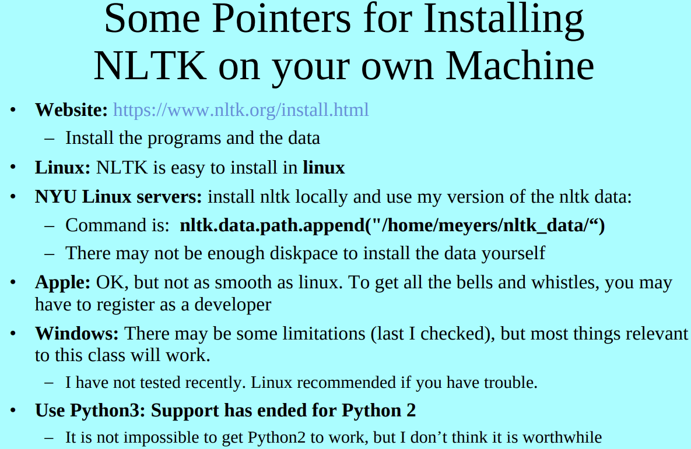

# NLP: intro

[TOC]

## Outline

* Administrative Matters – Grades, Exams, Policies, etc.
* Assignment 1: A Manual Annotation Task 
* Text Books and Suggested Reading 
* Discussion of Background Knowledge 
* Defining the Field 
* CL Applications
* Types of Text Analysis used in CL 
* Summary and Syllabus

## Class Info

### Schedule

==January 24 ---- May 5==

<u>Classes</u>: Tuesday & Thursday 9:30AM to 10:45PM 

<u>Room</u>: Silver 408 

[No Class: Tues Mar 14, Thurs Mar 16 ]

### Useful Information and tools

<u>Professor and TA</u>: 

* Office Hours: https://cs.nyu.edu/courses/spring23/CSCI-UA.0480-057/priv/links.html

* Prof email: meyers@cs.nyu.edu

<u>Course Website:</u>

* https://cs.nyu.edu/courses/spring23/CSCI-UA.0480-057/

<u>Data for Assignments and Final Project</u>: 

* https://drive.google.com/drive/u/3/folders/1a7La0Vqq1Q47wXpMG38gl3pMl_IxZ-6L 
* Sign in with your net id and password to gain access 
* Members of class are in a google group with access to the above link 
    * sp23_csci-ua_480_1_057_251844

### Goal of Class

* Overview of the field of Natural Language Processing
    * Evaluation based on midterm and long & short homework assignments 
* Work on a Longer Term Project with a Paper 
    * Evaluation based on Final Projects (and long homework assignments) 
    * Wider implications: conference papers, CV, grad school; job applications

### Grading

* 30% Long HW + 30%Midterm + 5% Short HW + 35% Final Project

* Long Homework – 6 Assignments (1st half of semester)
    * 1 annotation assignment & 4 shared tasks submitted through Gradescope
    * 1 Final project proposal (submitted through Brightspace)
* Short Homework: 
    * based on Assigned Readings & Lectures for second ½ Semester 

#### Midterm

* paper and pen/pencil test in class
* covers Lectures, Reading Material and HW for the first ½ Semester 

#### Final Project

* All final projects will be done by 3 or 4 student teams

* Details on Final Project Website 
* A paper supported by experiments 
    * A program that performs a task and scored against an answer key. Discuss task, methods, evaluation, previous work, etc. 
    * Annotation defining a task. Similar to program option. Evaluate for annotator consistency 
    * Evaluation of Systems – Papers about evaluation metrics, differences between systems, etc.
* Sample Topics 
    * https://cs.nyu.edu/courses/spring23/CSCI-UA.0480-057/final_project_info.html#Topics 
    * Slides for lectures include related final project descriptions
* Opportunities for feedback before final draft is due 
    * Final Project Proposal: Counts as 1 homework 
    * 30 Second Progress Reports 
    * First Draft (Optional) 
    * Short Talks 
    * Regular meetings with TA mentors 
* Will be evaluated based on written report (unusual for undergraduate STEM class)

## Assignment 1

https://cs.nyu.edu/courses/spring23/CSCI-UA.0480-057/homework1.html

### Adjective Specifications

### Mae Annotation Tool

## More Stuff to Read/Download, etc. 

* Look at projects currently going on at NYU: 
    * The Proteus website: http://nlp.cs.nyu.edu/ 
    * My website: http://nlp.cs.nyu.edu/people/meyers.html 
        * Termolator – an open source terminology extraction tool 
        * GLARF: processing tool written in Common Lisp (for linux) 
        * NomBank: annotation project 
        * COMLEX, NOMLEX: lexicon projects 
    * Web of Law – current research, including student researchers 
        * http://nlp.cs.nyu.edu/meyers/web_of_law.html 
            Final projects using this data is encouraged 
* Other useful links: 
    * Last term's NLP Class: https://cs.nyu.edu/courses/fall22/CSCI-UA.0480-057/ 
    * Association for Computational Linguistics: http://aclweb.org/ 
    * ACL repository of conference papers in NLP: http://aclweb.org/anthology/

## Linguistic Data Consortium 

* Their catalog: https://catalog.ldc.upenn.edu/ 
* They have data which may be useful for your final project and NYU has a license 
* If you need LDC data, contact me or the nyu library (this is a relatively new thing) 
    * If you are logged in to the library, try this link: https://catalog-ldc-upenn-edu.proxy.library.nyu.edu/ 
* LDC has different types of corpora (text), some of it manually annotated. 
    * Some data is already available elsewhere: freely downloadable or via the class Resources page

## Installing NLTK

