# NLP: Lecture 2

## Background

### Computer and Math Background 

 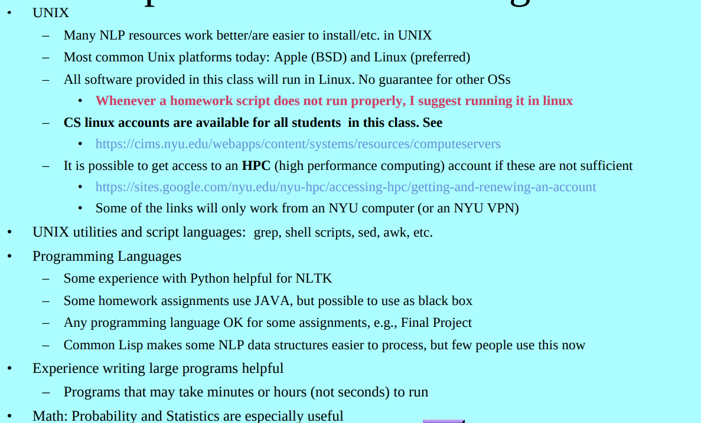

### Computational Linguistics Applications

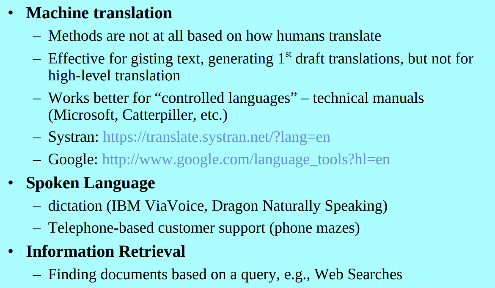

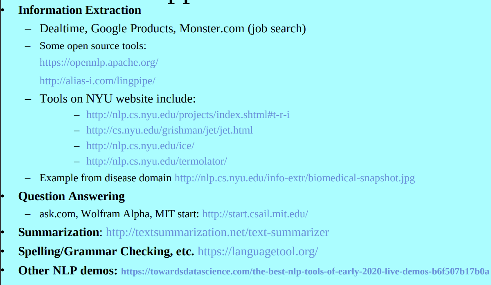

## Levels of Analysis

### Lowest Level Syntactic Processing (text)

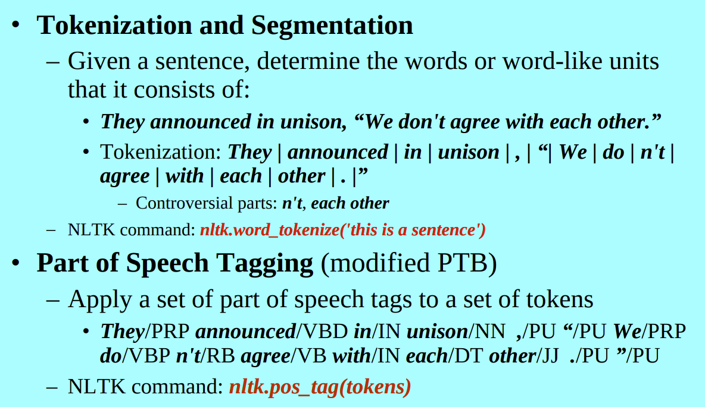

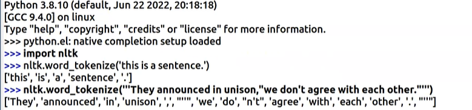

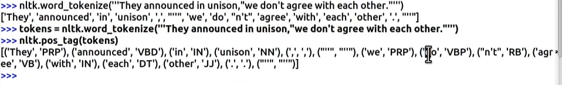

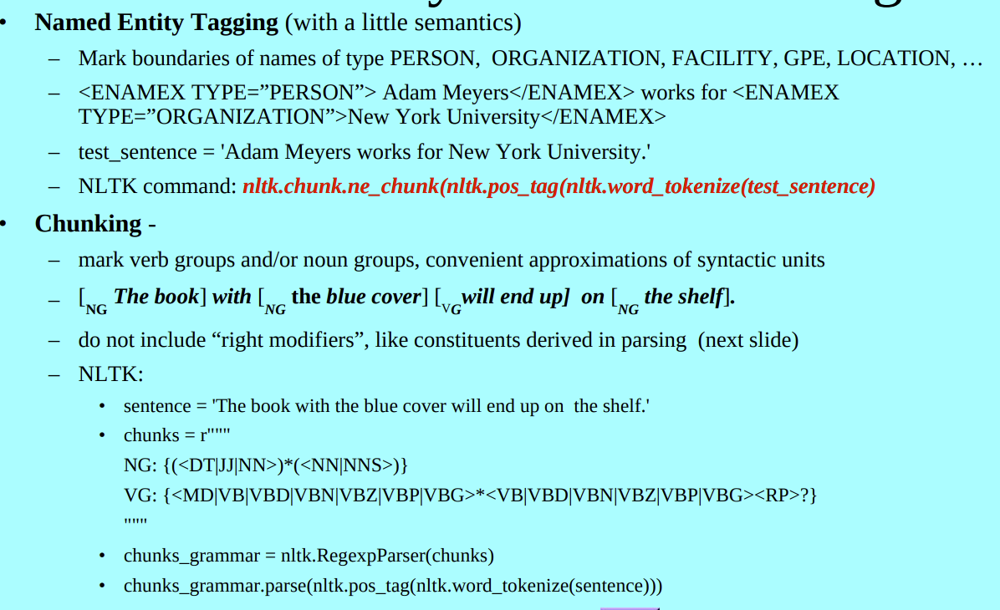

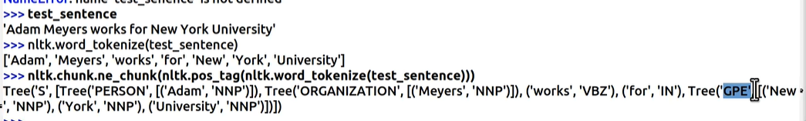

> Note that GPE here is wrong. NYU should be an organization

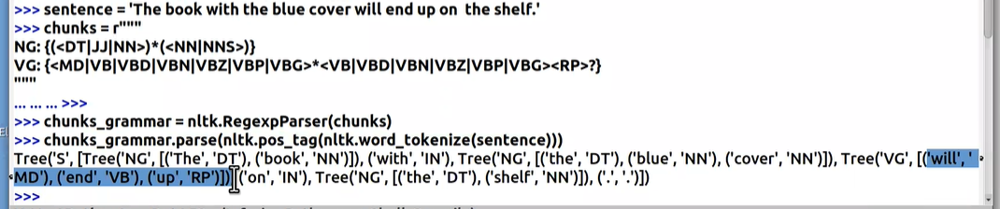

### Parsing: High Level Syntatic Processing

* Parsing is making one big structure for all the words in a sentence

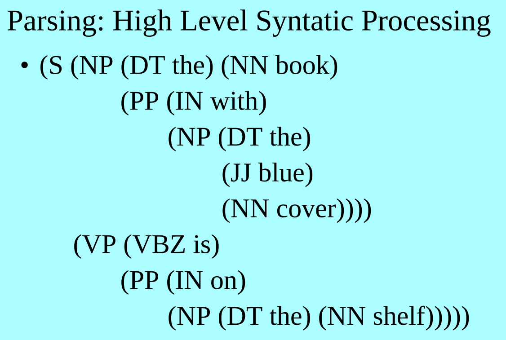

### Semantics

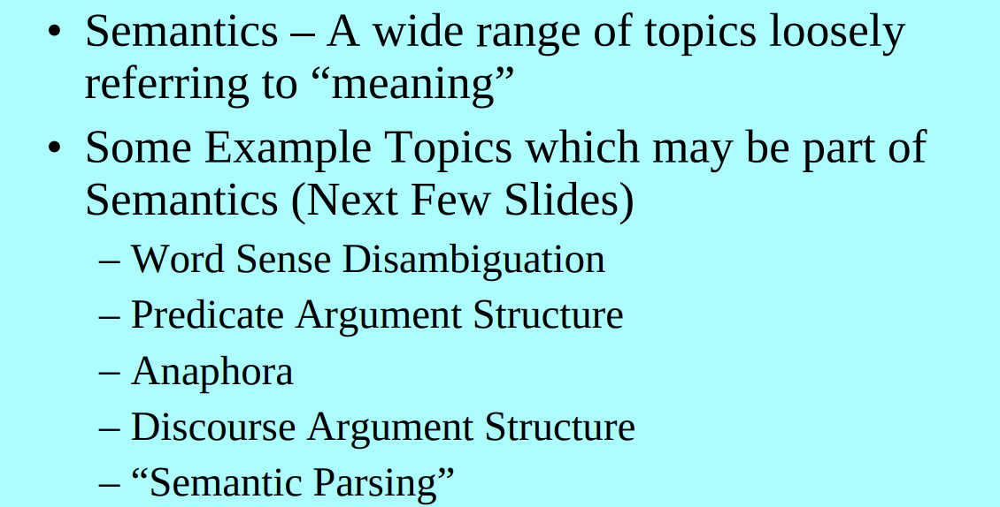