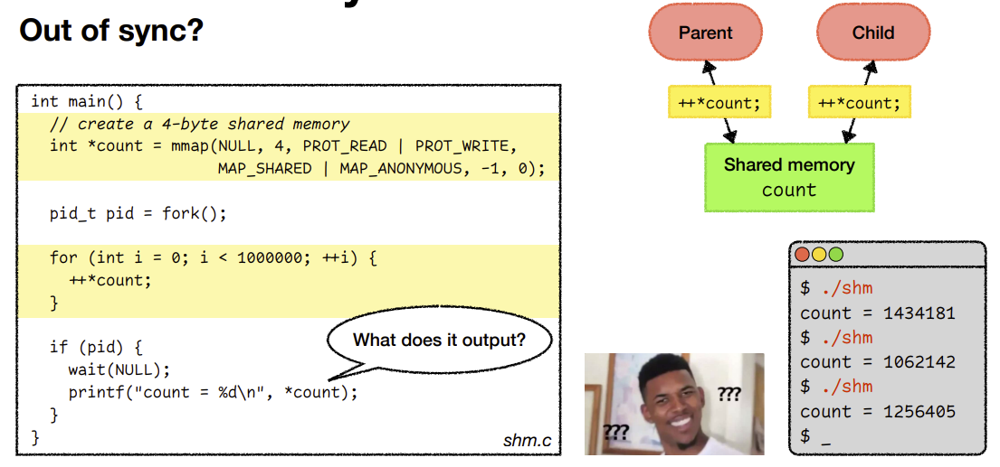
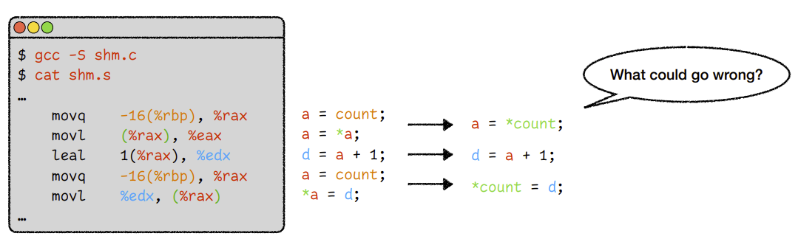
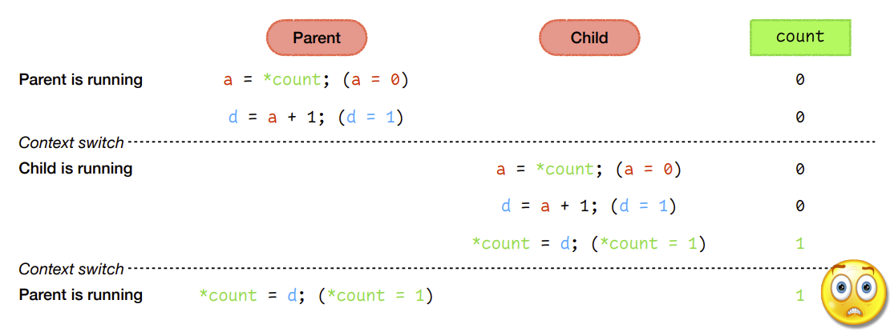
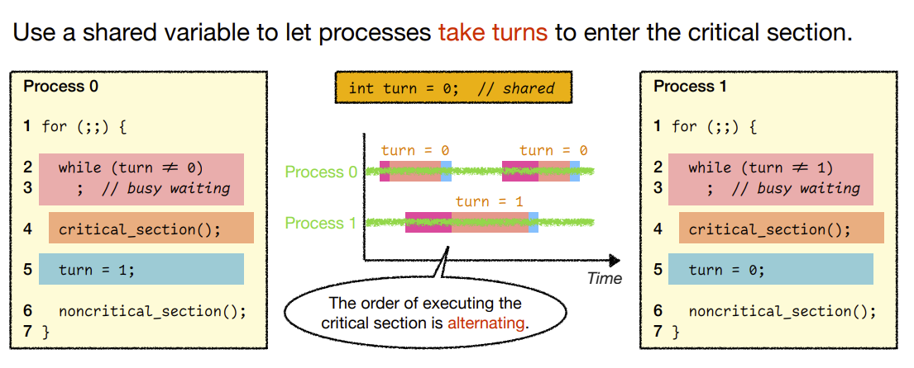

# OS Lecture 10

[TOC]

## Recall: race conditions (Data Races)

This scenario is called a **race condition** (or, more specifically, a **data race**). 

The results depend on the **timing** of the execution, i.e., the particular order in which the shared resource is accessed. 

**Race conditions are always bad…** 

* Worse yet, compiler optimizations may generate crazy output if your code has data races. 
* What if you compile the previous code with “gcc -O1” and “gcc -O2”? 
* To learn more about <a style='' href='https://en.wikipedia.org/wiki/Undefined_behavior'>undefined behavior</a> (a.k.a. “[nasal demons](http://catb.org/jargon/html/N/nasal-demons.html)”), read [Schrödinger’s Code](https://queue.acm.org/detail.cfm?id=3468263).

Because the computation is **nondeterministic**, debugging is no fun at all.

* [Heisenbug](https://en.wikipedia.org/wiki/Heisenbug): bugs that disappear or change behavior when you try to debug.

### Mutual exclusion

To avoid race conditions, we need **mutual exclusion**: 

* If one process is accessing a shared resource, 
* The other processes must be **excluded** from accessing the same thing. 

**Note**: race condition is a problem, and mutual exclusion is a requirement to avoid such a problem. 

* However, mutual exclusion may hinder the performance of parallel computations.

## Critical sections

A **critical section** (a.k.a. critical region) is a piece of code that accesses a shared resource.

### Requirements

### Attempt #1: disabling interrupts

### Attempt #2: using a “lock” variable

* **Busy Waiting**
    * The while loop keeps runing and running again. It's also called apinning
* **Priority Inversion Problem**
    * a high-priority process may have to wait for a low-priority process to relinquish resource.

### Attempt #3: strict alternation

### Attempt #4: Peterson’s algorithm

* When the while loop runs, we can wait for the other process. 
* When the while loop breaks, we can do our own work

### Attempt #5: spinlocks

> **Atomic operation**: The operation does a lot of things and can never be interrupted

* We can use the `test_and_set()` to set the `lock` to 1 and check its old value. 
    * If the value is already 1, it means someone else is in critical section, and we have to wait.
    * If it's 0, then we can enter the critical section

> If a scheduler is nonpreeptive, nothing can work

> Priority Inversion problem exists in this solution

#### Attempt #5.1: too much spinning?

* When the lock is 1, instead of waiting forever, we can just give up the CPU to others

### Attempt #6: semaphores

> Binary semaphore: the value of it is either 0 or 1

* `up()`
    * If there're more than one process blocked, it can choose any of the process to proceed.
    * there's no specific order

* Starvation?
    * Possible

### Summary

* Today we introduced **6 different attempts for critical sections**
* The first three attempts didn't actually work
* **<u>Peterson's algorithm</u>** was a good attempt back in the days, but now it doesn't work anymore
* **<u>Spinlocks</u>** and **<u>Semaphores</u>** are the two approaches that are widely used today
    * **Spinlocks** are mainly used for short critical sections, as it uses busy waiting
    * **Semaphores** put the processes to the block state instead of busy waiting, so that it doesn't waste CPU power

