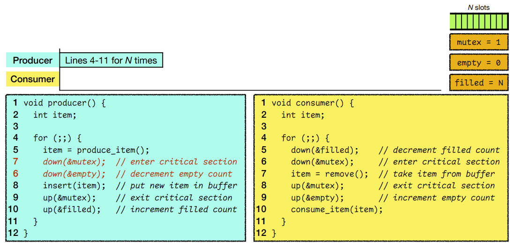
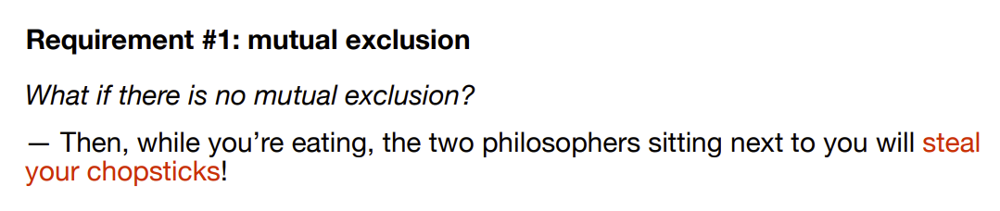
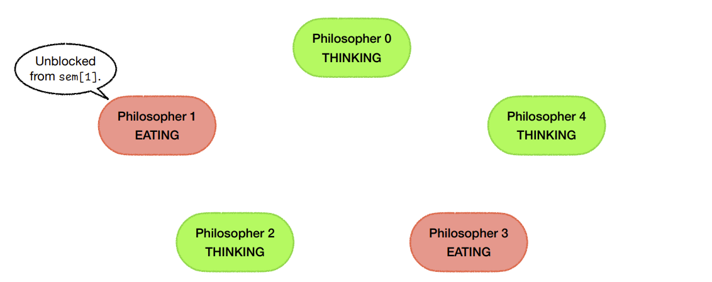

# OS: Lecture 11

[TOC]

## Review: Critical Sections

### Requirements

### Attempts

#### Attempt 5

* It's a good solution with some limitations
    * The critical section has to be small
    * The number of processes should not be more than the number of cores in your system

#### Attempt 6

## Classical IPC problems

## The producer-consumer problem

### Requirements

### Implementation using semaphores

* Only `insert()` and `remove()` are between the `down(mutex)` and `up(mutex)`, 
    * as we want our critical sections to be as short as possible
* `empty` counts the number of empty buffer slots
    * `down(&empty)`, if the buffer is already full and *empty* = 0, the **producer** is blocked
    * `up(&empty)` means that the **consumer** has removed something from the buffer and there's one more empty slot
        * If the **producer** was blocked, the consumer will wake up the producer by adding the *empty*
        * If it's not blocked, it means we still have plenty of empty space here
* `filled` counts the number of filled buffer slot, initial = 0
* 

#### If we swapped lines 6 & 7 in the producer…

#### deadlock

### Summary

**Mutual exclusion** 
A binary semaphore is used as a lock to protect the critical sections.

**Synchronization** 
Two counting semaphores are used to monitor the status of the buffer. oblem

## The dining philosopher problem

### Modeling

### Requirement #1: mutual exclusion

#### Attempt #1: mutex for each chopstick

### Requirement #2: synchronization

#### Attempt #2: mutex for each chopstick with backoff

#### Attempt #3: mutex for each chopstick with random backoff

#### Attempt #4: global mutex

#### Attempt #5: one semaphore per philosopher

### Summary

