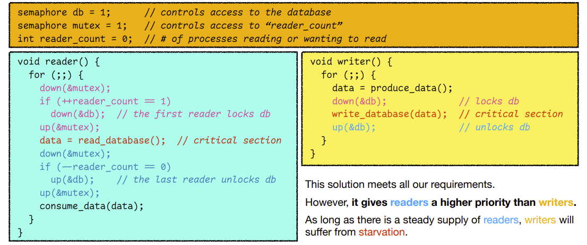

# OS: Lecture 12

[TOC]

## Review

### The producer-consumer problem 

### The dining philosopher problem 

## The readers and writers problem

### Accessing a database

### Requirements

### Attempt #1: mutex for the database

### Attempt #2: allow concurrent readers

## The sleeping barber problem

### The client-server model

### The solution

## IPC problems Summary

## Threads: lightweight processes

### What’s a thread?

A **thread** is an **execution entity within a process**. 

So far, we have only discussed **single-threaded** processes. 

A **multithreaded process** can have more than one execution in it. 

**Example**: a word processor may have… 

* A thread interacting with the user; 
* A thread formatting text in the background; 
* A thread handling automatic backups.

* This is different from `fork()`.
    * If you create a new process, the new process starts running from the `fork` function. 
    * But for a thread, the new thread can run starting with a specific function that you specified
* The thread will not return to its caller when ended.
    * A thread is s separate entity

* The Data section contains the global variables
* The Heap section contains the dynamically allocated memory
    * mainly from `malloc`
* These sections are shared between threads
    * If one thread calls `malloc` to allocate some memory, all the other threads has access to the same piece of memory
* Therefore, it's possible for multiple threads to have race conditions
    * because they have shared memories.

* Each thread has its own stack
    * That means, each thread has its own local variables
* However, the **Operating System Kernel** will **NOT** prevent a thread to access memory of another thread
    * Please don't do it

### Why threads?

## Thread models

### Where to implement threads?

**Many-to-one model** 

* Implement threads in user space. 

**One-to-one model** 

* Implement threads in the kernel.

**Many-to-many model** 

* Hybrid implementations.

### Many-to-one model

### One-to-one model

### Many-to-many model

## Midterm

