 #  OS: Lecture 13 - POSIX threads, condition variables, thread pool, thread safety 

[TOC]

## Thread Programming

### POSIX threads (`man 7 pthreads`)

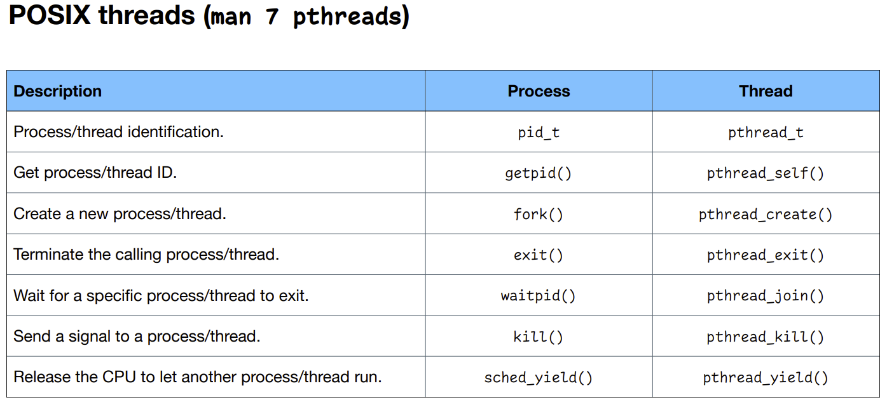

| Description                                        | Process         | Thread              |
| -------------------------------------------------- | --------------- | ------------------- |
| Process/thread identification.                     | `pid_t `        | `pthread_t `        |
| Get process/thread ID.                             | `getpid()`      | ` pthread_self()`   |
| Create a new process/thread.                       | `fork() `       | `pthread_create() ` |
| Terminate the calling process/thread.              | `exit() `       | `pthread_exit() `   |
| Wait for a specific process/thread to exit.        | `waitpid()`     | `pthread_join() `   |
| Send a signal to a process/thread.                 | `kill()`        | `pthread_kill() `   |
| Release the CPU to let another process/thread run. | `sched_yield()` | `pthread_yield()`   |

### `pthread` example

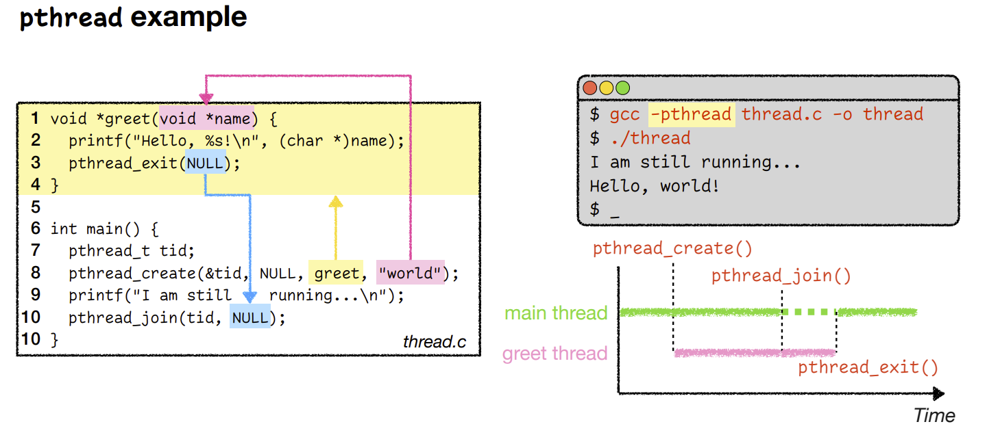

* ```
    int pthread_create(pthread_t *restrict thread,
                              const pthread_attr_t *restrict attr,
                              void *(*start_routine)(void *),
                              void *restrict arg);
    ```

* Note:

    * If your program contains threads
    * `#include <pthread.h>`
    * `gcc -pthread -o thread thread.c`

* We know that thread function never returns to the main function.

* But what if we **want** to return some value from child to the parent?

    * Note that the <span style='color:blue'>**NULL**</span> in blue can be the return value

### Mutual exclusion

A <span style='color:red'>**mutex object**</span> of type `pthread_mutex_t` is similar to a <span style='color:red'>**binary semaphore**</span>.

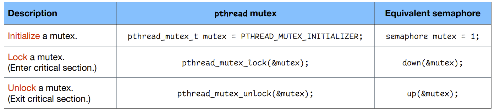

| Description                                                  | `pthread ` mutex                                     | Equivalent semaphore   |
| ------------------------------------------------------------ | ---------------------------------------------------- | ---------------------- |
| **<span style='color:tomato'>Initialize </span>**a mutex.    | `pthread_mutex_t mutex = PTHREAD_MUTEX_INITIALIZER;` | `semaphore mutex = 1;` |
| **<span style='color:tomato'>Lock </span>**a mutex. (Enter critical section.) | `pthread_mutex_lock(&mutex); `                       | `down(&mutex);`        |
| **<span style='color:tomato'>Unlock </span>**a mutex. (Exit critical section.) | `pthread_mutex_unlock(&mutex); `                     | `up(&mutex);`          |

**Note**: `pthread_mutex_t` cannot be used as counting semaphores.


### Semaphores

A **<span style='color:tomato'>semaphore object </span>**of type `sem_t` is similar to a **<span style='color:tomato'>counting semaphore</span>**.

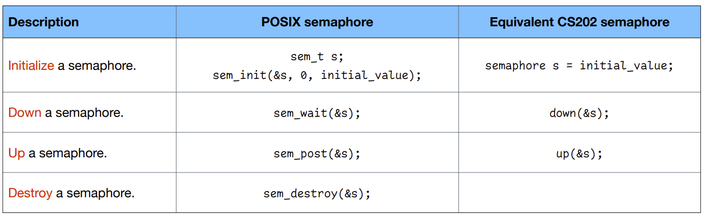

### Condition variables

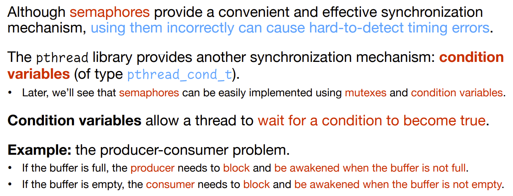

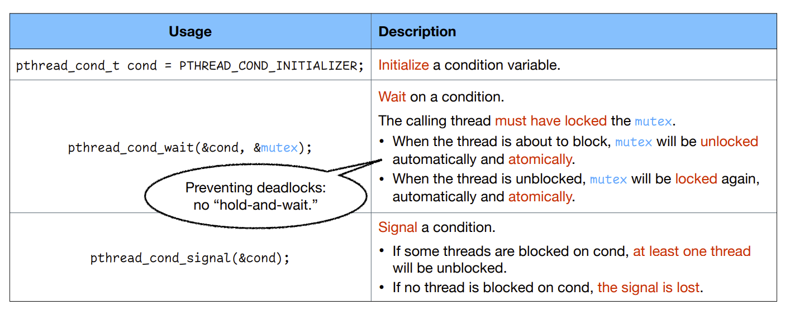

* The `wait` function basically puts the calling thread to the block state, and let it wait on the condition

    * Similar to `down`

* The `signal` function is called from another thread, that signals a condition

    * Similar to `up`

* If you knows that a condition becomes true, you call `pthread_cond_signal`, which wakes up the previous threads that have called `pthread_cond_wait`

    

* **<u>Note</u>** that the `pthread_cond_wait` has two arguments, 

    * it has `&mutex`as the second argument
    * The **<span style='color:tomato'>mutex</span>** **protects** our conditional variable
    * When you call the `pthread_cond_wait`, you must have the mutex locked
        * Call `pthread_mutex_lock(&mutex)` first
        * When the thread is about to block, <span style='color:royalblue'>mutex </span>will be unlocked automatically and atomically. 
        * When the thread is unblocked, <span style='color:royalblue'>mutex </span>will be locked again, automatically and atomically.
    * Basically, 
        * <u>Before you call it</u>, 	you **<span style='color:tomato'>hold</span>** the mutex
        * <u>When you are blocked</u>,  you **<span style='color:tomato'>release</span>** the mutex
        * <u>When you are unblocked(signal)</u>, you **<span style='color:tomato'>re-grab</span>** the mutex

    

* **<u>Note</u>** for the `pthread_cond_signal`

    * If there're more than one thread waiting for this signal, there's no guarantee that which one gets unblocked
        * It's possible that <span style='color:royalblue'>one or multiple thread</span> waiting gets unblocked
    * Therefore, if a thread gets <span style='color:red'>unblocked</span>, you still need to <span style='color:red'>check whether the condition is true</span>
        * In case that there are <span style='color:royalblue'>more than one threads</span> gets unblocked
    * If <span style='color:royalblue'>no thread</span> is waiting for the condition, the <span style='color:red'>signal is lost</span>

    

### The producer-consumer problem with `pthread`

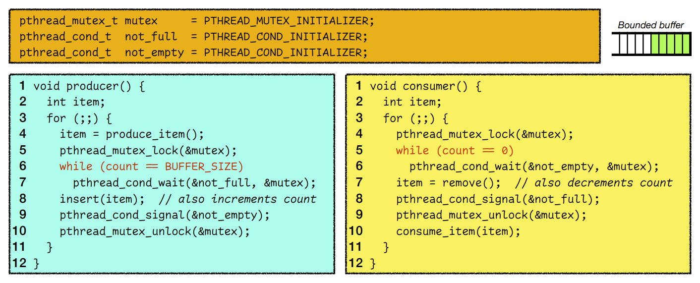

* Why we used `while` on line 6 and line 5?
    * Note that if there are multiple producers and consumers, there might be more than 1 producer or consumer gets unblocked, which will cause a race condition

### Implementing semaphores using mutexes and condition values

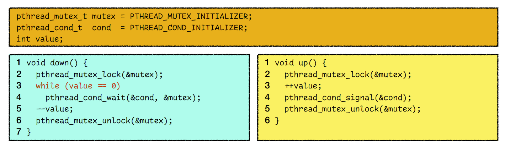

## Thread pool

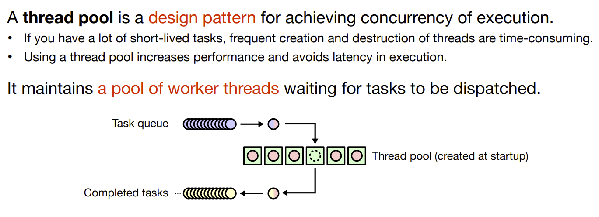

* This is what we are gonna do in <u>lab3</u>

* In **lab3**, you are asked to implement a **algorithm** to compress files

    * The way of doing it is to <span style='color:red'>divide your file into smaller **chunks**</span>
    * Then you use <span style='color:royalblue'>one thread</span> to <span style='color:royalblue'>compress every chunk</span>
    * You have essentially a large amount of small tasks

* Steps:

    1. In the beginning of our program, you **<span style='color:tomato'>allocate</span>** <span style='color:royalblue'>a number of threads</span>
    2. For each of the chunk of your data, you put it in a **<span style='color:tomato'>task queue</span>**
    3. Then the <span style='color:royalblue'>threads </span>in the thread pool <span style='color:red'>**grabs** the task from the task queue</span> one by one
    4. After it's done compressing, it puts the results to another queue called the **<span style='color:tomato'>completion queue</span>**
    5. And it keeps doing this forever (basically like an infinite loop)

    

## Thread safety

<span style="font-size:20px">Some data structures and functions are designed for single-threaded execution. </span>

* **Example**: `strtok()` uses a <span style='color:red'>static</span> buffer while parsing a string, thus <span style='color:tomato'>**not** </span>**thread safe**. 
    * Would be a race condition


<span style="font-size:20px;margin-top:10px">One way to achieve thread safety is to make the function **<span style='color:tomato'>reëntrant</span>**. </span>

* Multiple invocations can safely run concurrently. 
* The function may be interrupted in the middle of its execution and then safely be invoked again before its previous invocations complete. 
* This requires saving state information in variables local to each execution. 
* **Example**: `strtok_r()` is a reëntrant version of `strtok()`. It takes an extra argument that is used internally by `strtok_r()` to maintain context between successive calls that parse the same string.


## Summary

Using multiple threads is a convenient way to achieve… 

* Multitasking within a process; 
* A simple shared memory environment. 

However, you have to take care of… 

* Mutual exclusion; 
* Synchronization; 
* Thread safety.


## Lab 3: NYUEnc

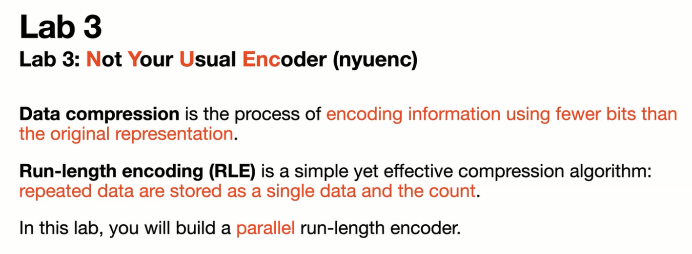

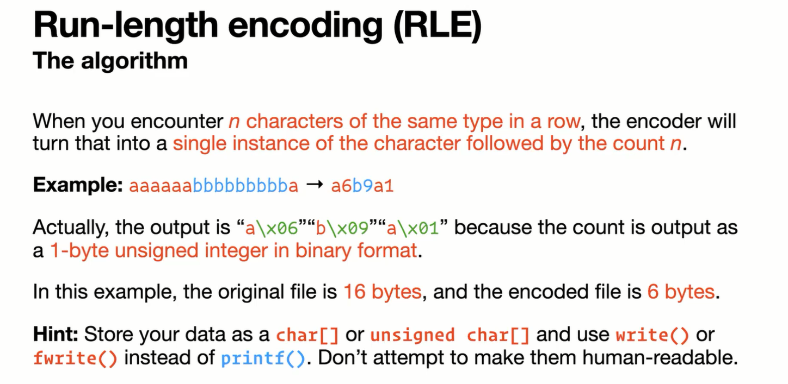

### Milestone 1

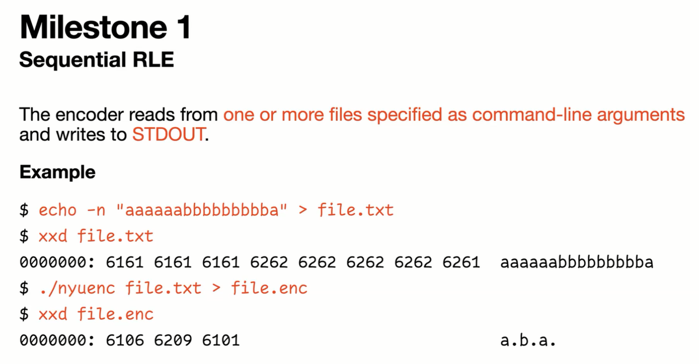

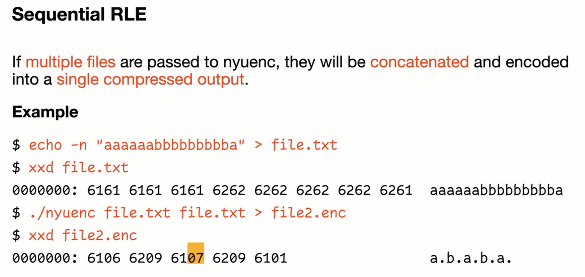

### Milestone 2

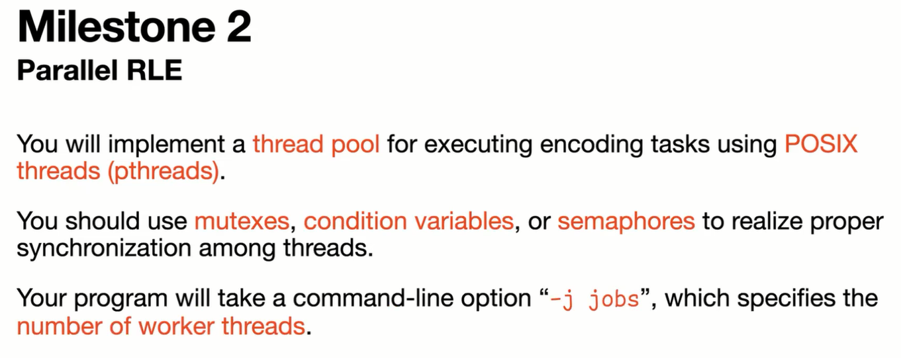

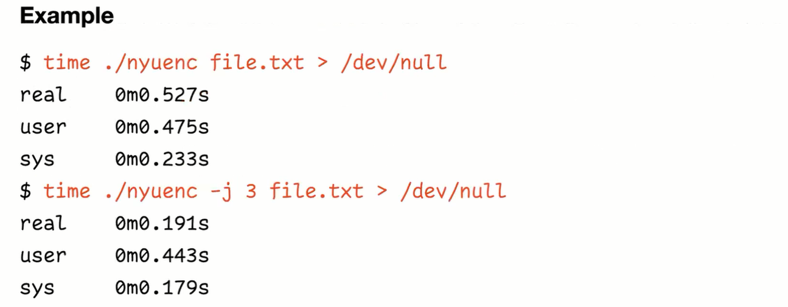

### How to parallelize the encoding?

Think about <span style='color:red'>what can be done in parallel</span> and <span style='color:red'>what must be done serially by a single thread</span>.

* <span style='color:royalblue'>Reading the file</span> and <span style='color:royalblue'>Splitting the file</span> must be done in the **<span style='color:tomato'>main thread</span>**
    * Because you have to calculate the size and the splitting point
    * Note the main thread shouldn't be actually reading the file
        You just calculate the split point and let each worker thread process the file
* Therefore, the <span style='color:royalblue'>encoding task</span> can be done in **<span style='color:tomato'>parallel</span>**
* In the end, you need to <span style='color:royalblue'>handle the output</span> in the **<span style='color:tomato'>main thread</span>**
    * Combine the last byte of the last block and the first byte of the second block into a single count

Also, think about <span style='color:red'>how to divide the necoding task into smaller pieces</span>

* The input files may vary greatly in size
    * Therefore, you cannot really split by file size
    * Instead, you should <span style='color:red'>split the input</span> by some <span style='color:tomato'>**fixed-size chunks**</span>
* Will all the worker threads be fully utilized?

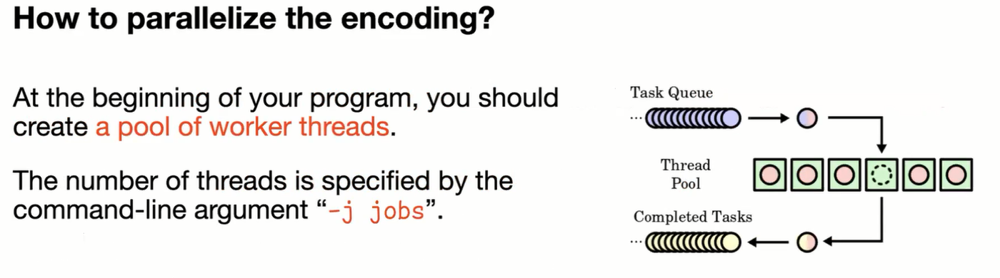

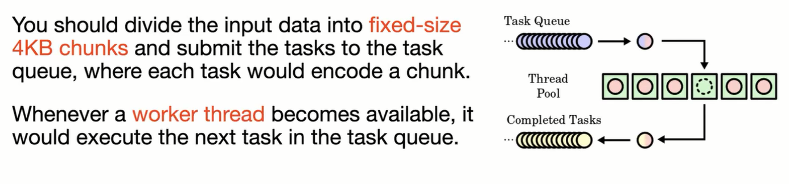

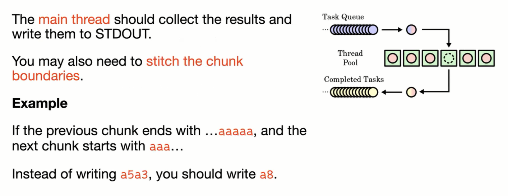

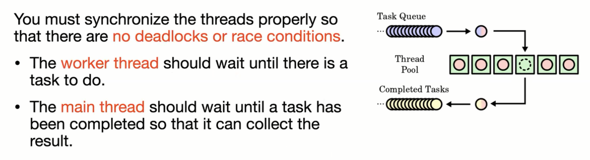

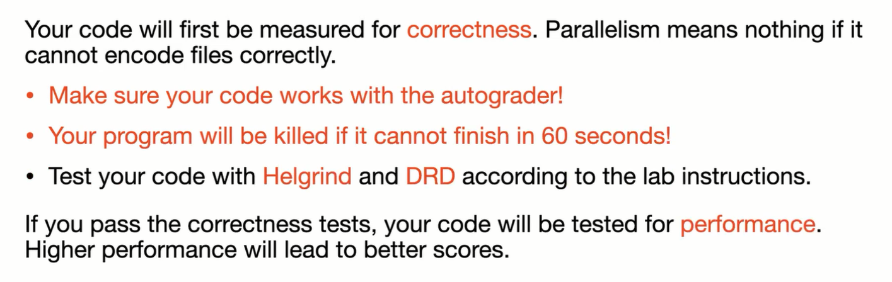

### Grading

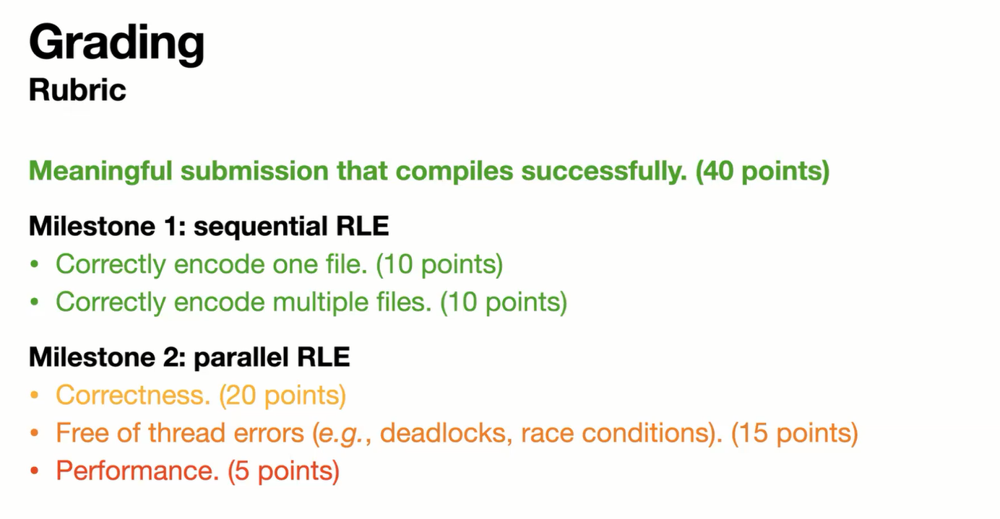

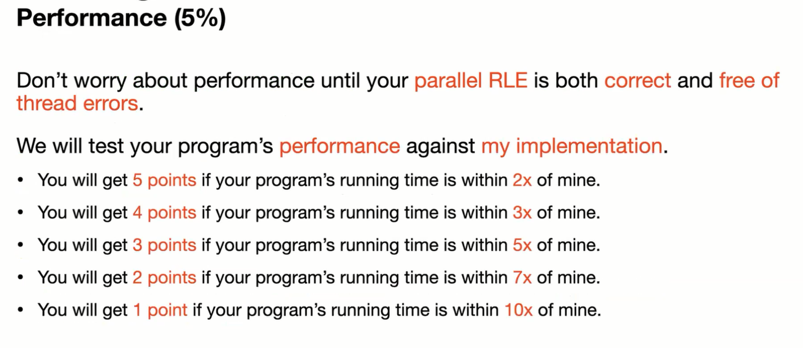
