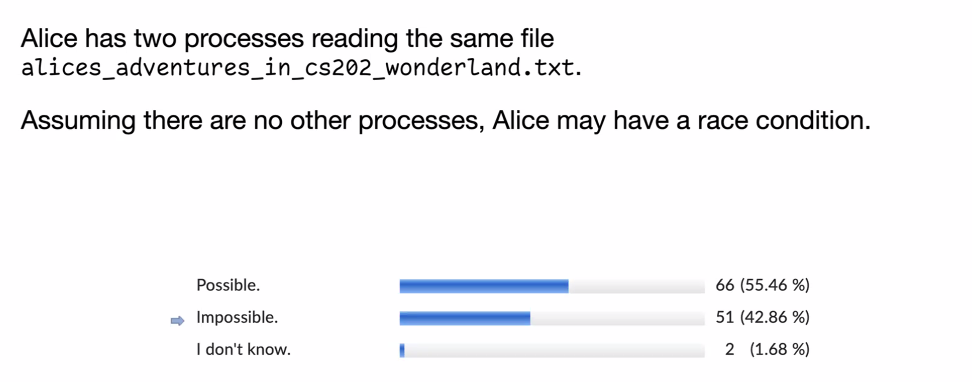
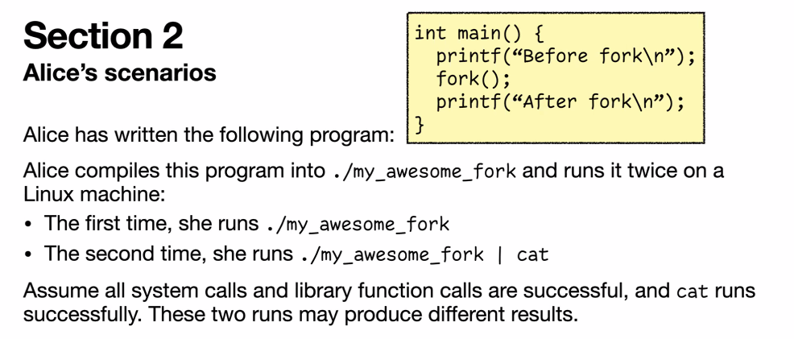
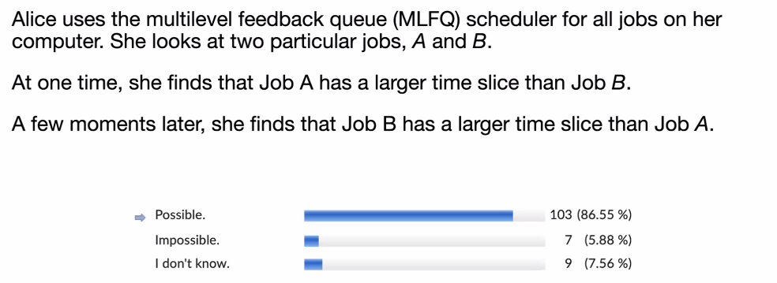
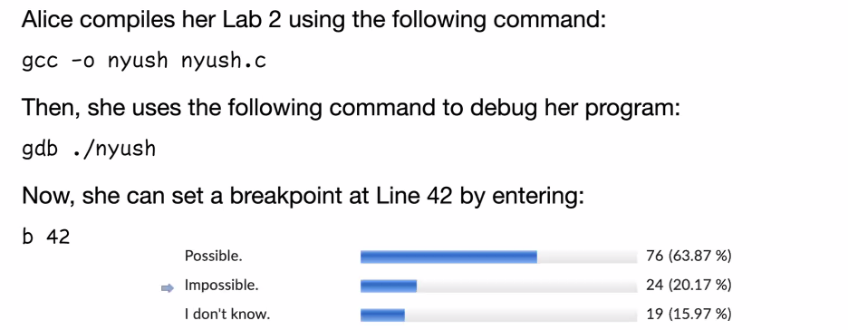
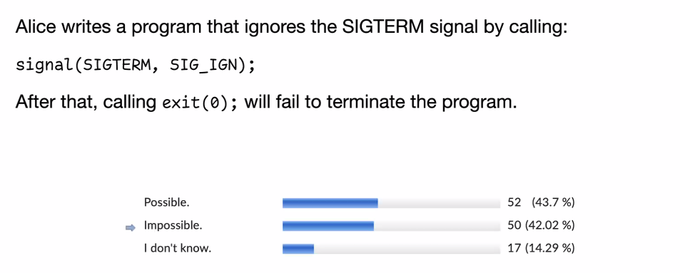
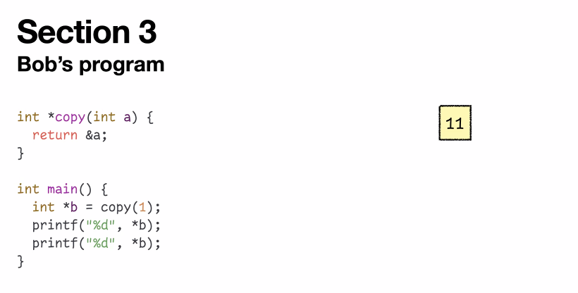
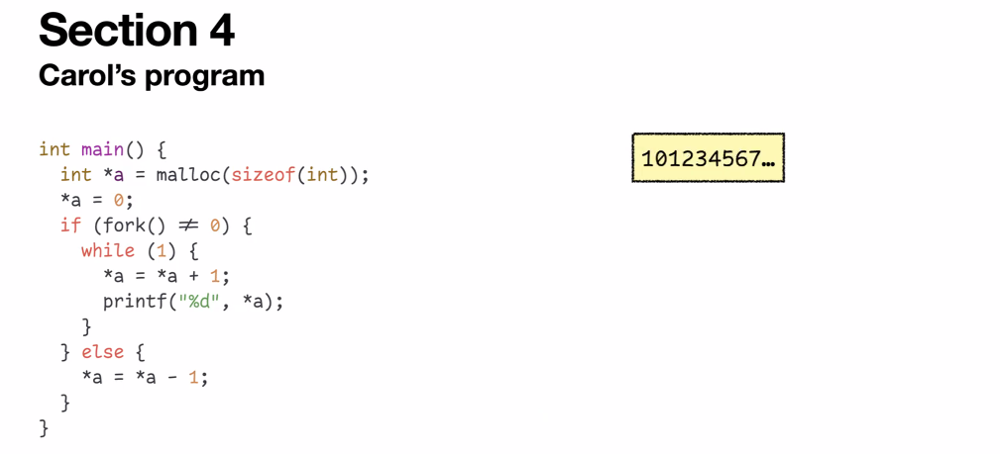
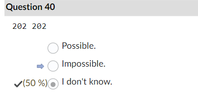
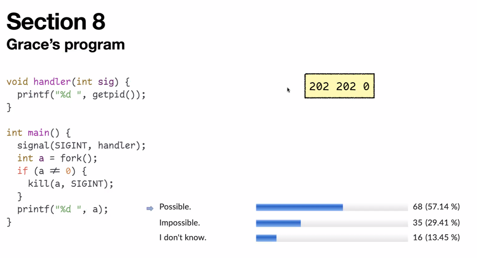
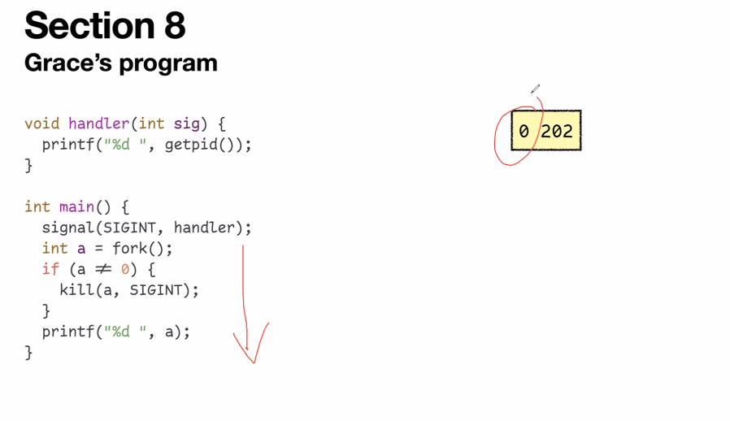

# OS: Midterm discussion

## Section 1

* Not necessary
* PID numbers can be reused

* `-O2` is the optimization flag
* faster but harder to debug
    * some instructions may disappear
    * some may be out of order
    * some functions may be gone

* False
* Should be the other way around
    * TRAP goes from user to kernel
* Return from TRAP

## Section 2

* If you copy from one docker container to another docker container, it should run just fine
* This is perfectly possible

* There cannot be a race condition if nobody is writing to the file
    * Nobody is modifying
    * The data is never changed
* Read only => No race condition

* possible
* File is fully buffered
    * before `fork()` nothing is printed
    * after `fork()` it's printed

* You have to use `-g` flag 

* `exit()` never fails
* `SIGTERM` is for interprocess conmmunication
* `exit()` is not implemented based on signals

* Real life scenario of the diner-philosopher problem

## Section 3

## Section 4

* Decrementing the number in child will never affect the parent

## Section 5

## Section 6

* calling wait in child process will fail
    * return -1
* calling wait in parent process will succeed
    * return pid of child

* you can not have 2 values if the first one is 202

## Section 7

## Section 8

* The child runs super fast
* when the parent send SIGINT, the child already printed 0 and terminated