# OS: 2023/03/23

[TOC]

## Deadlocks

### Example

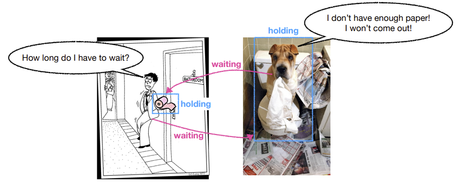

### Remember the deadlock in the producer-consumer problem?

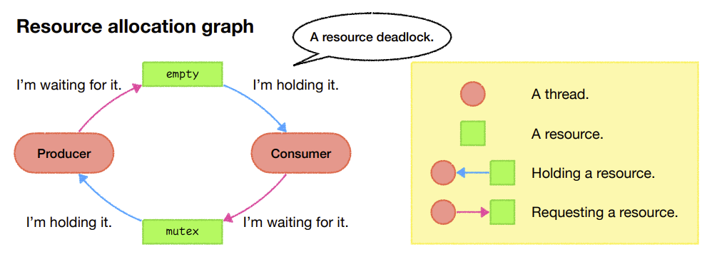

### Conditions for resource deadlocks

**Mutual exclusion** 

* Each resource is either available or currently assigned to exactly one thread. 

**Hold and wait** 

* Threads currently holding resources that were granted earlier can request new resources. 

**No preemption** 

* Resources previously granted cannot be forcibly taken away from a thread. 
* They must be explicitly released by the thread holding them. 

**Circular wait** 

* A cycle of 2+ threads, each of which is waiting for a resource held by the next member of the cycle.

## preventing deadlocks

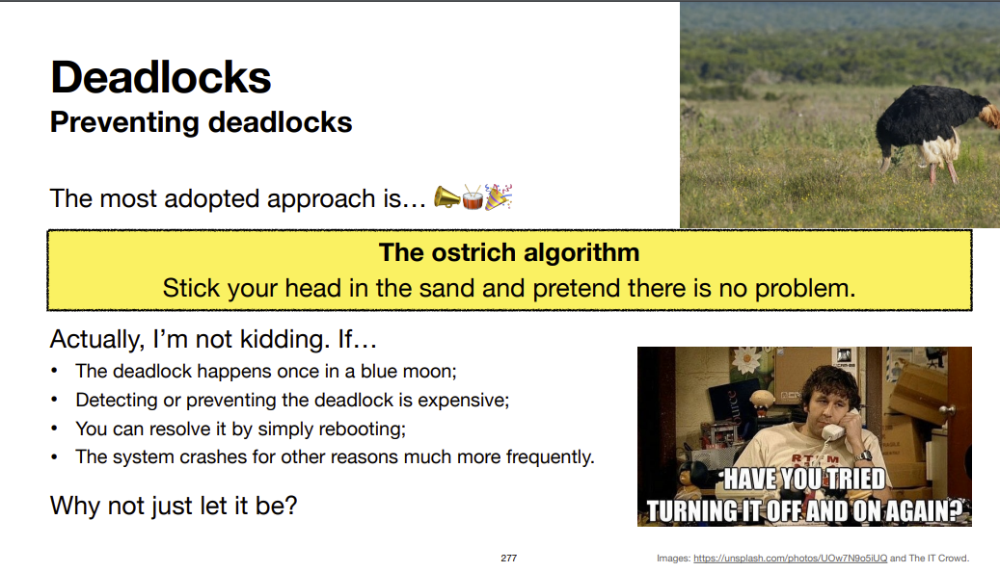

Let’s go back to the **four conditions**… 

* Mutual exclusion;
* Hold and wait; 
* No preemption; 
* Circular wait. 

If we can **attack any of them**, then deadlocks will be structurally impossible.

### Attack #1: no mutual exclusion

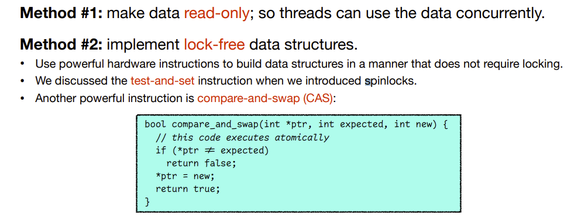

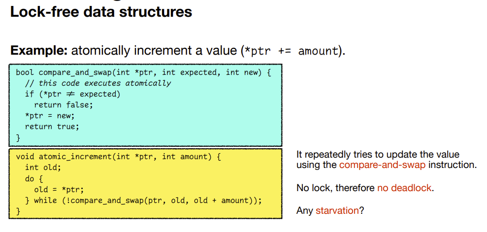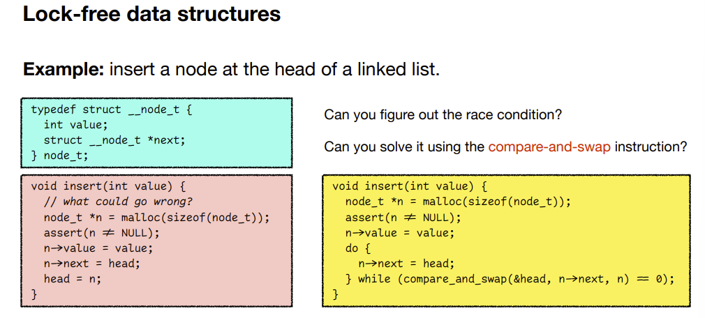

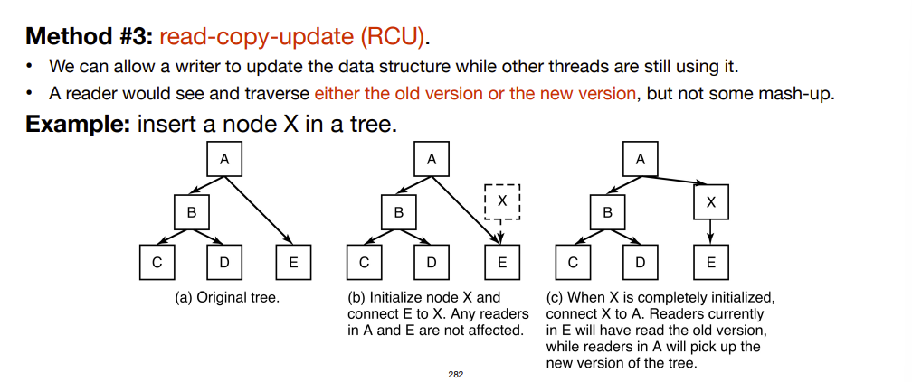

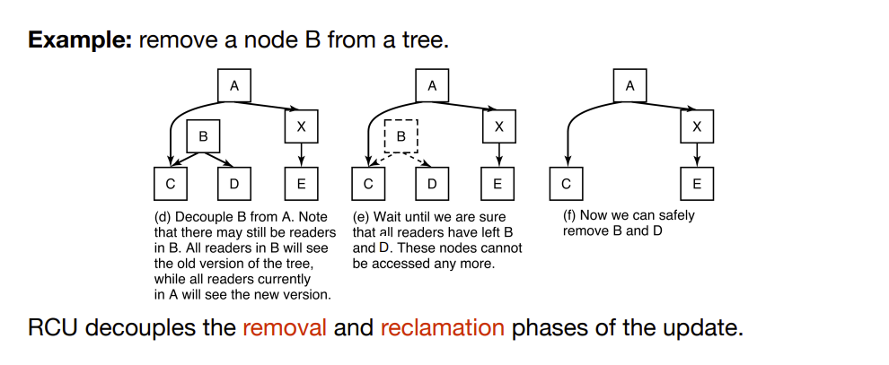

### Attack #2: no hold-and-wait

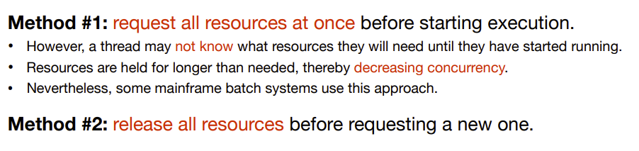

### Attack #3: no “no preemption”

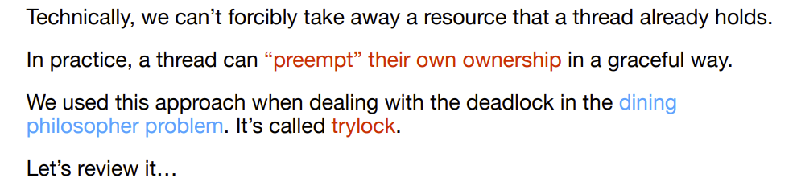

#### Review: the dining philosopher problem

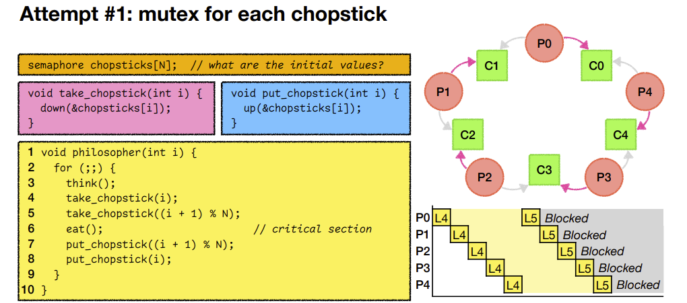

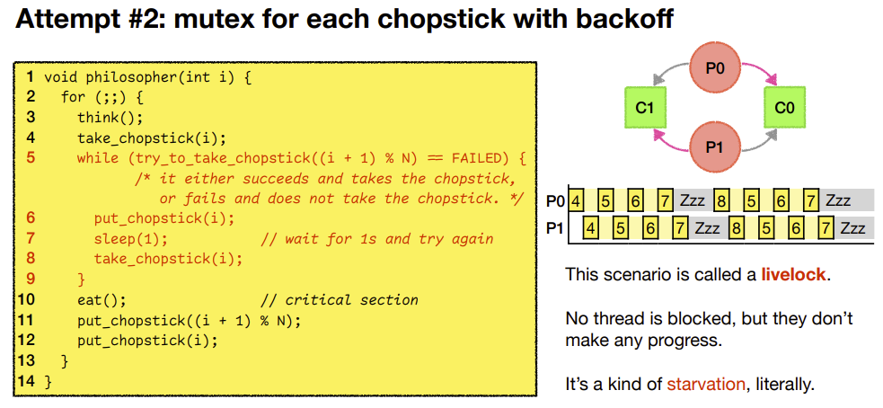

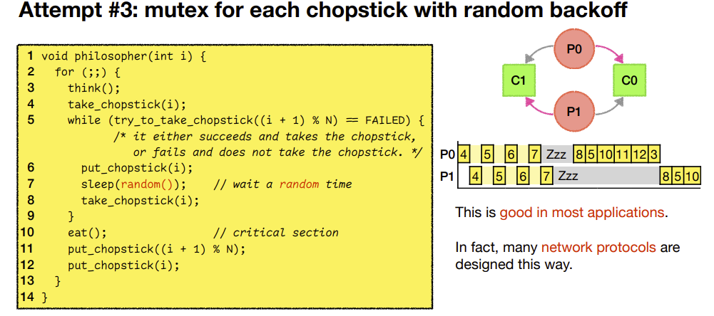

### Attack #4: no circular wait

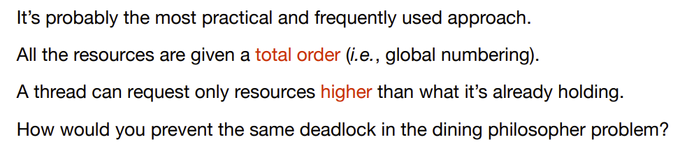

#### Review: the dining philosopher problem

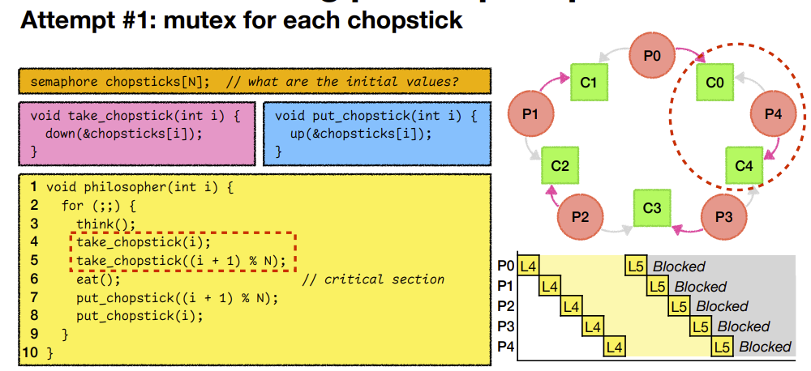

## Detecting and Recovering Deadlocks

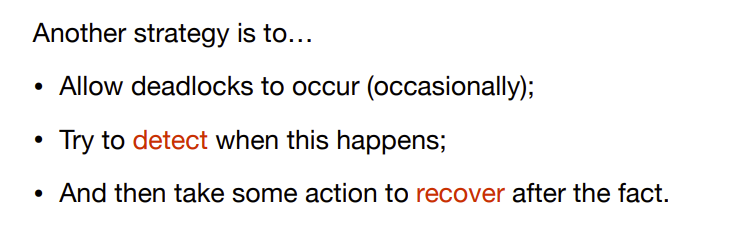

### Detecting deadlocks

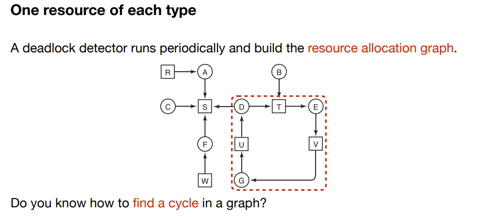

### Recovery from deadlock

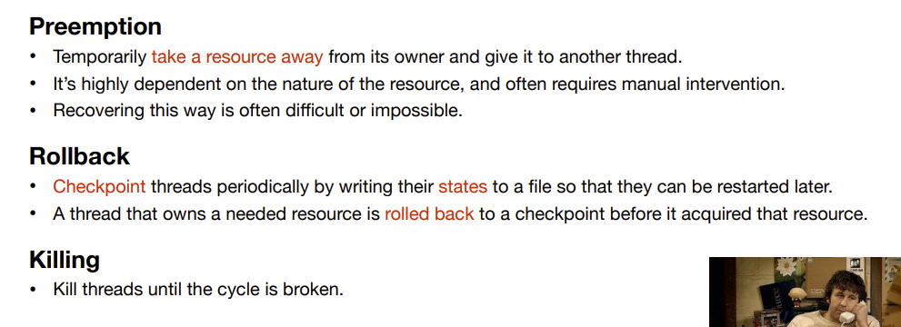

### Avoiding deadlocks?

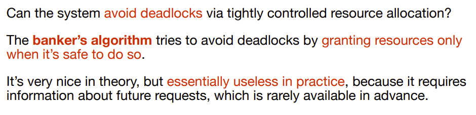

## Summary of process management

* What’s a process? 
    * A dynamic entity of a program
* How is a program related to a process? 
    * One is static, one is dynamic
* How are processes created? 
    * fork()
* How are processes organized? 
    * as a tree (single rooted in linux)
    * There are also orphans
* How are processes scheduled? 
    * different scheduling algorithms: FIFO, Short first, .....
* How do processes cooperate? 
    * interprocess communication
* What problems will occur when processes cooperate? 
    * race conditions, deadlocks, priority version problems, starving
* What are threads? How to program them?
    * pthread library
