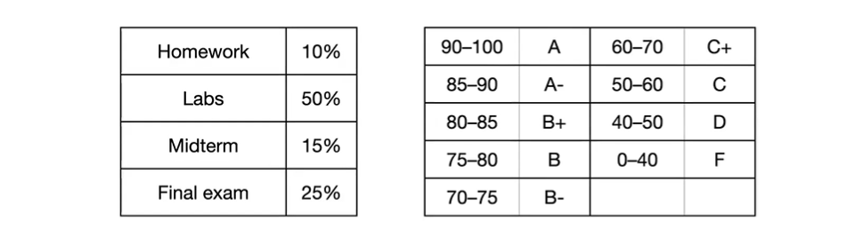

# Operating Systems: Lecture 1

[TOC]

## Course Info

* **Professor**: Yang Tang
* **Course Website**: https://ytang.com/cs202
* **Venue**: CANT 101
* **Time**: TuTh 12:30-1:45pm
* **Prerequisites**:
    * CS201
    * [The Missing Semester of Your CS Education](https://missing.csail.mit.edu/)
    * Familiarity with the C programming language in the Linux environment.
* <u>**Office Hour**</u>:
    * Tuesday 3-4pm @CIWW 406
    * Friday 9-10pm @Zoom
    
    

## Grading

* This course is lab-heavy
* No extra credit. No bonus. No drop. No curve for individual assignment.
* May curve up for the final grade.
* Don't cheat

### Homework

* <u>Biweekly</u> "written" assignments
* Graded based on <u>efforts</u>. 
* Due Weds midnight
* **Late**: <u>20 points off</u> for up to 4 days

### Labs

* Programming assignments
* ==most important==
* significantly more challenging than others

###  Exam

* In-person, closed book, cheat sheet
* Midterm: March 9
* Final: TBA

## Why operating system?

* In Computer Science, there're several different field of researches, like algorithms, computing, ai, machine learning etc.
* We are those who work on the systems. System basically means the architecture of the computer, like the hardware. 
* Basically, we do the stuff that can support the high-level applications
* If you don't know how operating systems work, you can barely write any efficient code.
* Most challenging course in computer science curriculum since it's not intuitive

## What we'll learn?

This is an **introductory** course in <u>operating systems (OS)</u>. 

We will focus on the **high-level** **design** of **key OS concepts**, such as… 

- Process scheduling and synchronization; 
- Deadlocks and their prevention; 
- I/O and file systems; 
- Memory management, including (demand) paging and segmentation; 
- Security and protection (if we have time).

 

