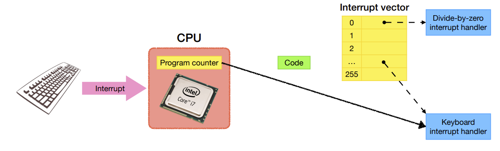
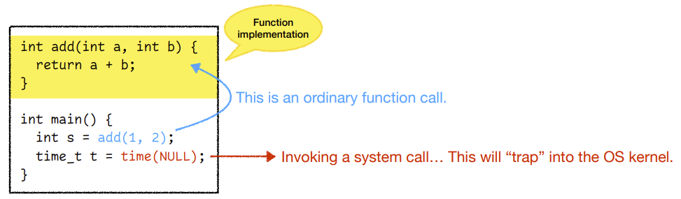
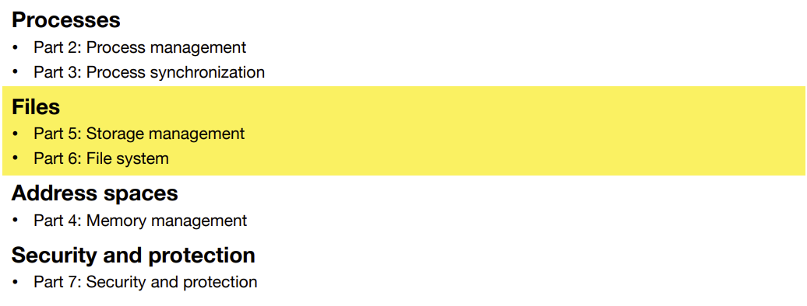

# OS Lecture 2: Introduction

[TOC]

## What is an Operating System

>  We will answer it later

### Where does the OS fit in?

* The Operating System lies between the user and the computer hardware

    

* It turns ugly hardware interface into beautiful abstractions

* allows users not to deal with the hardware directly

* **Example**:

    * The OS hides the mechanics of the hard disk away from you. On the other hand, it lets you manipulate files
    * You Don't have to worry about how the file is stored and how to locate it.

### Users are NOT dealing with the OS directly

*  In fact, The users are not dealing with the Operating System directly.

* They deal with processes, which are running images of a program.

    

    > A program is something you write. After being compiled you can run it. 
    >
    > But you are not running the program itself. 
    >
    > You are running the **processes**.

* **Example**:

    * You have only one copy of “Google Chrome,” but you can open multiple windows at the same time, using the same program file.

* All programs that you run behave as processes. 
* You need processes to access files, browse the web, watch videos, play games, etc.
* In this class, we will talk a lot about the process lifecycle, process management, and other process-related issues in this course.

## How users interact with the OS

* How do the interactions happen between these components?

* Ex: When the user enters `ls`, which process is running?

    

    > `ls` gives you the list of all the files in the current working directory.

    

* And the OS need to know how to react to the command: how to requests for the file, and how to list all the files.

### Example: Shell

* **Step 1**

    * Most commands you type in the shell will start a new **process**

        

        > The **shell** is an environment, which will run when you type a command

* **Step 2**

    * The operating system contains code that is needed to work with the file system. 

    * Such code in the OS is called the **kernel**.

        

        > The operating system contains several "modules" or components. Like the file system module, which handles things with the file system. 
        >
        > These modules are called the "kernel", which is the most important part of the operating system. 
        >
        > It contains all the code and a bunch of data structures in order to run the system.

* **Step 3**

    * The file system module inside the operating system knows how to work with devices, using device drivers.

        

* **Step 4**

    * Of course, the operating system will allocate memory for the results.

        

        > There's another module called the memory management module, which handles the memory related issues.

* **Step 5**

    * The memory management subsystem will copy the result to the memory of the process.

        

    

### The real-life interactions for different users

* **In general**

    

* **For <u>ordinary users</u>**

    * The OS is just something that can run programs for them. 
    * They don’t even need to know what a process is. 
    * …unless they need to kill the “Google Chrome” process when it freezes

    

* **For <u>software engineers</u>**

    * The OS is a piece of software that allows them to interact with the user, the hardware, or even the OS itself, using system calls.

    

* **For <u>hardware engineers</u>**

    * The OS is a piece of software that allows them to host device drivers. 
    * How does the computer handle I/O (input and output)? 
    * What happens when the user types a key on the keyboard?

    

## Background: Computer Architecture

### What happens when the user types a key on the keyboard?

* Originally, the CPU is executing some program code. 

    * The CPU has a register called the program counter that points to the next instruction to be executed

        > With one CPU and one core, it can only run one instructions at one time

    

* Suddenly, someone types a key on the keyboard. 

    * This generates a **hardware interrupt**, which requests the CPU to interrupt the currently executing code (when permitted). 
    * …so that the keyboard event can be processed in a timely manner.

    

* Each kind of interrupt has a unique interrupt number. 

    * There are many kinds of interrupts.
    * The interrupt vector is an array of addresses pointing to each interrupt handler.

    

* The CPU transfers control to the interrupt handler. 

    * The interrupt handler processes the interrupt

    

* Finally, the interrupt handler returns control to the original code.

    

> If you press multiple keys at the same time, the keyboard will let the keyboard interrupt handler know that you pressed multiple keys, and the interrupt handler will let the OS know about it.

## System Calls

It’s similar to an ordinary function call, but with an important distinction...

* A **system call**’s implementation is **inside the OS kernel**

    

* By calling it, it will "**trap**" into the OS kernel

### Example: `time()`

> The kernel is not an process. It's just some pieces of code.
>
> Your process will call those code in the kernel, and the kernel will run. 
>
> But when it returns, the kernel is not really running anything.

### What is a system call?

* **System calls** are the **programming interface** between **processes** and the **OS kernel**. 

* They are usually primitive and fundamental. 

    * For example, the `time()` system call tells you what time it is. 

* <u>What system calls should the OS provide?</u> 

    * Process control
    * File management
    * Device management
    * Information maintenance
    * Communications
    * Protection

* The POSIX (Portable Operating System Interface) standardizes some common system calls.

    

### How do we know if some function is a system call?

In Linux System, use `man syscalls` to get a manual of basic system calls

Let’s guess: which of the following are system calls?

* `abs() `
* `fopen()` 
* `fread() `
* `malloc() `
* `memcpy() `
* `printf()`

In fact - **NONE** of them are system calls!

### vs Library Function Calls

If those are not system calls, what are they? 

* They are just ordinary function calls. 

* Those functions are <u>implemented in some **libraries**</u> (not the OS kernel). 

* Library functions are usually compiled and packed inside a **library file**.

    * Linux:  *.so— shared object.
    * macOS: *.dylib — dynamic library. 
    * Windows: *.dll — dynamic-link library.

* Example:

    * fopen() is a <u>library function</u> that invokes the <u>system call</u> open().

    

    > The **Standard C Library** contains all the standard functions defined by the C standard.

* Why do people reinvent the wheel? 
    * Because system calls are often too primitive and not programmer-friendly. 
    * Compare the following two calls… 
        * open("file.txt", O_CREAT|O_WRONLY|O_TRUNC, S_IRUSR|S_IWUSR); 
        * fopen("file.txt", "w");
    * As a programmer, which do you prefer?

## Two Modes of Operation

### Kernel mode vs. User mode

* The CPU has (at least) two separate modes of operation. 
* The OS runs in **kernel mode** (a.k.a. privileged mode).
    * It has complete access to all the hardware and can execute any instruction. 
* All other programs run in **user mode**. 
    * Only a subset of the machine instructions is available. 
    * Cannot affect control of the machine. 
    * Cannot do I/O.

### Example: `fopen()`

> After we return from trap, we <u>already have</u> the results stored in the **memory**
>
> So what's returned by the `open()` system call is a **file descriptor**
>
> * It's **primitive** and has only **one integer number**
> * Basically an <u>index</u>
> * It's a way to tell the process how to access the file
>
> the `fopen()` function call will wrap the **file descriptor**  
>
> * into a **<u>file pointer</u>**
> * It'll be returned to the user 

## So, What is an operating system? 

* A piece of software from two viewpoints 

* **Top-down view:** 
    * OS is an **extended machine**. 
    * It provides a clean abstraction for processes to access the machine. 
* **Bottom-up view:** 
    * OS is a **resource manager**.  
    * It manages all parts of the system efficiently. 

* We will discuss the details of the OS design throughout this course

## OS abstractions

* Course Structure

    

        
Processes

        <list>
        	<li>Part 2: Process management</li>
            <li>Part 3: Process synchronization</li>
        </list>
    

    

        
Files

        <list>
        	<li>Part 5: Storage management</li>
            <li>Part 6: File system</li>
        </list>
    

    

        
Address spaces

        <list>
        	<li>Part 4: Memory management</li>
        </list>
    

    

        
Security and protection

        <list>
            <li>Part 7: Security and protection</li>
        </list>
    

    

## Processes

* Let’s consider the following two commands… 

    * `ls`

    * `ls /`

* What are their <u>similarities</u>? 
    * Both use the program file `/bin/ls`. 

* What are their <u>differences</u>? 

    * The program arguments are different. 

    * The processes’ internal states (e.g., running time) are different.

      

### Process ≠ program

* A **process** is an **execution instance** of a program. 

    * Multiple processes can execute the same program code. 

    * A process is not bounded to execute just one program! 

* A process is an **active** entity. 

    * It maintains local states about the execution… 
        * Which CPU core is it running on?
        * What is the next instruction to be executed? 
        * ...

    * The local states change over time.

### The Shell: UNIX command interpreter

* The **shell** is not part of the OS, but an important program shipped with the OS. 

* When you log in, a shell is started up.
    * It is a place that creates **processes**. 
    * If you enter a command, the shell will **execute** it for you

* **Example**:

    * When you enter `ls`

        * The shell is the parent process. 
        * The shell creates a child process. 
        * The child process executes `ls`.

        

### Process hierarchy

>  A.k.a. Process Tree

* The shell itself has its parent. 

* Also, child processes can have their own children. 

* Therefore, all processes form a process tree.

### The `ps` command: Show process information

* The `ps` command can display information about every process in the system.

### What will we learn in this course?

* **Process-related functions and syscalls**
    * How to write a shell yourself? → Lab 2 

* **Process lifecycle and scheduling**

    * How to create processes?

    * How to handle the death of processes? 

* **Process control** 

    * How to suspend a process?

    * What happens if you press *Ctrl-C*? Can you change this behavior? 

* **Process synchronization and deadlocks**
    * How can processes communicate with one another and cooperate to do useful work? → Lab 3

## Files

### What is a file? What is a File System?

* A **file** is a logical unit of information created by a process.
    * Think of it as an array of bytes, each of which you can read or write.
* A **file system (FS)** is how the OS utilizes the storage device to manage files.
    * <u>NTFS</u> - Default file system on Windows
    * <u>APFS</u> - Default file system on MacOS
    * <u>ext4</u> - Default file system on Linux
    * <u>FAT32</u> - Previous Version of NTFS
* A file system maintains files, directories, allocated space, and free space. 
* A file system is independent of the OS. An OS can support multiple file systems.

### File Systems

There are two viewpoints:

* **Static view** 

    * How to store files on the disk? 

* **Dynamic view**

    * How to support the operations that update the files? 

        

### What will we learn 

* **File-related functions and syscalls**
    * How to manipulate files and directories? 
* **File system implementation**
    * How are some famous file systems implemented? 
    * Why is my file system becoming slow? 
    * How to recover a deleted file? Why doesn’t it always work? → Lab 4 
    * Why is my file lost even if my disk is physically ok? 
* **Disks** 
    * What’s inside a hard disk drive? 
    * Can you use multiple disks together to improve performance, reliability, or both?

##  Memory management

### Memory Hierarchy

**What happens when you run a program?**

* The program is loaded from hard disk to main memory. 
* During execution, instructions are fetched from main memory to CPU. 
* There may be 100+ processes running “at the same time,” but only a few CPUs/ cores. How can it happen?

### A Process's Memory

* What does a process need to store?

### Why using C?

* **Real operating systems are virtually always written in C.**

    

* C was invented for developing Unix. It’s powerful, efficient, and predictable. 

* On the flip side, you must take care of memory management, e.g., 

    * Use `malloc()` and `free()` properly. 
    * Initialize the memory before using it. 
    * Be careful about the bounds. 

* → Lab 1

    

### What will we learn

* **Memory-related functions and syscalls**
    * Why does my program segfault?
    * My program does not segfault. Does that mean I’m managing memory correctly?
    * How to write malloc() yourself using system calls? 
* **Virtual memory**
    * My computer has only 8GB memory, but my processes take way more memory. How can that happen? 
    * Why does my computer sometimes feel slow? 
    * How can multiple processes share memory?

## Security and Protection

The OS needs to control the access of processes or users to the resources defined by the system. 

It must provide means to… 

* Specify the controls to be imposed. 
* Enforce the controls. 

Have you heard of the following attacks? 

* Viruses, worms, denial-of-service (DOS) attacks, identity theft, theft of service, …

### What will we learn?

* **Protection-related functions and syscalls** 
    * How does the OS control access to resources? 
    * What do file permissions mean? 
* **Security best practices** 
    * How to store and verify the user password? 
* **Hacking** 
    * How to gain the root privilege legally and illegally? 
    * How to protect yourself from being hacked?
