# OS Lecture 3

[TOC]

## OS Course Structures (Cont.)

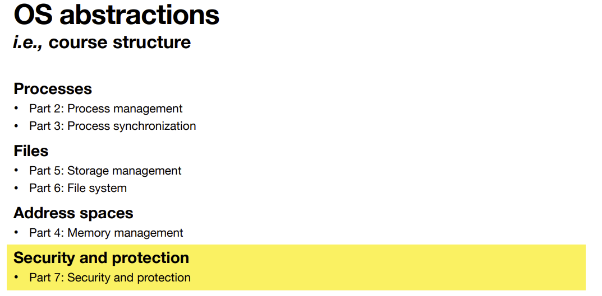

### Security and Protection

The OS needs to <span style='color:red'>control the access</span> of processes or users <span style='color:red'>to the resources</span> defined by the system. 

It must provide means to… 

* <span style='color:blue'>Specify</span> the controls to be imposed. 
* <span style='color:blue'>Enforce</span> the controls. 

Have you heard of the following <span style='color:red'>attacks</span>? 

* Viruses, worms, denial-of-service (DOS) attacks, identity theft, theft of service, …

#### What will we learn?

* **Protection-related functions and syscalls** 
    * How does the OS control access to resources? 
    * What do file permissions mean? 
* **Security best practices** 
    * How to store and verify the user password? 
* **Hacking** 
    * How to gain the root privilege legally and illegally? 
    * How to protect yourself from being hacked?


## Process Management

### Process ≠ program

#### What is a program?

A **program** is just a piece of <span style='color:red'>code</span>. 

But…*which*code do you mean? 

* <span style='color:blue'>High-level language</span> (C, C++, Java…) 
* <span style='color:blue'>Intermediate language </span>(Java bytecode, LLVM IR, .NET CIL…) 
* <span style='color:blue'>Low-level language</span> (assembly) 
* <span style='color:blue'>Machine code</span>

## Life of a C program

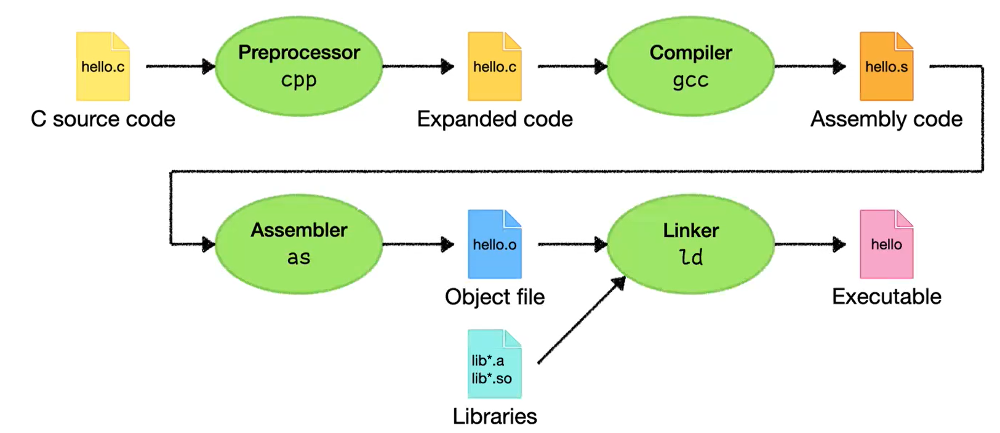

> When you run the gcc, it compiles the code and also invokes the cpp, assembler and linker

### Preprocessor

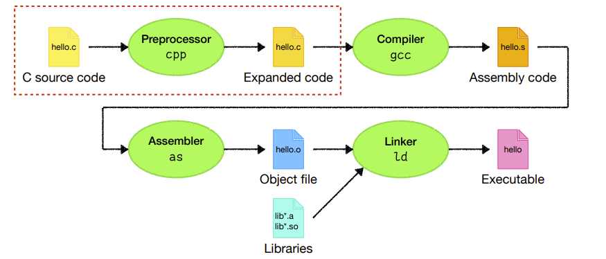

* The **preprocessor** expands <span style='color:red'>directives</span> such as `#include`, `#define`, `#ifdef`…

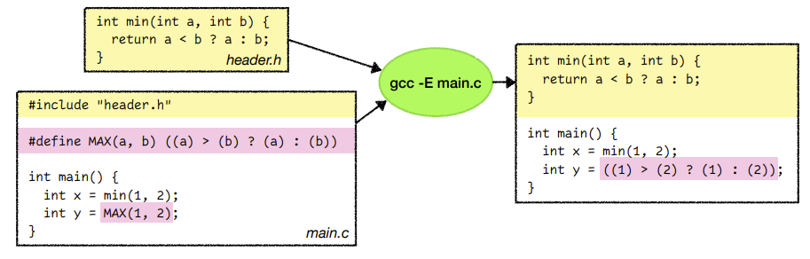

* Example:

    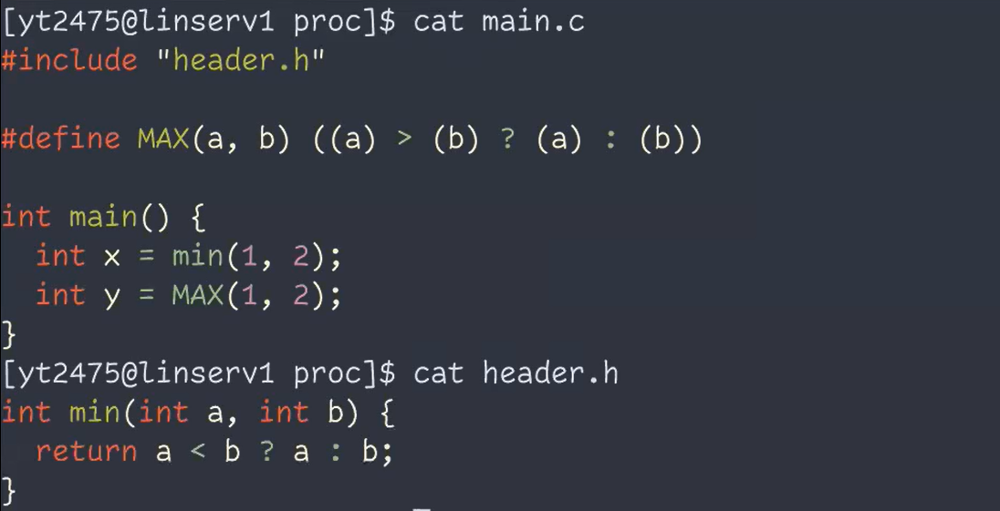

    Preprocessor:

    ``` shell
    gcc -E main.C
    ```

    Result:

    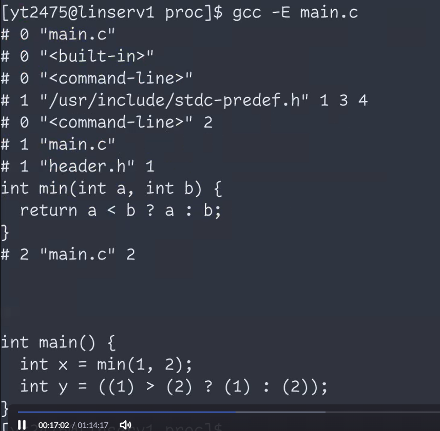


### Compiler

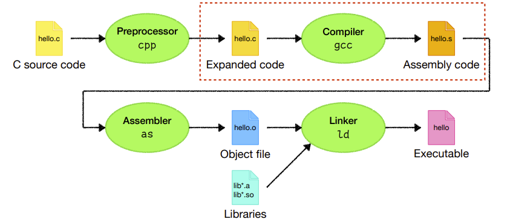

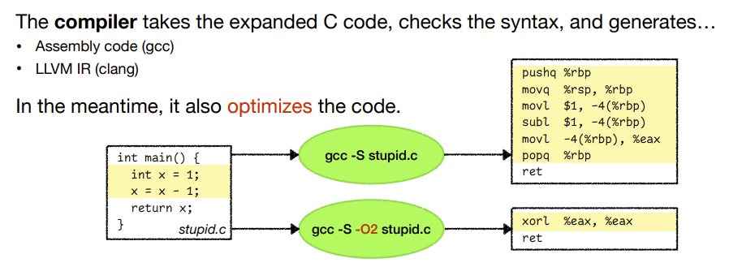

> -O2 is the code for optimization. 
>
> There're different levels of optimization
>
> Why not higher level? O3 might cause bugs.


### Assembler

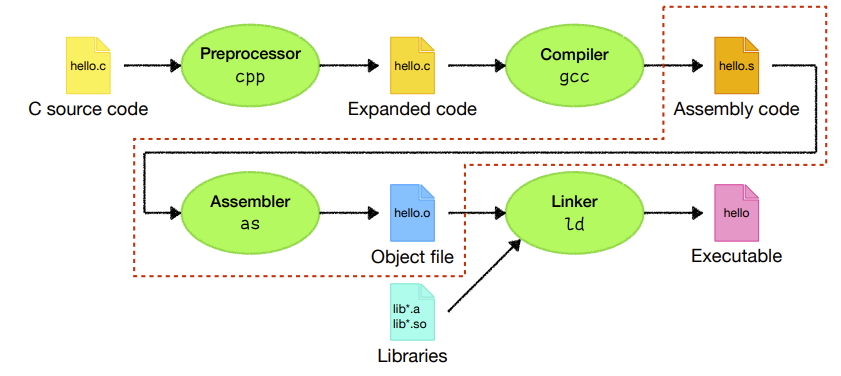

The **assembler** converts the generated assembly code to an <span style='color:red'>object file</span>. 

The object file contains <span style='color:blue'>machine code</span>, but <span style='color:blue'>isn’t yet executable</span>.

> It may contains functions from other libraries, so you must link them together before execution.

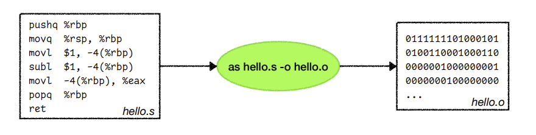


### Linker

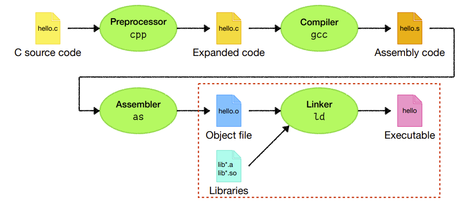

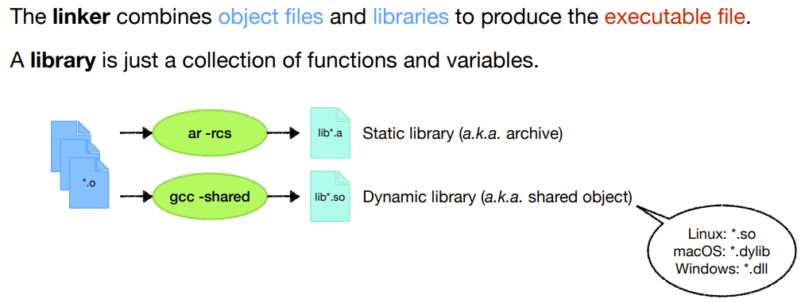

* What's the difference between Static Library and Dynamic Library?

* **Static & Dynamic linking**

    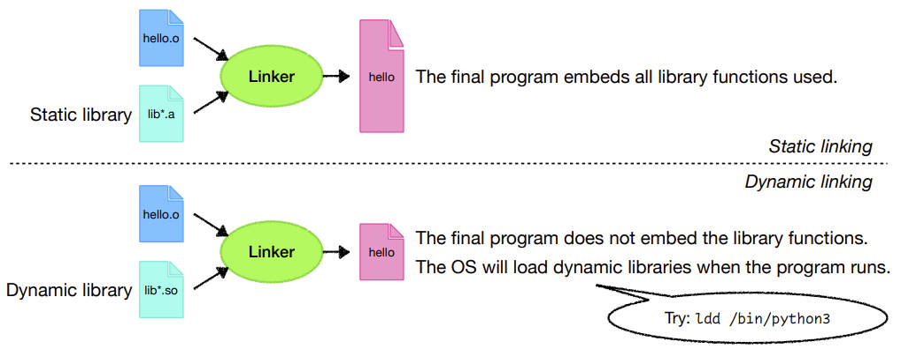

    * The dynamic linking is the default one, because it saves space, reuses codes, and is easy to update if there's any bugs in the library

    * The static linked file is useful for embedded systems
    * The Dynamic Library and the Static Library has different formats (*.a* and *.so*), so you can't replace one with another

## Processes

The **process** is the most central concept in an operating system. 

* It’s an abstraction of a <span style='color:red'>running program</span>. 
* It attaches to all the <span style='color:blue'>memory </span>that is allocated for the process.
* It associates with all the <span style='color:blue'>files </span>opened by the process. 
* It contains <span style='color:blue'>accounting information</span> such as its owner, running time, memory usage… 

Let’s start with some system calls.

### Process identification: `getpid()` and `getppid()`

The OS gives each process a unique identification number, the <span style='color:red'>Process ID (PID)</span>. 

* `getpid()` returns the PID of the calling process. 
* `getppid()` returns the PID of the parent of the calling process.

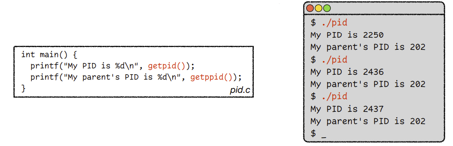

* Example:

    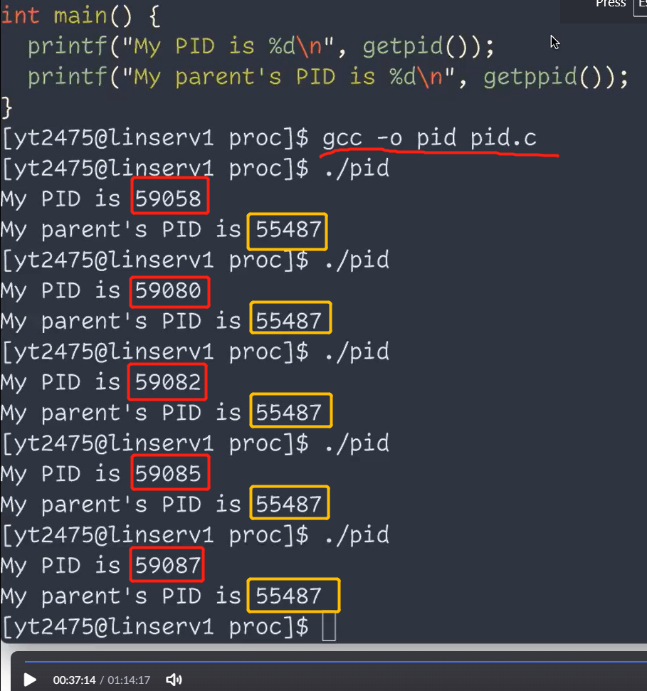

    > Note that the PID each time is different, but the PPID remains the same.
    >
    > This is because we launch a new process every time we run the program.
    >
    > But the parent process is always the shell, and we didn't start a new session for the shell.

### Process creation:` fork()`

`fork()`’s return value differs for the parent and the child. 

* In the <span style='color:red'>parent</span>, `fork()` returns <span style='color:blue'>the PID of the child process</span>. 
* In the <span style='color:red'>child</span>, `fork()` returns <span style='color:blue'>0</span>.

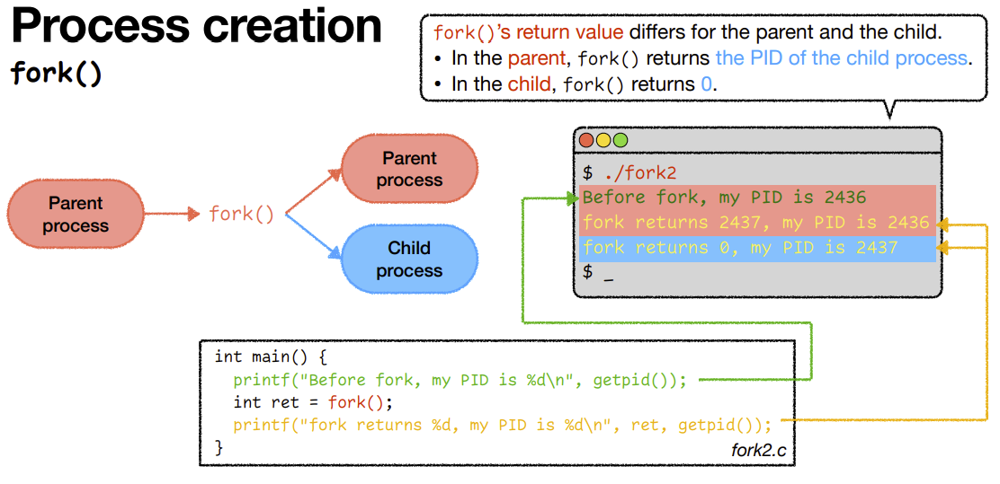

How do we know the process is the parent or child?

* return value of `fork()` is different

* Example:

    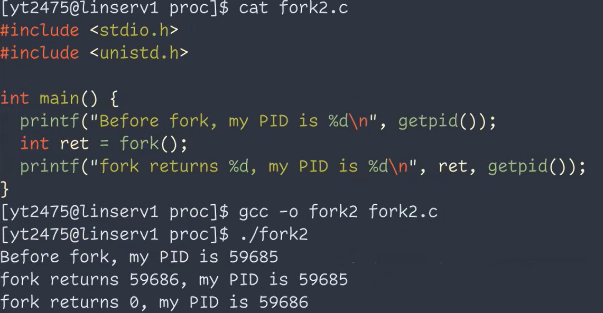

#### `fork()` Behaves like "cloning."

<div style='padding-top:20px;padding-bottom:10px;font-size:18px;font-weight:bold'>The child <span style='color:red'>inherits</span> (but is independent from) the parent’s… </div>

* **Program code** 
    * Both the parent and child share the same code. 
* **Program counter** 
    * Therefore, both the parent and the child execute from the same location after `fork()`. 
* **Memory** 
    * This includes global variables, local variables, and dynamically allocated memory. 
* **Opened files** 
    * If the parent has opened a file, then the child also has the same file opened.

<div style='padding-top:20px;padding-bottom:10px;font-size:18px;font-weight:bold'>However, the child <span style='color:red;font-weight:bold;'>differs </span>from the parent in a few things…</div>

* **Return value of fork()** 
    * The parent returns the PID of the child, or -1 if `fork()` fails. The child returns 0. 
* **Process ID** 
    * The child gets a new PID, which is <span style='color:red'>not necessarily </span>the parent’s PID + 1. 
* **Parent** 
    * The child process’s parent is the parent process, not the grandparent. 
* **Running time** 
    * The child’s running time is reset to 0.
* **File locks** 
    * The child does not inherit file locks from its parent.


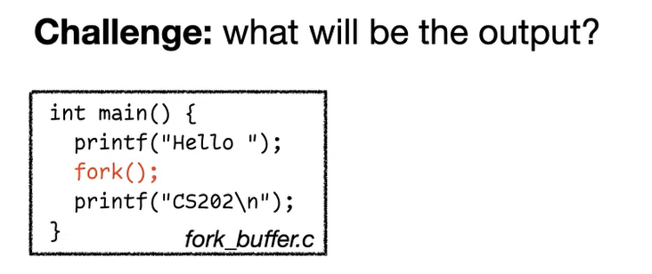

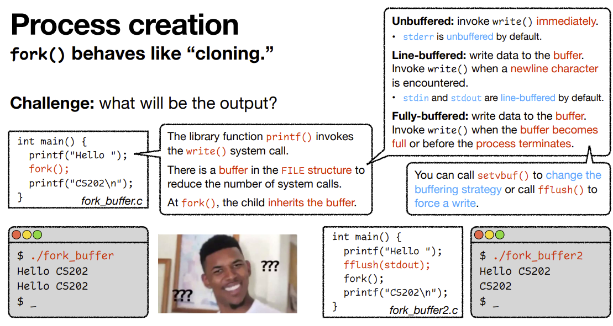

> At printf("Hello"), the Hello is not immediately printed. It's saved to a buffer, which was cloned by the forked process

* Use `setvbuf()` or `fflush()` to set the buffer

* `fflush()` force the output to standard output

    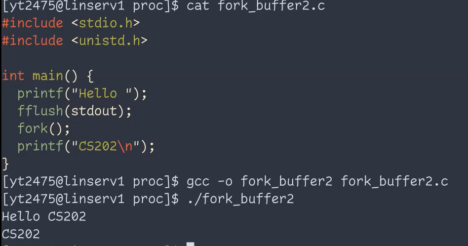