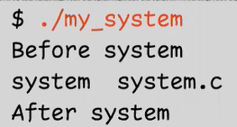

# OS Lecture 4

[TOC]

## Process 

### Process creation:` fork()`(Review)

`fork()`’s return value differs for the parent and the child. 

* In the <span style='color:red'>parent</span>, `fork()` returns <span style='color:blue'>the PID of the child process</span>. 
* In the <span style='color:red'>child</span>, `fork()` returns <span style='color:blue'>0</span>.


#### `fork()` Behaves like "cloning."

<div style='padding-top:20px;padding-bottom:10px;font-size:18px;font-weight:bold'>The child <span style='color:red'>inherits</span> (but is independent from) the parent’s… </div>

* **Program code** 
    * Both the parent and child share the same code. 
* **Program counter** 
    * Therefore, both the parent and the child execute from the same location after `fork()`. 
* **Memory** 
    * This includes global variables, local variables, and dynamically allocated memory. 
* **Opened files** 
    * If the parent has opened a file, then the child also has the same file opened.

<div style='padding-top:20px;padding-bottom:10px;font-size:18px;font-weight:bold'>However, the child <span style='color:red;font-weight:bold;'>differs </span>from the parent in a few things…</div>

* **Return value of fork()** 
    * The parent returns the PID of the child, or -1 if `fork()` fails. The child returns 0. 
* **Process ID** 
    * The child gets a new PID, which is <span style='color:red'>not necessarily </span>the parent’s PID + 1. 
* **Parent** 
    * The child process’s parent is the parent process, not the grandparent. 
* **Running time** 
    * The child’s running time is reset to 0.
* **File locks** 
    * The child does not inherit file locks from its parent.


> Use `fflush()` to force the `write()` system call

#### Who runs first?

* On a single-processor system, <span style='color:blue'>only one process</span> can be executed at one time.

* After `fork()`, does the parent or the child run first? 
    * ......We don’t know. 
* The OS has a mechanism called <span style='color:red'>**process scheduling**</span>. 
    * It decides which process to run. 

We will discuss it later.


<div style='font-size:18px;margin-bottom:10px'>
However, <span style='font-family:cursive'>fork()</span> seems useless…
</div>

If a process can only <span style='color:blue'>duplicate </span>itself, *how* can we execute other programs?

* The` execve()` system call executes a program.

```c
int execve(const char *filename, char *const argv[], char *const envp[]);
```

* It <span style='color:blue'>replaces</span> the current process image with the new program.


Working with `execve()` is tedious. 

Luckily, we have a family of wrapper functions:

<div style='font-family:cursive;text-align:center'>
    <table style='border:1.5px solid black;text-align:center;width:500px;'>
       <tr>
           	<td style='border:1.5px solid black'>exec<span style='color:deepskyblue'>l</span></td>
            <td style='border:1.5px solid black'>exec<span style='color:deepskyblue'>l</span><span style='color:red'>p</span></td>
            <td style='border:1.5px solid black'> exec<span style='color:deepskyblue'>l</span><span style='color:darkorange'>e</span></td>
            <td style='border:1.5px solid black'>exec<span style='color:limegreen'>v</span></td>
            <td style='border:1.5px solid black'>exec<span style='color:limegreen'>v</span><span style='color:red'>p</span></td>
            <td style='border:1.5px solid black'>exec<span style='color:limegreen'>v</span><span style='color:darkorange'>e</span></td>
       </tr> 
    </table>
</div>

Let’s look at a simpler one: `execl()`.


### Process execution: `execve() `and the `exec*()` family of functions

#### `execl()`


* Example:

    

    The After Exec line is missing!


#### `ececve()`

When `execve()` is called, the process <span style='color:red'>replaces </span>the code that it’s executing with the new program and <span style='color:red'>never returns to the original code</span>. 

* Nothing after `execve()` will be executed.

    

The process **discards**…  

* <u>Memory</u>: global variables, local variables, and dynamically allocated memory 

* <u>Registers</u>: program counter...

    

The process **preserves**… 

* Process ID
* Process relationship 
* Running time…


#### The `exec*()` family of functions

<div style='padding:5px;font-family:cursive;'>
    <table style='border:1.6px solid black;text-align:center;width:500px;'>
       <tr>
           	<td style='border:1.5px solid black'>exec<span style='color:deepskyblue'>l</span></td>
            <td style='border:1.5px solid black'>exec<span style='color:deepskyblue'>l</span><span style='color:red'>p</span></td>
            <td style='border:1.5px solid black'> exec<span style='color:deepskyblue'>l</span><span style='color:darkorange'>e</span></td>
            <td style='border:1.5px solid black'>exec<span style='color:limegreen'>v</span></td>
            <td style='border:1.5px solid black'>exec<span style='color:limegreen'>v</span><span style='color:red'>p</span></td>
            <td style='border:1.5px solid black'>exec<span style='color:limegreen'>v</span><span style='color:darkorange'>e</span></td>
       </tr> 
    </table>
</div>


<div style='padding-left:20px'>
    <div style='font-size:20px;font-weight:bold;margin-top:15px;'>Path name or file name </div>
    <list>
        <li>Default — path name, e.g.,  <span style='font-family:Comic Sans MS, Comic Sans, cursive'>“/bin/ls”</span></li>
        <li><span style='color:red;font-family:Comic Sans MS, Comic Sans, cursive'>p</span> — file name, e.g., <span style='font-family:Comic Sans MS, Comic Sans, cursive'>“ls”</span></li>
    </list>
    <div style='font-size:20px;font-weight:bold;margin-top:15px;'>Argument list or array 
    </div>
    <div style='position:relative;left:250px'>
        (It’s a <span style='color:royalblue'>variadic function</span>.)
    </div>
    <list>
        <li><span style='color:deepskyblue;font-family:Comic Sans MS, Comic Sans, cursive'>l</span>— list, e.g., <span style='font-family:Comic Sans MS, Comic Sans, cursive'>execl(“/bin/ls”, <span style='background-color:gold'>“/bin/ls”, “-a”, “-l”, NULL</span>)</span> ;</li>
        <li><span style='color:limegreen;font-family:Comic Sans MS, Comic Sans, cursive'>v</span> — array, e.g., <span style='font-family:Comic Sans MS, Comic Sans, cursive'>execv(“/bin/ls”, argv)</span>;</li>
    </list>
    <div style='font-size:20px;font-weight:bold;margin-top:15px;'>Environment variables </div>
    <list>
        <li>Default — inherit the current environment.</li>
        <li><span style='color:darkorange;font-family:Comic Sans MS, Comic Sans, cursive'>e</span> — specify a new environment array</li>
    </list>
</div>


#### Environment variables

* Environment variables are a set of strings maintained by the <span style='color:red'>shell</span>. 

* Many programs will read and make use of environment variables.


> PATH tells the shell where to search for a program when you type in a program name, not a path.
>
> There may be multiple paths

* Example

    

    

### Process creation and execution: `System()`

* Can we just run a program and be able to come back?

    * Yes, there is a convenient library function: `system()`.

        

    * It is implemented using `fork()` and `exec()` to call `/bin/sh -c command`. 

        > So System itdelf doesn't do anything
        >
        > It just put another command as an argument to the shell, an then calls the shell to run the program.

#### Implementing `system()`

* Can we do it ourselves?

    

* What's the **problem** of it?

    * If child runs first - as we desire

        

    * If the parent runs first - Problem!

        

    


**How to let the child run first?** 

* Unfortunately, we cannot control the OS’s <span style='color:red'>process scheduling</span> to this extent.

**But, is this our real issue?** 

* We should pause the parent process while the child is running!

**So, our real issue is…** 

* How to <span style='color:red'>suspend </span>the execution of the parent process? 

* How to <span style='color:red'>wake up</span> the parent after the child is terminated?


#### Implementing `system()` with `wait()`


The `wait()` system call <span style='color:blue'>suspends </span>execution of the calling process <span style='color:blue'>until </span>one of its children <span style='color:blue'>terminates</span>. 

* What if it has no running children? 
    * Nothing happens. It returns immediately


* If passing a non-NULL argument, it will be filled with the child’s <span style='color:blue'>status</span>, such as the exit code. 
    Passing NULL means “I don’t care.” 

* `waitpid()` is a more general version. 

    * Wait for a particular child. 

    * Wait for a <span style='color:red'>stopped</span>/resumed child. 


See “<span style='color:blue'>man 2 wait</span>” for more details.

> What's the purpose of line 4: `exit(-1)`?
>
> If line 3:`execl()` succeed, line e will never be executed
>
> If line 3 failed, it won't execute the new program. It'll return -1 that needs to be handled.
>
> If line 3 failed and you don't have line 4......
>
> 
>
> Note that the `execl()` failed, and the child process keeps running, go through the if statement, and printed `wait()`. 
>
> Since the child doesn't have children, `wait()` returns -1. 
>
> Then child returns to the main and also prints After system.
>
> If we add the line 4, it'll print whenn `execl()` fails:
>
> 

#### Reading man pages

<span style='color:red'>**Man pages**</span> (i.e., manual pages) are of vital importance for programmers working on Linux and such. 

They include important information… 

* Header files to be included. 
* Compiler flags to be added. 
* Input arguments. 
* Return values. 
* Error conditions.

Man pages are divided into <span style='color:red'>sections</span>.


* Example: `man 2 wait`

    

    

    

### Are `fork()` and `execve()` wasteful?

It seems wasteful that the child <span style='color:blue'>copies </span>the parent’s entire memory at `fork()` and immediately <span style='color:blue'>discards </span>it at `exec()`. 

In fact, after `fork()`, the child <span style='color:red'>shares </span>the parent’s memory <span style='color:red'>copy-on-write</span>. 

* As long as nobody modifies the shared memory, no copying is needed. 
* Whenever a process wants to <span style='color:blue'>modify </span>the memory, the OS makes a <span style='color:blue'>copy</span> of that chunk of memory so that the modification can be done privately. 

More on that later when we talk about the <span style='color:red'>memory management</span> of the OS.


### Summary

* **A process is created by cloning.** 
    * `fork()` is the system call that <span style='color:red'>**clones**</span> processes. 
    * Cloning is copying — the new process inherits many things (but not all) from the parent process. 
    * (But, where is the first process?) 
* **Program execution is not trivial.** 
    * A <span style='color:red'>**process** </span>is the entity that hosts a program and runs it. 
    * A process can run more than one program. 
    * The `exec*()` system call family <span style='color:red'>**replaces** </span>the program that a process is running.


## Processes in the kernel

### Kernel-Space Memory vs User-Space Memory


#### Task list


#### Redirect using file descriptors

> In Shell, we are able to redirect the input and output to a file:
>
> 
>
> How to do it in our codes?


* `dup2()` duplicates the file descriptor to file descriptor 1

    * So file descriptor 1 corresponds to "output.txt"
    * 

* It's the same for input. If you want to input from file, use `dup2(fd, 0)`

    

### Process execution


#### Handling system calls - Example: `getpid()`


