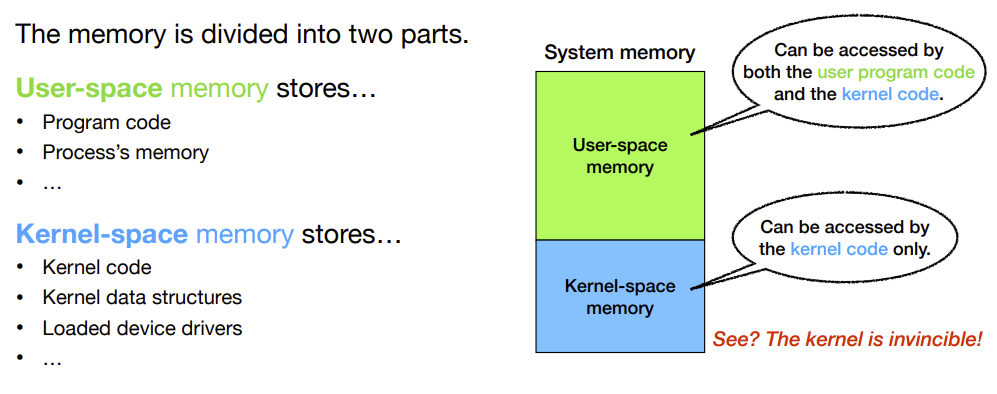
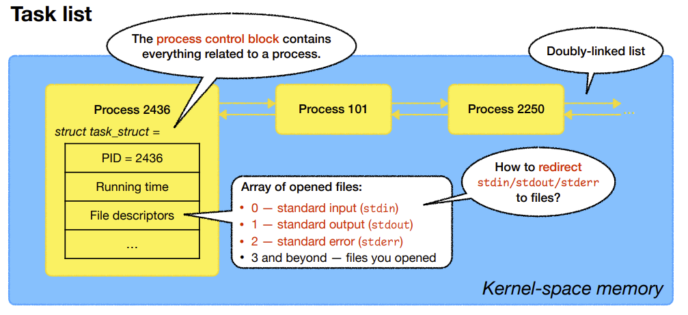
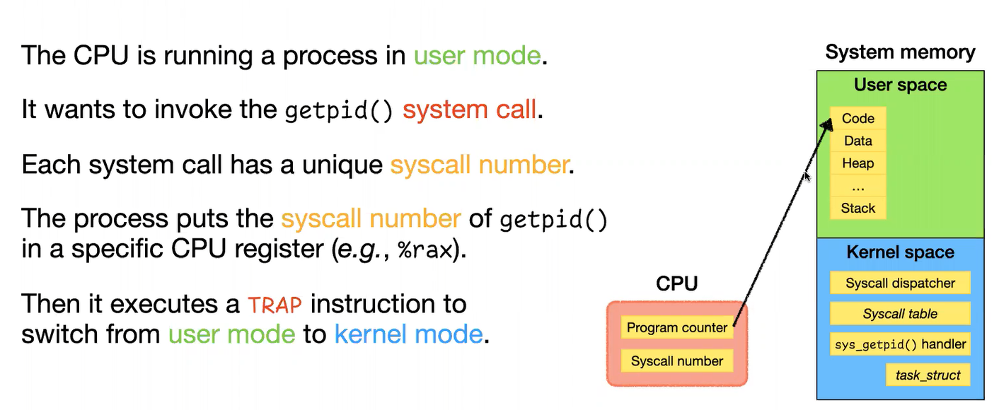
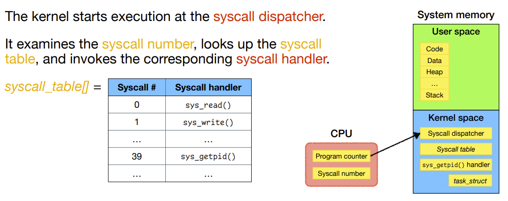
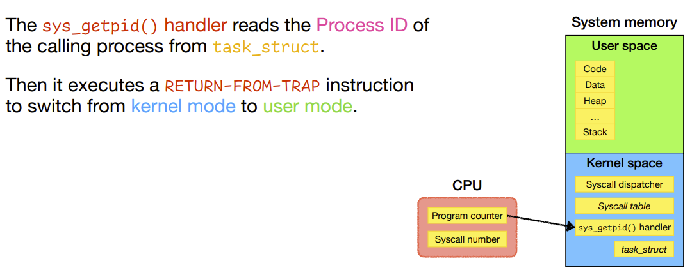
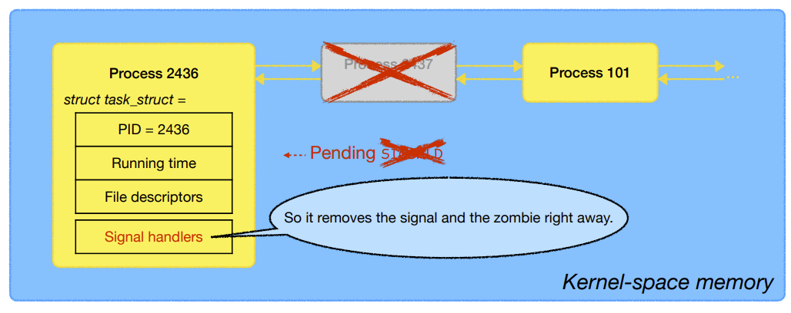

# OS: Lecture 5

[TOC]

## Review

### Process-Related System Calls

| **System call** | **Purpose**                    | **Return value on success**                                  | **Return value on failure**                                  |
| --------------- | ------------------------------ | ------------------------------------------------------------ | ------------------------------------------------------------ |
| `getpid()`      | Get process identification.    | PID of the calling process.                                  | It never fails.                                              |
| `fork()`        | Create a child process.        | In the parent: PID of the child.<br />In the child: 0.       | In the parent: **-1** (check `errno`).<br />No child process is created. |
| `exec*()`       | Execute a program.             | It never returns.                                            | **-1** (check `errno`).                                      |
| `wait()`        | Wait for a child to terminate. | PID of the terminated child.(status is stored in the argument.) | **-1** (check `errno`).                                      |

### Exit codes


* `echo $?` returns the exit code of the previous program. 

* For the program above, it returns $0$ if succeed

* But you can also return any byte to show the states in the program

    

    

## Processes in the kernel

### Kernel-Space Memory vs User-Space Memory



#### Task Struct



#### Redirect using file descriptors


### Shell pipelines

#### Redirect in a shell : `<`, `>`


* Output to file

    

* input from file

    

#### Pipe in a shell: `|`

* Use on <u>two or more</u> program, connecting their input/output together

    * `wc -l` counts the number of lines of the input

    

    * `grep` searches for a pattern

    


### Process execution


#### Handling system calls - Example: `getpid()`







### Process Time

#### User time vs. system time

The <span style='color:red'>**execution of a process**</span> is also divided into two parts.


#### The `time` command


* the `time` command gives the runtime of the program

    

    

    

    

    

## Process-management syscalls in the kernel

### `fork()`

From a programmer’s perspective…


In the Kernal-space memory....

* Process control blocks before calling `fork()`

    * Process 2436

    

* After calling `fork()` a new process is created. Let the PID be 2437

    * A new task struct is created. 
    * Inserted into the double linked list

    

In the User-space memory....

* Copy-on-write

    * Not really copied until you actually modify something

    

* Another difference is the return value of `fork()`.

* In the parent process, the returned value is the PID of the child

* In the child process, the returned value is 0

    

#### What happen if two process writes to the same file (Race Condition)

(00:40:00 - )


> * Used `fflush()` because writing to a file is fully buffered
> * After printing each line, it randomly chooses to sleep for a second or not
> * `if (pid)` tells if it's the parent process, because if it's the parent process, pid is not 0.
>     * If i'm a parent, I wait until the children terminates. So that I can make sure both parent and child has printed 5 lines


* Run:

    ```c
    #include <stdio.h>
    #include <stdlib.h>
    #include <unistd.h>
    #include <sys/wait.h>
    
    int main() {
        FILE *fp = fopen("file.txt", "w");
    
        pid_t pid = fork();
    
        int i;
        for (i = 0; i < 5; ++i) {
            fprintf(fp, "[%d] %d\n", getpid(), i);
            fflush(fp);
            sleep(rand() % 2);
        }
        fclose(fp);
    
        if (pid)
            wait(NULL);
    }
    ```

* We get

    ```
    [23033] 0
    [23034] 0
    [23033] 1
    [23033] 2
    [23034] 1
    [23034] 2
    [23033] 3
    [23034] 3
    [23033] 4
    [23034] 4
    ```

    * Note that for a single process (like 23033), the number is printed in order

* If we remove the `sleep()` line

    ```
    [23178] 0
    [23178] 1
    [23178] 2
    [23178] 3
    [23178] 4
    [23179] 0
    [23179] 1
    [23179] 2
    [23179] 3
    [23179] 4
    ```

    * This is because the program is too short
        * The scheduler has not get the chance to interrupt the running
        * The parent process runs until it terminates, and the scheduler kicks in and start another process
        * If the program is long enough, the scheduler will come in and interupt your execution and start another process
    * The order of process is not deterministic
        * The scheduler could choose to run the child process immediately after the `fork()`

* If we remove the `wait()`

    ```
    [24222] 0
    [24223] 0
    [24222] 1
    [24222] 2
    [24223] 1
    [24223] 2
    [24222] 3
    [24223] 3
    [24222] 4
    [24223] 4
    ```

    * the program should terminate when the parent process reaches the end of the program 

> This is what we called a **race condition**


### `execve()`

From a programmer’s perspective…


> The task_struct in the kernel space memory is preserved
>
> But in the user-space memory, the entire stuff would be replaced by the new program's code
>
> * The code is changed
> * Allocated memory changed
> * Stack is reset
> * Data is reset
> * CPU registers (Program counter) are also reset

### `wait()` and `waitpid()`

From a programmer’s perspective…


To understand ` wait()`, we have to look at `exit() ` first…


> We need a way for **Interprocess Communication**

#### `exit()`


* We shouldn't remove the *task_struct* of the process
    * The parents maybe still waiting for the status, and the exit code.
    * Therefore you need a place to store the status and exit code
        * the *task_struct*
* This is what we called a "**zombie**" state
    * A process that's already terminated 
    * but not yet removed from the kernel data structure


> `SIGCHLD` is a **signal** that tells the parents that the child has terminated
>
> This is what we called the **Interprocess Communication**


#### Come back to `wait()`


#### Case 1: `wait()` <u>before</u> `SIGCHLD `arrives


* The *task_struct* has a section called <span style='color:red'>Signal handlers</span>, which executes the signals

    * It's a function pointer

    

* When the process calls `wait()`, the kernel sets the process to a <span style='color:tomato'>**blocked**</span> (sleeping) state

    

* When `SIGCHLD` arrives, the parent's signal handler(not the original program code) is invoked.

    * executes the stuff pointed by the signal handler

    

* Then the signal handler can let the parent process to remove the signal and  destroy the child process

* In this way, the parent process can read the status of the program, and have the exit code of the child process

    

* Finally, the signal handler is removed, so the process is once again ignoring SIGCHLD.

* It then returns to the previously-executing original program code in the user space.

* Therefore, it looks as if `wait()` is returned from its invocation.

    * Program code after this `wait()` would be executed

    


* No zombie in this case
* Because the a SIGCHLD is sent to the parent, and the zombie is taken care immediately


#### Case 2: `wait()` <u>after</u> `SIGCHLD `arrives





### Zombies


* We didn't do anything in the child process, so it will terminate immediately, before the parent e

* Before calling `wait()`, you can tell that there's a zombie

    * labeled `<defunct>` in the system

* After calling `wait()`, there's no zombie

* **Note**:

    * If the parent never calls `wait()`, the zombie will stay in the system until the parent process terminates

        
