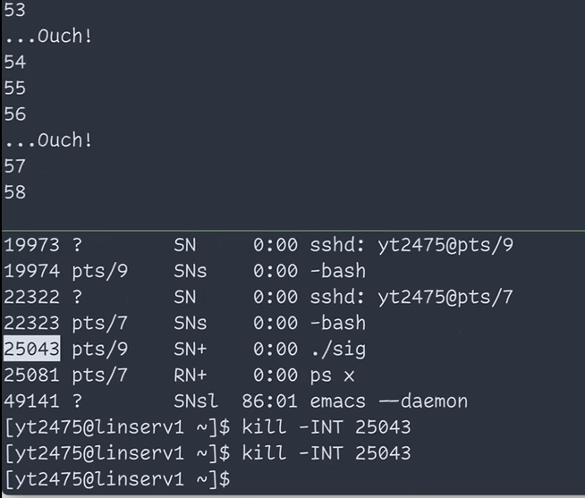

# Operating Systems: Lecture 6

[TOC]

## Zombies

### after `exit()`

After `exit()`called, the kernel removes everything about the process, including the codes and files opened and other data. However, we shouldn't remove the task_struct, as the PID, status and exitcode are still needed by the parent process. 	


A `SIGCHLD` signal is sent to the parent process. 


The `SIGCHLD` signal will be processed by the parent process, but it depends on the timing of `wait()`.

The `wait()` sets up a signal handler, which gets the exit code from the child and removes the *task_struct*.

There are two seranios:

1. `wait()` called <u>before</u> `SIGCHLD`

    

2. `wait()` called <u>after </u>`SIGCHLD`

    

### Zombie


> `wait()` eliminated the zombie (defunct) from the system. The PID is removed from the processes.

### Calling `wait()` is important

Why should we **remove all the zombies** from the system?

* We have already removed all the user-space memory and other kernel data. What it remains is just a PID and a node in the data struct. It takes only a tiny amount of memory.
* What could be the issue?
    * It takes a PID
* There's a maximum number of PID ( $64k \approx 2^{16}$ )


* The code above calls `fork()` infinitely, so it will continous create zombies and leave them in the system. The only active process running is the parent process. 
* It will take up the maximum amount of PID
    * In this case it's 65536
* Then, you can't run any other process. You can't even turn off the computer, since you need `poweroff` to turn it off in Linux.

### Summary

It’s important to know the internal workings of <span style='color:red'>system calls</span>. 
Some system calls may produce <span style='color:blue'>surprising results</span>. 

Understanding those system calls helps you understand the <span style='color:red'>process control</span> in the operating system. 

At least, you don’t have to guess what would happen after invoking a system call.

## Signals

### Signals are software interrupts

It’s a form of <span style='color:red'>**inter-process communication** (IPC)</span>. 

A process can send a **signal** to another process. 

When a signal arrives, the OS interrupts the target process’s normal control flow and executes the <span style='color:red'>signal handler</span>. 

* In our previous example, the receiver is the parent process. 
* After it receives the signal, its normal execution is interrupted, and the signal handler is invoked.

**Example**: 

* What happens when you press *Ctrl-C*? 
    * It sends a `SIGINT `signal to the current process. 
    
    * The default signal handler of `SIGINT` is to **terminate** the process. 
    
    * The process can override this behavior by providing a signal handler.
    
        
    
* What about *Ctrl-Z*?

    * It sends a `SIGTSTP` signal to stop the current process

    * Stop is different from terminating. It can be resumed by the signal `SIGCONT`

        


### How are signals generated?

**From the user space…** 

* Using <span style='color:red'>**keyboard**</span>: Ctrl-C sends `SIGINT`, Ctrl-Z sends `SIGTSTP` (terminal stop), Ctrl-\ sends `SIGQUIT`. 
* Using <span style='color:red'>**commands**</span>: `kill`, `top`… 
* Using the `kill()` system call. 

**From the kernel or hardware…** 

* `SIGCHLD `(child stopped or terminated) comes from the kernel. 
* `SIGFPE` (floating point exception, e.g., <span style='color:royalblue'>division by zero</span>) comes from the CPU. 
* `SIGSEGV `(invalid memory reference, a.k.a. <span style='color:royalblue'>segmentation fault</span>) comes from the CPU to the kernel and then to the process.

### Sending signals using the `kill `command

The `kill `command sends `SIGTERM `to the target process by default. 

The default signal handler of `SIGTERM `is to terminate the process


Actually, the `kill `command can send <span style='color:royalblue'>any </span>signal. 

Let’s try `SIGTSTP `and `SIGCONT`.


* use `-TSTP` to send `SIGTSTP`
    * the same as *Ctrl-Z*


* Use `-CONT` to send `SIGCONT`

    

* The `kill` command is actually a command to send signal. Although it by default kills a process, the true purpose of the command is to send signals

* However, after the process is resumed by `SIGCONT`, it can't be stopped by *Ctrl-C*!

    * Why?

        

### Foreground and background jobs


* Here, the shell calls `wait()`, and it will be blocked until the loop (child process) terminates or stops

* As long as the forground program is still running, the shell will block itself. It won't take any command until the child stops or terminates


* Here, we send a `SIGCONT` to the process from another window, and it continues running
* However, the shell **has no idea** that the process has continued running. So the shell is not blocking itself anymore.
    * As a result, **Both** the shell and the process are running at the same time.
* Note the shell runs as the <span style='color:tomato'>**foreground** **job**</span>, and the child process runs as the <span style='color:tomato'>**background** **job**</span>.
    * When you press Ctrl-C or other keys in shell, the signal is only sent to the shell, not the child process
    * Only shell has access to your keyboard input
    * This is not a good thing
    * Therefore, we should use the `fg` command to resume a job.

### The `fg `command


* After you used the `fg` command, the shell knows that you want to resume that process.
    * **The shell** will send a `SIGCONT` to the process
    * it'll block itself to wait for this process
* The difference is that `fg` is initiated by the **Shell**
    * So the shell knows you want to continue this process. It'll send a `SIGCONT` and wait
    * If you send `SIGCONT` from another process instead of the shell, it has no idea that you have resumed the process. So it has no idea that it needs to wait.
* To stop the loop process before, you can type `fg` in shell. 
    * The shell will regain control of the child process.
    * Now you can use *Ctrl-C* to stop the process 

### The `kill()` system call


* To implement `raise()`, you can just use `getPID()` and `kill()`


### `SIGTSTP` and then `SIGTERM`

* What would happen if we stop a process and then terminate it?

    

* What we did is that we sent a `SIGTSTP` to the process to stop it. 

* Then we send a `SIGTERM` to it when it's stopped, trying to terminate that process

    * Because the process was stopped, it conldn't handle the `SIGTERM`. 
    * So it seems like nothing happens.
    * The `SIGTERM` is a pending signal. It will be handled whenever the process is resumed

* When we use `fg`, the process is continued

* Right after it's continued, the `SIGTERM` is handled, and the process is terminated

* However, we can also send a `SIGKILL` to kill the process immediatly

    


### Some standard signals (man 7 signal)

| Signal     | Default handler                                              | Default handler                               |
| ---------- | ------------------------------------------------------------ | --------------------------------------------- |
| `SIGINT`   | Interrupt from keyboard (Ctrl-C).                            | Terminate the process.                        |
| `SIGTERM ` | Termination (the default signal sent by the *kill* command). | Terminate the process.                        |
| `SIGKILL ` | Kill, no matter what.                                        | Terminate the process (cannot be overridden). |
| `SIGTSTP ` | Stop typed at terminal (Ctrl-Z).                             | Stop the process.                             |
| `SIGCONT ` | Continue if stopped.                                         | Continue the process.                         |
| `SIGCHLD ` | Child stopped or terminated.                                 | Ignore the signal.                            |
| `SIGFPE `  | Floating point exception.                                    | Terminate the process and dump core.          |
| `SIGSEGV ` | Invalid memory reference (segmentation fault).               | Terminate the process and dump core.          |

### Changing signal handlers: `signal()`


####  Example: change the behavior of Ctrl-C


```c
#include <signal.h>
#include <stdio.h>
#include <unistd.h>

void handler (int sig) {
  printf("...Ouch!\n");
}

int main() {
  signal(SIGINT, handler);
  int i;
  for (i=0; ;++i) {
    printf("%d\n", i);
    sleep(1);
  }
}
```




* We changed the default signal handler for the signal `SIGINT`, so when we press Ctrl-C or use `kill` to send the signal, it'll only print Ouch, but the process won't be stopped

* Now, we can still use`SIGTSTP` to stop the process and use`SIGTERM` to terminate the process. However, we can also overwrite these two handlers. 

* The only signal we can't overwrite is `SIGKILL`. If we overwrite every other signal handlers, we could only use `SIGKILL` to kill the process

> There are also some signal reserved for user to define, like `SIGUSR1   `, `SIGUSR2   `. 
>
> But there's a fixed amount of signals

### Waiting for a signal

The `pause() `system call puts the process to <span style='color:red'>block (sleep)</span> until the delivery of… 

* a signal <span style='color:red'>handled </span>by the process, or 
* a signal <span style='color:red'>terminating </span>the process.


### Timer

The` alarm() `system call sets up a <span style='color:red'>one-time asynchronous timer</span> for the process. 

* A ***SIGALRM*** signal will be sent to the process at the timeout. 
* The default ***SIGALRM*** handler terminates the process, but you can override it. 

The `setitimer()` system call sets up an <span style='color:red'>interval timer</span>. 

Can you implement` sleep()`?

### Summary

**Signal** is a kind of <span style='color:red'>software interrupt. </span>

It has many quirky behaviors. 

`kill()` is <span style='color:royalblue'>not intended to kill anybody</span>, but to <span style='color:red'>**send signals**</span>. 

When in doubt, refer to the <span style='color:red'>man pages</span>.


## Midterm Exam


