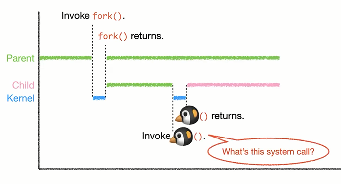
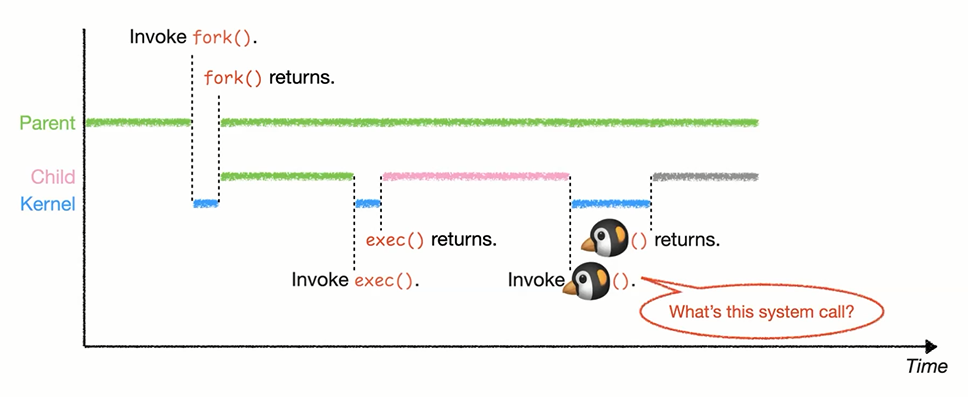
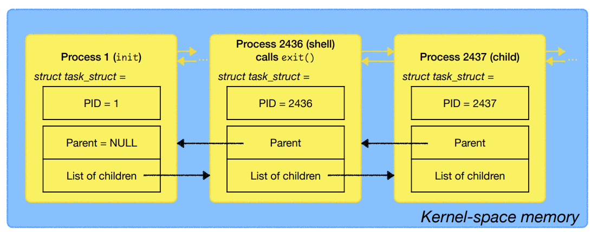

# OS: Lecture 7

[TOC]

## Review

### System calls for process management

1. What's 🐧？

    

    * It's `fork()`!

2. What's 🐧？

    

    * It's `exec()`!

3. What's 🐧？

    

    * It's `exit()`!

4. What's this？

    

    * It's the signal `SIGCHLD`!

5. What's the purpose of it？

    

    * The purpose of the signal is the **interprocess communication**

6. What's 🐧？

    

    * It's `wait()`!

| System call                  | Purpose                                                      | Return value on success                                 | Return value on failure                                      |
| ---------------------------- | ------------------------------------------------------------ | ------------------------------------------------------- | ------------------------------------------------------------ |
| `fork() `                    | Create a child process (by cloning the calling process).     | In the parent: PID of the child.  In the child: 0. | In the parent: -1 (check errno).  No child process is created |
| `exec*()`                    | Execute a program.                                           | It never returns.                                       | -1 (check errno).                                            |
| `exit()`                     | Terminate the calling process.                               | It never returns.                                       | It never fails.                                              |
| `wait() `  `waitpid() ` | Wait for any child to terminate.  Wait for a child to change state. | PID of the child. (status is stored in the argument.)   | -1 (check errno).                                            |
| `signal() `                  | Change the signal handler.                                   | The previous signal handler.                            | SIG_ERR (check errno).                                       |
| `kill()`                     | Send a signal to a process.                                  | 0                                                       | -1 (check errno).                                            |

### `Fork()`

* `fork()` returns the PID of the child to the parent process, and returns 0 to the chold process

**NOTE:**

* For this execution, the order of the last two printed lines can be switched

    

* For this program, there're 4 lines printed.

    

    

    

    * This is because it's output to a file, and a file outpt stream is fully buffered. 

    * When `fork()`is called, the buffer has not been flushed, so it's inherited by the child.

    * Both process flushes the buffer when they terminates.

* You can also change the default buffering strategy

    * Using the library function `setvbuf ()`

## Process Organization

### Booting the computer

#### BIOS: Basic input/output system

#### Boot device

* boot sector is the very first sector on the disk.

#### Boot loader

### The first process - `init` (Linux)

* Why do we want `init`, the parent of all other processes?

### Orphans

#### Reparenting

* the `init` process will adopt all the orphans

> In the program above, the child sleep for 2 secs between the line printed, and the parent sleep for 1 second and then terminates. 
>
> This means that before the parent terminated, the child has already print out a line, and it prints the second line after the parent terminates.
>
> From the output, we can see that it's not the grandparents that has adopted the orphan. It's the `init` process that adopted the orphan.

#### What happens in the kernel?

> The grey pointers remains as the zombie process is not yet removed.

#### Will `init `clear the zombie?

> The `init` process adopted the orphans. Now it has two children.

#### How does `init `clear the zombie?

**Left:** We can make an infinite loop, and continously call `waitpid()` to clear all the zombies

* Nice try, but it won't work. 

* `init` would be blocked if it calls `waitpid()`, but we can't let it to be blocked. 
* The `init` process is not just for clearing the zombies, it has many other useful works to do.

**Right**: We can overwrite the signal handler, let the signal handler of `SIGCHLD` to call `waitpid()`

* In this way, the `init` process will not be blocked.
* Whenever there's a `SIGCHLD`, the signal handler will call the `waitpid()` and clear the zombie.
* Now the `init` won't be blocked and can do other work

### Some observations

**Processes in Linux are organized as a single tree.**

* Why not a forest? 
* Windows does maintain a forest-like process hierarchy, but we’ll focus on Unix/Linux in this course. 

**Reparenting allows processes to run without a parent shell.**

* Therefore, **background jobs** can survive even after the shell exits.

## Process scheduling

### What and Why 

Computers often do several things **concurrently**, even if it has only one CPU. • 

* It’s called **multiprogramming**. 

The CPU **switches** from process to process quickly, running each for a few *ms*. 

* It’s called **multitasking**. 

The OS needs to **choose** which process to run next. 

* It’s called **scheduling**. 
* The part of the OS that makes the choice is called the **scheduler**.

### Process states

#### Ready

#### Running

#### Blocked

> This is very rare

#### Zombie

### Context switching

> * The best place to store these register data is our **task_struct**
> * During context-switching, those register values are all saved to the task_struct
> * **Context**:
>     * <u>User-space memory</u>
>     * <u>Register values</u>
>     * because you need to switch the user-space memory and the register values between different contexts

## Homework

### Question 1

* Note that in this stack, everything above the result is removed after the function `add()` is returned.
* However, the result points to somewwhere inside the removed stack.
    * will cause an **undefined behavior**!
    * The compiler would be able to generat any code they want

### Undefined behavior

