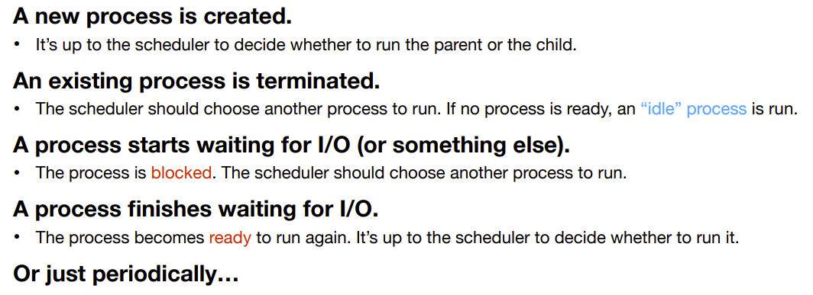

# OS: Lecture 8

[TOC]

## Process scheduling

### Review - What and Why

Computers often do several things concurrently, even if it has only one CPU. • 

* It’s called **multiprogramming**. 

The CPU switches from process to process quickly, running each for a few *ms*. 

* It’s called **multitasking**. 

The OS needs to choose which process to run next. 

* It’s called **scheduling**. 
* The part of the OS that makes the choice is called the **scheduler**.

### Process states

**Some questions:**

* If we just created a new process, what state is the process in?

    * Ready

* If we only have 1 core, how many process can be in the running state?

    * One

* What's the state after a process called `waitPID()`

    * blocked
    * because it has to wait for some child process to terminate

* What's a zombie

    * The child terminates, but the parent process hasn't called `wait()`

    

### Context switching

### CPU-bound processes vs. I/O-bound processes

### When do we need to schedule?

### Nonpreemptive vs. preemptive scheduling

* **Nonpreemptive Scheduling:**
    * We can't force a process to give up the CPU unless it's waiting for an I/O or it voluntarily gives up the CPU.
* **Preemptive Scheduling:**
    * A process can run for a particular amount of time.  If the time is up or it's waiting for I/O, then the process is suspended and we can switch to run another process.

## What’s a good scheduling?

### General goals

**<u>Fairness</u>** 

* Each process should have a fair share of the CPU. 

**<u>Policy enforcement</u>** 

* The system’s policies should be carried out. 
* **Example**: the admin may state that certain processes have a higher priority. 

**<u>Balance</u>** 

* All parts of the system should be kept busy all the time. 
* **Example**: mix CPU-bound and I/O-bound processes.

### Batch systems

A **batch system** collects a set of jobs and then process them **in** **batches**.

* **Examples**: 
    * bank systems, data analytics, or even your laundry basket. 
    * You “submit” your dirty clothes to be washed at the end of the ~~year~~ week. 

Batch jobs can run **without user interaction**, so nonpreemptive scheduling or preemptive scheduling with large time slices are acceptable. 

**Scheduling goals for batch systems:** 

* **High throughput**: maximize the number of jobs per hour. 
* **Short turnaround time:** minimize time between submission and completion. 
* **High CPU utilization:** keep the CPU busy all the time. (*Is it a good metric*?)

### Interactive systems

An **interactive system** may be… 

* A computer with an interactive user;
* A server that serves multiple interactive users. 

**Preemption **is essential to keep one process from denying service to others. 

**Scheduling goals for interactive systems:** 

* **Short response time**: 
    * <u>minimize the time between request and response.</u> 
    * Interactive jobs may take precedence over background jobs. 

* **Proportionality**: 
    * <u>meet users’ expectations.</u> 
    * You think it’s OK to load a video game for minutes, but not OK if it reacts a second after you press A.

### Real-time systems

**Real-time systems** must guarantee response **within specified time constraints**. 

* There's a precise deadline
* You have to meet the deadline for each process.

**Example**: a robot welding cars moving down an assembly line. 

**Scheduling goals for real-time systems: **

* **Meeting deadlines**: 
    * <u>avoid losing data</u> (or a car, or a nuclear reactor…). 
    * If a device produces data at a regular rate, you must run the data-collection process on time. 
* **Predictability**: 
    * <u>avoid quality degradation</u> (in multimedia systems). 
    * If the audio process runs too erratically, the sound quality will deteriorate rapidly (i.e., jitter).

## Scheduling Algorithms

* **First-come, first-served** 
    * It’s nonpreemptive. 
* **Shortest job first** 
    * It can be nonpreemptive or preemptive. 
* **Round-robin** 
    * It’s preemptive. 
* **Priority scheduling** 
    * It can be nonpreemptive or preemptive.

### Metrics

**Wait time**

* The duration that the job is in the system but not running

**Turnaround time**

* The duration from when the job arrives in the system to the time it completes.

$$
T_{turnaround} = T_{completion} - T_{arrival}
$$

### First-come, first-served (FCFS)

**First-come, first-served (FCFS)**, a.k.a. **first-in, first-out (FIFO)**, is a **nonpreemptive** scheduling algorithm in **batch systems**.

### Shortest job first (SJF)

**Shortest job first (SJF)** has both **nonpreemptive** and **preemptive** versions. Let’s look at the **nonpreemptive** version first.

### Preemptive shortest job first (PSJF)

* Preemptive shortest job first is like shortest job first 
* but if a new job comes in with a shorter runtime than the total runtime of the current job, it is run instead. 

#### A new metric - **response time**

### Round-robin (RR)

### SJF vs. RR

* Recall SJF

    

* SJF vs. RR

    

Typically, **RR** has **worse CPU efficiency** than **SJF**.

However, jobs on a RR scheduler are **more responsive**.

* You won't feel that a job **freezes** because it's on theCPU from time to time.
* Therefore it's more suitable for **interactive systems**.

### Trade-offs

### Priority scheduling

#### Static priority scheduling

#### Limitations

#### Dynamic priority scheduling

### Can we do better?

