# OS: Lecture 9

[TOC]

## Review

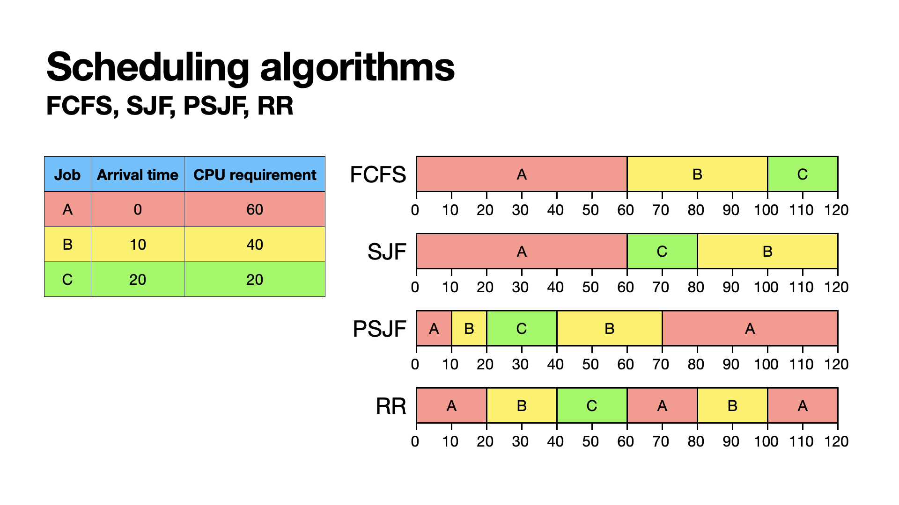

## Scheduling Algorithms

### Trade-offs

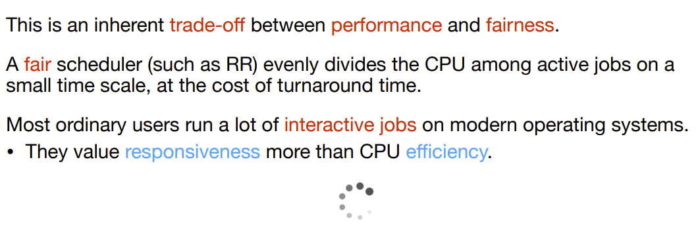

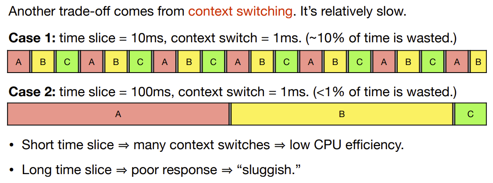

### Priority scheduling

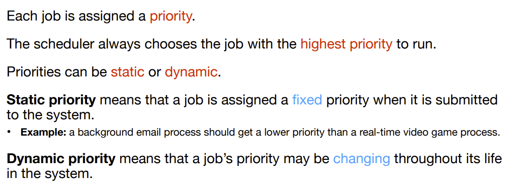

#### Static priority scheduling

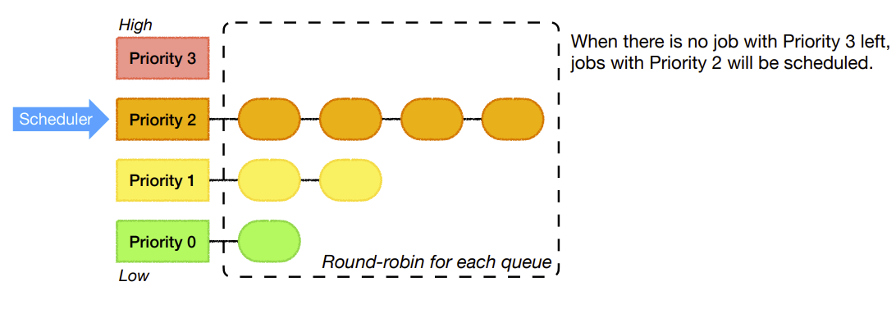

#### Limitations

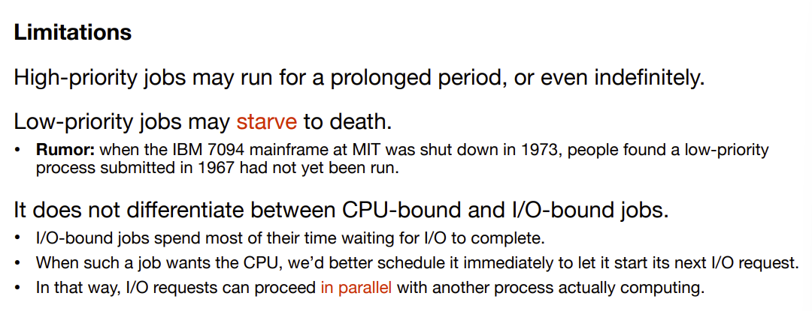

#### Dynamic priority scheduling

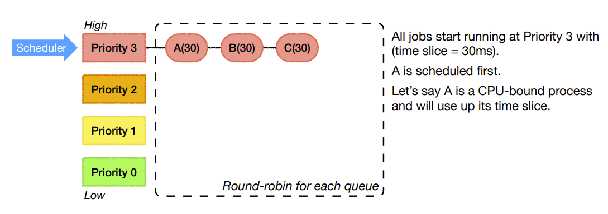

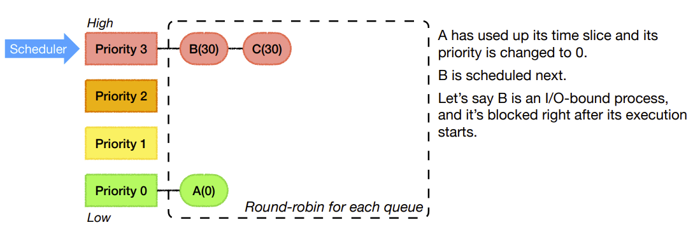

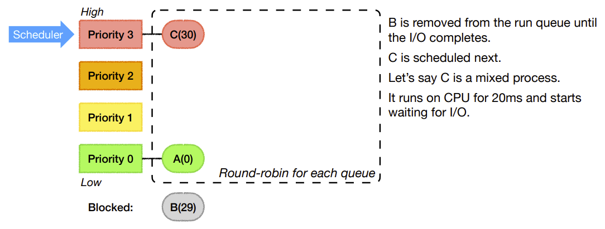

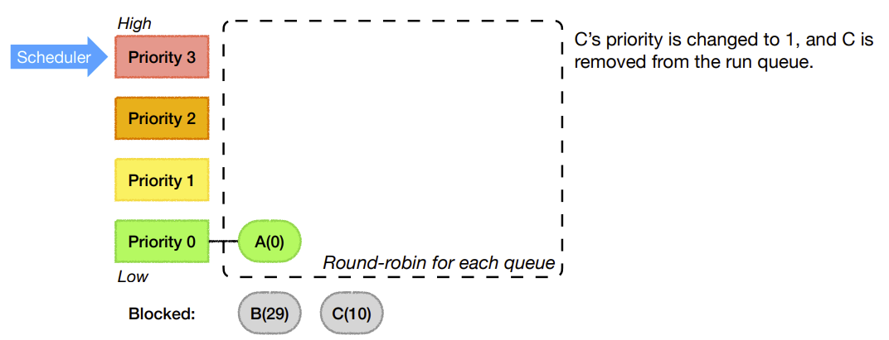

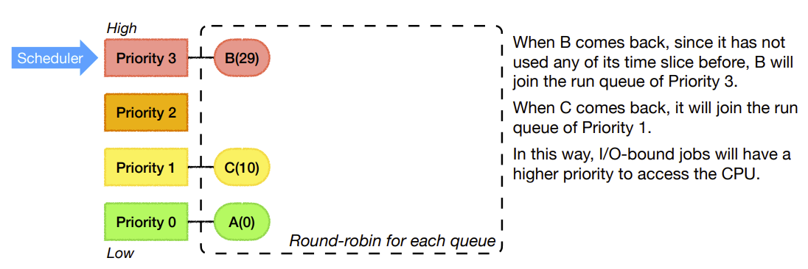

#### Can we do better?

Remember the **trade-off **between **efficiency **and **responsiveness**? 

Ideally, we want to… 

* **Optimize turnaround time.** 
    * Run shorter jobs first. 
    * Give CPU-bound jobs a large time slice to reduce context switching. 
* **Make the system feel responsive to interactive users.** 
    * Can’t give all jobs a large time slice. 
    * Minimize response time.

### Multilevel feedback queue (MLFQ)

> This is just an example
>
> In reality, we might have way more levels than it. We could have 20 levels or even over a hundred.

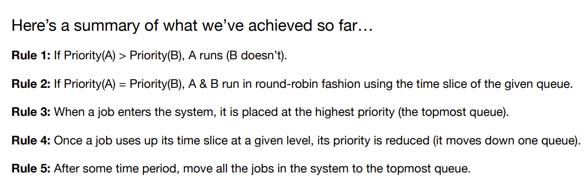

### Summary

## Interprocess communication

### What is IPC?

### Why do we need IPC?

### How to do IPC?

#### Case study: pipe

    <b>Example</b>: ls  |  less

### Shared memory

### What could go wrong?

* In the case of a **pipe**, the kernel provides a form of **synchronization**.
* However, for **shared memory**, it's up to the processes to coordinate.
* What could possibly go wrong?

#### Out of sync?

> `mmap()` system call can create a shared memory

#### Race conditions

This scenario is called a **race condition** (or, more specifically, a **data race**). 

The results depend on the **timing** of the execution, i.e., the particular order in which the shared resource is accessed. 

**Race conditions are always bad…** 

* Worse yet, compiler optimizations may generate crazy output if your code has data races. 
* What if you compile the previous code with “gcc -O1” and “gcc -O2”? 
* To learn more about <a style='' href='https://en.wikipedia.org/wiki/Undefined_behavior'>undefined behavior</a> (a.k.a. “[nasal demons](http://catb.org/jargon/html/N/nasal-demons.html)”), read [Schrödinger’s Code](https://queue.acm.org/detail.cfm?id=3468263).

Because the computation is **nondeterministic**, debugging is no fun at all.

* [Heisenbug](https://en.wikipedia.org/wiki/Heisenbug): bugs that disappear or change behavior when you try to debug.

> This is also one of the **undefined behavior**s in C
>
> The **undefined behaviors** come from data races.
>
> If your code contains a data race, it's undefined, and the compile can choose whatever code it want to generate.
>
> Will cause Heisenbug:
>
> * it seems to work when you try to debug
>
>  
>
>  

